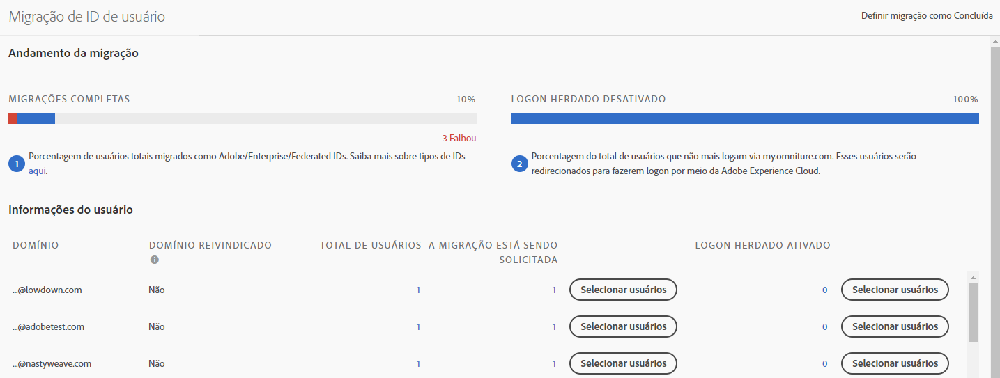
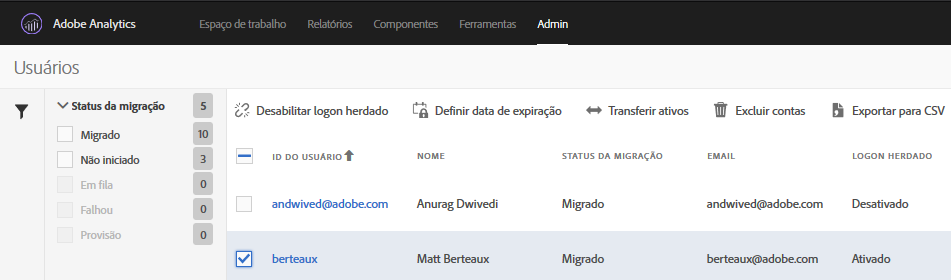

# Migrar contas de usuário do Analytics para Adobe IDs {#migrate-analytics-user-accounts-for-adobe-ids}

Migre usuários do sistema de gerenciamento de usuário herdado do Analytics para o Admin Console.

## Migrar contas de usuário do Analytics para Adobe IDs {#task-f3355f3b14a340feae58cfa04c0ba1c9}

Migre usuários do sistema de gerenciamento de usuário herdado do Analytics para o Admin Console.

> [!NOTE] Se um Administrador que não tenha feito logon por meio da Experience Cloud tentar acessar a ferramenta de Migração de IDs de usuários, ele será redirecionado para a página de logon da Experience Cloud.

**Para migrar usuários do Analytics**

1. Navegue até **[!UICONTROL Analytics]** > **[!UICONTROL Admin]** > **[!UICONTROL Migração de ID de usuário]**.

   

   A página de Migração da ID do usuário tem duas seções: *Processo de migração* e *Informações do usuário*.

   **Andamento da migração**

   <table id="table_F9F1CFF762C745E198CB075A02BA2DDA"> 
   <thead> 
   <tr> 
      <th colname="col1" class="entry"> Fase </th> 
      <th colname="col2" class="entry"> Descrição </th> 
   </tr>
   </thead>
   <tbody> 
   <tr> 
      <td colname="col1"> 
Migrações concluídas 
 </td> 
      <td colname="col2"> 
Os usuários aceitaram o convite. 
 </td> 
   </tr> 
   <tr> 
      <td colname="col1"> 
Logon herdado desabilitado 
 </td> 
      <td colname="col2"> 
O logon antigo que usa uma ID da empresa está desativado. Os usuários passarão a acessar a Experience Cloud usando uma Adobe ID ou uma Enterprise ID. Quando todos os usuários atingirem essa fase, você terá concluído a migração. 
 
Na migração, o logon antigo é desativado. Os usuários são redirecionados para  experiencecloud.adobe.com e devem fazer logon usando a Adobe ID ou Enterprise ID. 
 </td> 
   </tr> 
   </tbody> 
   </table>

   **Informações do usuário**

   As informações do usuário descrevem os usuários em sua organização, separados por nome de domínio.

   <table id="table_3822E27AF81E4A188562FEB5131548A5"> 
   <thead> 
   <tr> 
      <th colname="col1" class="entry"> Elemento </th> 
      <th colname="col2" class="entry"> Descrição </th> 
   </tr>
   </thead>
   <tbody> 
   <tr> 
      <td colname="col1"> 
Domínio 
 </td> 
      <td colname="col2"> 
Os domínios são específicos das IDs de email da base de usuários atual do Analytics. Um domínio pode ser reivindicado apenas por uma única organização, e somente os administradores de sistema podem reivindicar um domínio. Para obter mais informações, consulte <a href="https://helpx.adobe.com/br/enterprise/help/request-access-to-claimed-domain.html">Solicitar acesso a um domínio reivindicado</a>. 
 </td> 
   </tr> 
   <tr> 
      <td colname="col1"> 
Domínio reivindicado 
 </td> 
      <td colname="col2"> 
Caso deseje migrar os usuários como Enterprise ou Federated IDs, você deve ser um Administrador do sistema e reivindicar um domínio disponível pelo Admin Console antes de migrar os usuários. Saiba mais <a href="https://helpx.adobe.com/br/enterprise/help/identity.html">aqui</a>. 
 
Se você não deseja reivindicar domínios para Enterprise or Federated IDs, ignore este passo e migre os usuários como Adobe IDs. Saiba mais sobre os tipos de IDs <a href="https://helpx.adobe.com/br/enterprise/help/identity.html">aqui</a>. 
 </td> 
   </tr> 
   </tbody> 
   </table>

1. Localize o domínio que contém as IDs de usuário que você deseja migrar e, em **[!UICONTROL Migração obrigatória]**, clique em **[!UICONTROL Selecionar usuários]**.
1. Na página [!DNL Users], selecione os usuários que deseja migrar e clique em **[!UICONTROL Migrar]**.

   Ao clicar em **[!UICONTROL Migrar]**, os usuários recebem um convite (Migração iniciada) e devem aceitá-lo. Essa ação mova a ID do usuário para Migração concluída. É possível desativar o acesso herdado para `[!DNL my.omniture.com].`

   

1. Especifique o tipo de ID para a qual você deseja migrar a (Adobe ID ou Enterprise ID) dos usuários

   Depois de migrar os usuários, o status na coluna Status da migração muda de *`Not Initiated`* para *`Migrated`*.

   Se *`Failed`* for exibido, passe o cursor sobre o ícone para obter uma descrição sobre por que a migração falhou.
