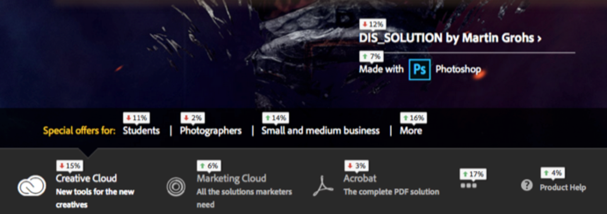

# Sobreposições personalizáveis

As sobreposições fornecem várias formas de configurar a visualização de dados, para que seja possível ver e compreender com facilidade a popularidade dos links em uma página.

As sobreposições permitem que você visualize os dados de clique diretamente na página. Isso é o que separa uma ferramenta de análise visual, como o Mapa de Atividade, das ferramentas gráficas e tabulares, como o Relatórios e análises.

O mapa de Atividades oferta três tipos de sobreposições:

* Sobreposição de gradiente (mapa de calor)
* Sobreposição em bolha
* Sobreposição de ganhadores e perdedores

Você também pode configurar [a renderização de sobreposição para o conteúdo dinâmico](/help/analyze/activity-map/activitymap-link-tracking/activitymap-stl-track-custom-elements.md).

Para fazer alterações em sobreposições, abra o painel [Configurações da](/help/analyze/activity-map/activitymap-overlay-settings.md) sobreposição e edite as opções disponíveis.

Passar o mouse sobre uma sobreposição exibirá seus [detalhes](/help/analyze/activity-map/activitymap-overlay-details.md).

## Sobreposição de gradiente (mapa de dados) {#section_06AF13DE05A1454D960176CD0DA921A6}

Com a sobreposição de gradiente, a intensidade da cor é baseada na popularidade do link. Essa intensidade pode ser normalizada para as 30 melhores classificações, ou uma função do valor absoluto da métrica.

Essas métricas são sobrepostas na parte superior dos links da página como um tipo de &quot;mapa de calor&quot; para responder a perguntas críticas, incluindo as seguintes:

* Qual é o valor de uma página individual?
* Qual é o valor de um elemento individual em uma página?
* Qual é a &quot;propriedade digital&quot; mais valiosa em uma página?

## Sobreposição em bolha {#section_A657AB3F64CB47F881BBFFD72B37D9D4}

A sobreposição em Bolha mostra o conteúdo da sobreposição (métrica, porcentagem ou classificação) em uma pequena bolha de chamada.

As sobreposições de bolha são exibidas quando você seleciona essa sobreposição no Tipo de sobreposição na barra de ferramentas. . As sobreposições em bolha são exibidas para todos os links que correspondem à seleção em Configurações [do mapa de](/help/analyze/activity-map/activitymap-overlay-settings.md) Atividade (30 melhores, 50 melhores, todos...). As sobreposições de gradiente serão exibidas se essa opção não estiver selecionada.

>[!NOTE] as sobreposições em bolha de submenus são exibidas somente quando o submenu é exibido:
>
>>

## Sobreposições de ganhadores e perdedores {#section_EE80278E20C14824869BF5A27A4634C8}

**[!UICONTROL Gainers and losers overlays]** estão disponíveis somente no modo Online. Eles relatam mudanças em tempo real na atividade do link ao comparar as métricas do período atual com as do último período. Eles lhe dão uma maneira visualmente atraente de visualização em tempo real.

Essa sobreposição em tempo real classifica os cliques com base nas alterações no valor da métrica entre os períodos anterior e atual.

