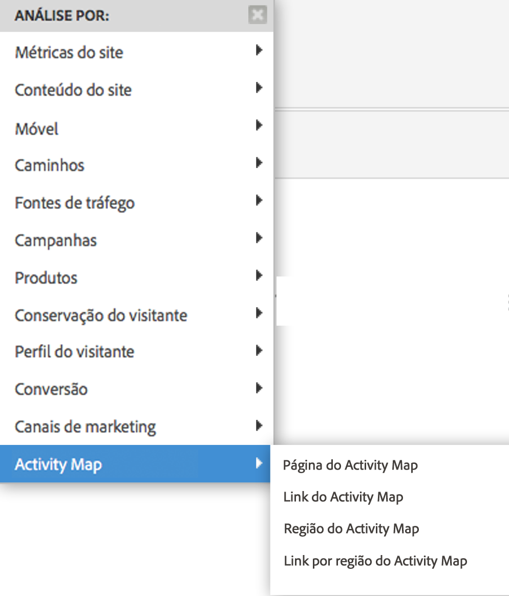

# Habilitar o Activity Map {#enable-activity-map}

Explica as etapas que o Administrador do Analytics precisa completar para ativar a coleta de links e o download do usuário no Activity Map.

## Etapa 1. Atualizar o código AppMeasurement (Javascript) para v1.6 (ou posterior) {#section_5D1586289DF2489289B1B6C1C80C300D}

O módulo do Mapa de Atividade faz parte do arquivo AppMeasurement.js (localizado na parte superior do arquivo). A biblioteca do AppMeasurement carregará o módulo do Mapa de Atividades quando instanciado.

Os dados do Mapa de Atividade não podem ser coletados a menos que você atualize para esta versão (ou superior) do AppMeasurement.

1. Download the latest AppMeasurement code (AppMeasurement_Javascript-1.6.zip) by going to  **[!UICONTROL Analytics]** > **[!UICONTROL Admin]** > **[!UICONTROL Code Manager]** and [implement it](https://marketing.adobe.com/resources/help/pt_BR/sc/implement/js_implementation.html).

   Incluímos alguns códigos [de implementação de](/help/analyze/activity-map/activitymap-getting-started/activitymap-getting-started-admins/activitymap-sample-implementation-code.md) amostra para ajudá-lo a visualizar as alterações que foram feitas no código, incluindo o módulo Mapa de Atividade.

1. Valide a implementação:

   1. Quando um elemento clicável é clicado, os dados são armazenados em um cookie chamado s_sq.
   1. Os dados do Mapa de Atividades podem ser vistos na sequência de query na chamada de rastreamento. Por exemplo:

      ```
      …&c.&a.&Activity Map.&link=My%20Link&region=My%20Region&page=My%20Page&.Activity Map&.a&.c&...
      ```

1. Break this report down by **[!UICONTROL Activity Map Link by Region]** to see the link/region for that page:  {width=&quot;400px&quot;}

## Etapa 2. Ativar relatórios do Activity Map {#section_D14F15D2FC0346FCAD8B3B87E6DD33D4}

Primeiro, você precisa ativar os Relatórios do Activity Map a um nível de conjunto de relatórios.

1. Log in to Adobe Analytics and navigate to  **[!UICONTROL Analytics]** > **[!UICONTROL Admin > Report Suites >[select report suite]> Edit Settings > Activity Map]** > **[!UICONTROL Activity Map Reporting]** .
1. O Activity Map coleta os dados do link nos Relatórios do Activity Map. For the activation to happen, you must first activate the variables by clicking **[!UICONTROL Enable Activity Map Reports]**.

   Essa etapa adiciona todas as dimensões do Analytics necessárias para coletar dados.

1. Após cerca de uma hora, verifique o relatório [Página do mapa de](/help/analyze/activity-map/activitymap-reporting-analytics.md)Atividades, que mostra todas as páginas em que os usuários clicaram em um link.

## Etapa 3. Adicionar usuários ao grupo de acesso do Activity Map {#section_4C7A47BB7DEF4AFFBC276392467F9675}

1. Clique em **[!UICONTROL Add Users to Group]**.

   Isso vai redirecionar você até a página de gerenciamento de grupos no Admin Console.

1. [Adicione usuários a este grupo](https://marketing.adobe.com/resources/help/pt_BR/reference/groups.html) e **[!UICONTROL Save Group]**.

1. This allow your Admin users to download Activity Map from  **[!UICONTROL Adobe Analytics]** > **[!UICONTROL Tools]** > **[!UICONTROL ActivityMap]** .

>[!NOTE] Se você quiser que usuários não administradores baixem o Activity Map, crie um novo grupo de usuários que forneça permissão de acesso a &quot;Ferramentas&quot; e &quot;Instalação herdada do ClickMap&quot;. Este nível de permissão, combinado ao Acesso ao Activity Map, fornece permissões as para baixar e usar a ferramenta.
