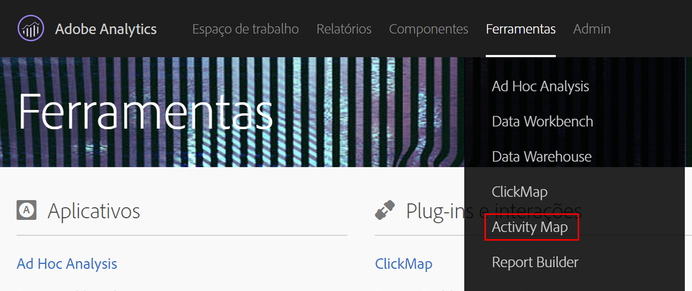
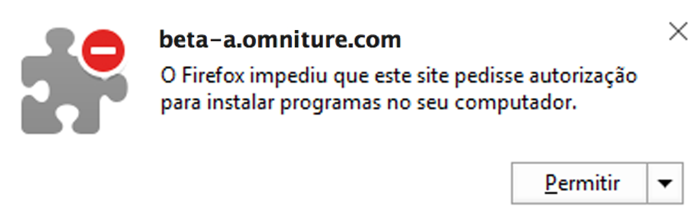
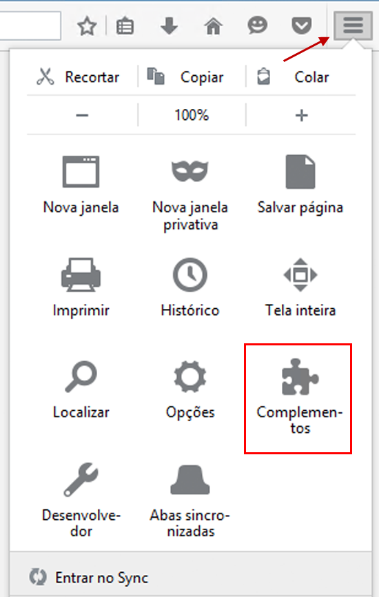

# Instalar os plug-ins do navegador do Activity Map {#install-activity-map-browser-plug-ins}

O processo de instalação varia de acordo com o navegador usado.

Plug-ins de navegador do Activity Map:

* São inseridos manualmente como uma tag de página do Analytics.
* São inicializados por um botão ou item de menu na barra de ferramentas do navegador.
* São compatíveis apenas com as versões mais recentes desses navegadores de desktop: Internet Explorer, Firefox, e Chrome.
* São compatíveis com o recurso **[!UICONTROL Lembrar meu logon]**.
* **Podem inserir** a barra de ferramentas do Activity Map em páginas da Web que não contêm o código de página do Analytics. Vão mostrar uma mensagem de erro se a página não tiver o código de página do Analytics.
* Exigem que você passe por um processo de instalação do plug-in no navegador.

## Instalar o plug-in do Activity Map no Chrome {#section_6907253D5D5E4422967E6439207A013F}

1. Vá para **[!UICONTROL Adobe Analytics]** > **[!UICONTROL Ferramentas]** > **[!UICONTROL Activity Map]**.  

1. Clique em **[!UICONTROL Baixar Activity Map]**.
1. Clique em **[!UICONTROL Instalar o plug-in do Activity Map]**.
1. Quando o aviso de segurança perguntar se deseja baixar o plug-in do navegador do Activity Map, responda **[!UICONTROL Sim]**.
1. Após concluir o download, encontre a localização do arquivo .zip e descompacte o conteúdo.
1. Volte para a barra de endereços do Chrome e digite `chrome://extensions`.
1. Marque a caixa de diálogo do modo Desenvolvedor.
1. Clique em Carregar extensões descompactadas e selecione a pasta descompactada no pop-up.
1. Se você visualizar um ícone do Adobe Analytics {width=&quot;70px&quot;} adicionado à sua barra de ferramentas, o download foi bem-sucedido. Agora, é possível [inicializar o Activity Map](/help/analyze/activity-map/activitymap-getting-started/activitymap-getting-started-users/activitymap-launch.md) na página.

## Instalar os plug-ins do Activity Map no Firefox {#section_1F69D3D22DB34D6992747B1A62C1D2DA}

1. Vá para **[!UICONTROL Analytics]** > **[!UICONTROL Activity Map]**.

1. Clique em **[!UICONTROL Baixar Activity Map]**.
1. Clique em **[!UICONTROL Instalar o plug-in do Activity Map]**.
1. Clique em **[!UICONTROL Permitir]** quando esta mensagem for exibida: 

1. Clique em **[!UICONTROL Instalar agora]**.
1. Clique no ícone **[!UICONTROL Abrir menu]** na parte superior direita e selecione **[!UICONTROL Complementos]**. {width=&quot;250px&quot;}

1. O Activity Map deve ser listado como um dos complementos do Firefox.
1. Se você visualizar um ícone do Adobe Analytics  adicionado à sua barra de ferramentas, o download foi bem sucedido. Agora, é possível [inicializar o Activity Map](/help/analyze/activity-map/activitymap-getting-started/activitymap-getting-started-users/activitymap-launch.md) na página.

## Instalar plug-in do Activity Map no Internet Explorer {#section_1A33705D7F784C4A88C9026ADC860FB8}

1. Vá para **[!UICONTROL Analytics]** > **[!UICONTROL Activity Map]**.

1. Clique em **[!UICONTROL Baixar Activity Map]**.
1. Clique em **[!UICONTROL Instalar o plug-in do Activity Map]**.
1. Clique em **[!UICONTROL Executar]** para inicializar a instalação do Activity Map.
1. Clique em **[!UICONTROL Sim]** no pop-up para permitir que o programa faça alterações no computador.
1. Siga as instruções do assistente de instalação.
1. Se o Activity Map foi instalado com sucesso, você verá uma notificação no Internet Explorer informando que a barra de tarefas do Activity Map está pronta para uso. Habilite-a para começar a usar o aplicativo. Agora, é possível [inicializar o Activity Map](/help/analyze/activity-map/activitymap-getting-started/activitymap-getting-started-users/activitymap-launch.md) na página.
