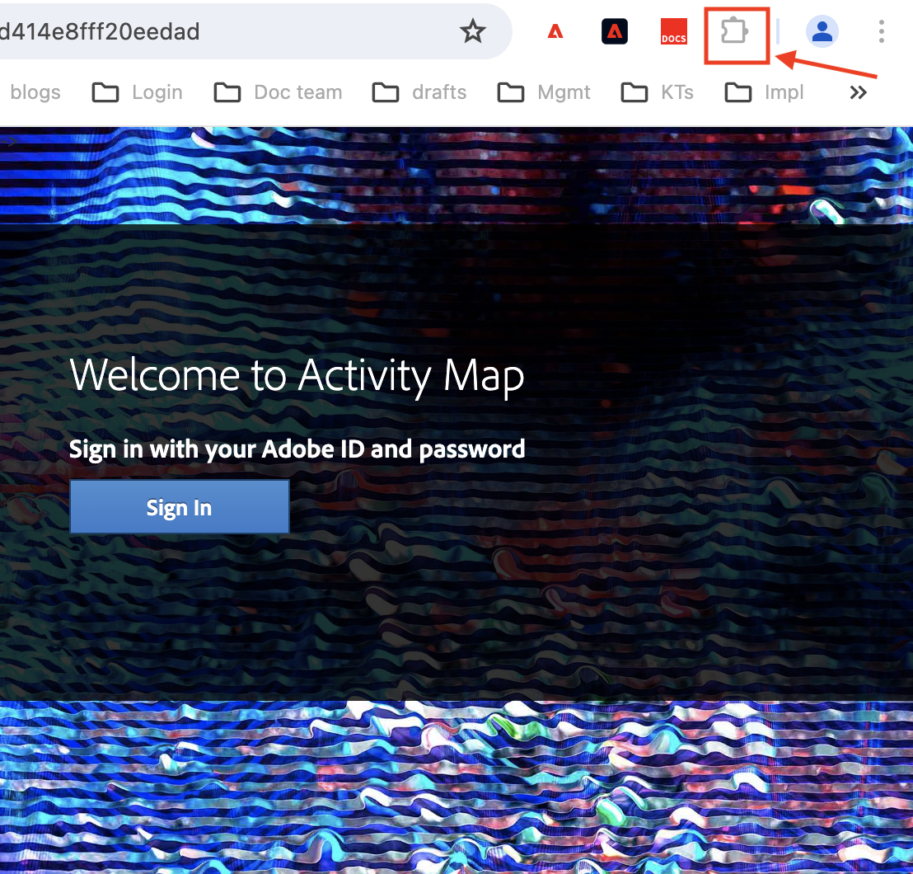

# Iniciar o Activity Map

Presumindo que o navegador/extensão correto esteja [instalado](/help/analyze/activity-map/activitymap-getting-started/activitymap-install.md), você pode iniciar o Activity Map diretamente na sua página da Web.

## Iniciar no Chrome

1. 
   1. Clique no ícone Extensões do Chrome na parte superior direita.
      
1. Clique em Activity Map.
   
1. Faça logon com seu perfil, nome de usuário e senha.
1. O aplicativo deve inicializar, mostrando a barra de ferramentas e as sobreposições.

## Iniciar no Firefox

