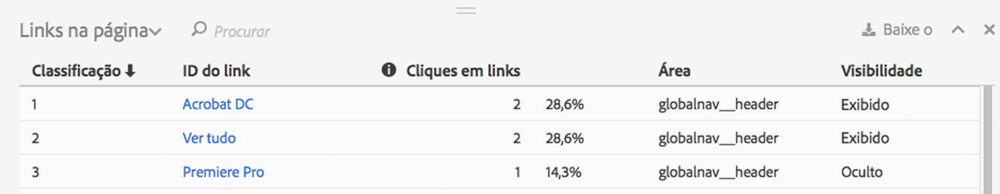
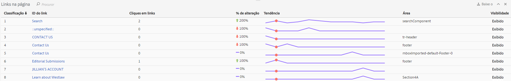

# Relatório de links

O Relatório de links informa sobre os links que foram encontrados na página atual. Ele não informa sobre todos os links que foram coletados para essa página.

O Relatório de links na página oferece uma exibição tabular dos links. Às vezes, você pode querer ver os cliques em links (ou outras métricas) classificados em uma única exibição. Isso permite comparar melhor um link com outro. Crie o Relatório de links na página, incluindo uma lista de classificação de todos os links (pela ID do link), as informações de cliques (número e porcentagem) e a região da página. Clique no Relatório de links na página, na barra de ferramentas do Activity Map.

No painel Activity Map, o **[!UICONTROL Relatório de links na página]** é aberto abaixo da estrutura do navegador.

## Modo padrão {#section_C8D2A1C07A2A4E3A8F84AC9240603FA7}

No modo Padrão, o “Relatório de links na página” mostra os dados do link, de um único dia a vários dias, agregados ao longo do período integral. As seguintes informações serão mostradas para cada link:

<table id="table_3DE41B2CFA644B70AF802A3123CE51D9"> 
 <thead> 
  <tr> 
   <th colname="col1" class="entry"> Coluna </th> 
   <th colname="col2" class="entry"> Descrição </th> 
  </tr> 
 </thead>
 <tbody> 
  <tr> 
   <td colname="col1"> Classificação </td> 
   <td colname="col2"> Classificação na página. No modo Padrão, o valor de classificação permanece o mesmo, independentemente de qual coluna é clicada. </td> 
  </tr> 
  <tr> 
   <td colname="col1"> ID do link </td> 
   <td colname="col2">A ID primária do link (para obter mais informações sobre como a ID primária é definida pela [Nova metodologia de rastreamento de links] (/home/analyze/activity-map/activitymap-link-tracking/activitymap-link-tracking-methodology.md) </td> 
  </tr> 
  <tr> 
   <td colname="col1"> Cliques </td> 
   <td colname="col2"> O número de cliques brutos para um link especificado e sua porcentagem do total de cliques na página. Se o usuário escolher uma métrica diferente na barra de ferramentas, o Relatório de links informará sobre essa métrica. </td> 
  </tr> 
  <tr> 
   <td colname="col1"> Região </td> 
   <td colname="col2"> Representa a região na página onde o link está localizado. </td> 
  </tr> 
  <tr> 
   <td colname="col1"> Visibilidade </td> 
   <td colname="col2">Refere-se ao status de visibilidade do link. Dois valores são possíveis: 
    <ul id="ul_BABCC0F64145407C9D439150A6898E6D">
     <li id="li_9AF0479BDCEB4A44A37292FAABFA83A5"><b>Oculto</b>: o link está na página, mas não é visível para o usuário final (como um submenu em um Menu de navegação, que se torna visível somente se o usuário passar o mouse por cima do Menu pai) </li>
     <li id="li_C6FA4EC27EDD4341AB9821E2B4BC9E60"><b>Exibido</b>: o link é exibido na página. No entanto, ele pode ser exibido abaixo da dobra: o usuário teria que rolar a página para vê-lo. </li>
    </ul>
Observação: se um link for definido como “Oculto”, as sobreposições para ele não serão exibidas. 
</td> 
  </tr> 
 </tbody> 
</table>

**Filtragem de dados**

Quando quiser focar em um link específico, é possível procurar por um termo relacionado no campo **[!UICONTROL Filtrar dados]**. Apenas os links que correspondem à pesquisa terão sobreposições. Sem um filtro, as sobreposições especificadas nas [Configurações do Activity Map](/help/analyze/activity-map/activitymap-overlay-settings.md) serão exibidas.

## Modo online {#section_AC1967217B5A4532ACB01D33636F6770}

No modo Online, o Relatório de links na página mostra os dados de tendência que abrangem vários minutos.

<table id="table_61D1FB0F02894055A1AB394DE4FE4742"> 
 <thead> 
  <tr> 
   <th colname="col1" class="entry"> Coluna </th> 
   <th colname="col2" class="entry"> Descrição </th> 
  </tr> 
 </thead>
 <tbody> 
  <tr> 
   <td colname="col1"> Classificação </td> 
   <td colname="col2"> Classificação na página. No caso de uma sobreposição de gradiente ou em bolha, o valor de classificação permanece o mesmo, independentemente de qual coluna é clicada. No caso de uma sobreposição de ganhadores/perdedores, o valor de classificação muda com base nos links que mais ganharam/perderam. </td> 
  </tr> 
  <tr> 
   <td colname="col1"> ID do link </td> 
   <td colname="col2">ID primária do link. Para obter mais informações sobre como a ID primária é definida pela Nova [Metodologia de rastreamento de links] (/help/analyze/activity-map/activitymap-link-tracking/activitymap-)ink-tracking-method.md). </td> 
  </tr> 
  <tr> 
   <td colname="col1"> Cliques em links </td> 
   <td colname="col2"> Total de cliques para o período selecionado. </td> 
  </tr> 
  <tr> 
   <td colname="col1"> % Alterar </td> 
   <td colname="col2"> A variação em porcentagem entre as métricas de links no período atual e no período anterior. A variação em porcentagem negativa é mostrada em vermelho, a positiva em verde. </td> 
  </tr> 
  <tr> 
   <td colname="col1"> Tendência </td> 
   <td colname="col2"> Um gráfico de linhas para todos os períodos coletados. O período selecionado atualmente é indicado por um marcador verde. O período focalizado atualmente é indicado por um marcador vermelho. </td> 
  </tr> 
  <tr> 
   <td colname="col1"> Região </td> 
   <td colname="col2"> Representa a região na página onde o link está localizado. </td> 
  </tr> 
  <tr> 
   <td colname="col1"> Visibilidade </td> 
   <td colname="col2">Refere-se ao status de visibilidade do link. Dois valores são possíveis: 
    <ul id="ul_B10C55ED4D3C4CF99506DC467E2E7CFB">
     <li id="li_EA646722A51041CC9E62C56DEF92C81F">Oculto: o link está na página, mas não é visível para você (por exemplo, qualquer link que aparece após o carregamento da página.) </li>
     <li id="li_F9543614C2894003AC9984A7404E2785">Exibido: o link é exibido na página. No entanto, ele pode ser exibido abaixo da dobra: você teria que rolar a página para vê-lo. </li>
    </ul></td> 
  </tr> 
 </tbody> 
</table>

## Classificação e filtragem {#section_4B8E8233C21247CAA70DAEC2156548AD}

Às vezes, é necessário analisar apenas os resultados de uma região da página específica (por exemplo, painel esquerdo), para decidir como organizar o conteúdo daquela região específica na página da Web.

Para essa finalidade, criamos uma funcionalidade de classificação e filtragem para links no Relatório de links na página. A filtragem está disponível no campo de filtro e o termo de pesquisa será aplicado à coluna ID do link e Região do link. A classificação está disponível ao clicar nas chamadas (Classificação, ID do link, Cliques, Mudanças ao longo do tempo, Região, Visibilidade) e pode ser crescente ou decrescente. As sobreposições desaparecem do site quando os links são filtrados do Relatório de links na página.
