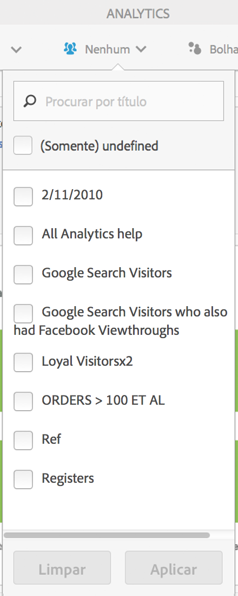
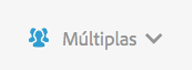

# Segmentação de cliente

Permite aplicar um filtro com vários segmentos no Activity Map.

> [!NOTE] o controle Segmentos está disponível apenas no modo Padrão, pois a plataforma do Adobe Analytics não é compatível com a segmentação de dados em tempo real.

Você pode selecionar um ou vários segmentos do menu suspenso **[!UICONTROL Segmentos]** mostrado abaixo. Os segmentos listados são idênticos aos seus ou aos que foram compartilhados com você, por meio dos Reports &amp; Analytics, para o conjunto de relatórios selecionado.

Após alterar a seleção de segmentos e depois de fechar o seletor de segmento, um novo processo de recuperação de dados do Analytics será inicializado para todas as métricas exibidas no aplicativo. Os segmentos selecionados são lembrados durante a navegação de página para página.

O rótulo Seleção de segmento (em um estado retraído) será exibido como “Múltiplos” quando mais de um segmento for selecionado. A lista completa dos segmentos selecionados será mostrada ao clicar no controle.

Os segmentos selecionados serão aplicados a todos os relatórios do Analytics apresentados no Activity Map, ou seja, as sobreposições e os relatórios de **[!UICONTROL Links na página]** e **[!UICONTROL Detalhes da página]**.
