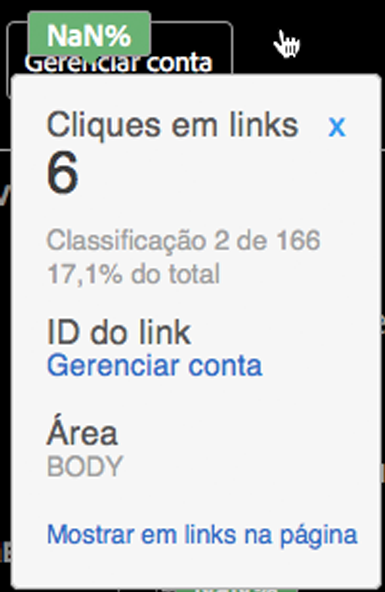

# Detalhes da sobreposição

Os detalhes da sobreposição são exibidos ao passar o mouse em cima de uma sobreposição de link.

Os detalhes da sobreposição exibem os seguintes valores, que são controlados por este link:

* Métrica
* Valor bruto
* Classificação
* Valor percentual
* ID do link
* Região
* Mostrar no Relatório de links na página

