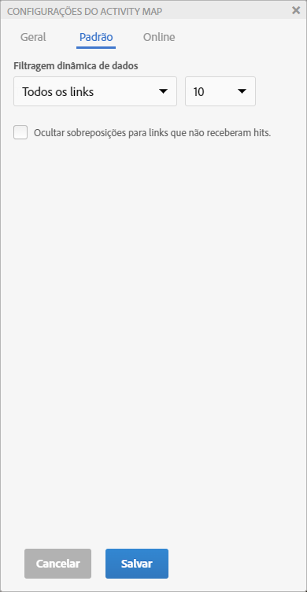
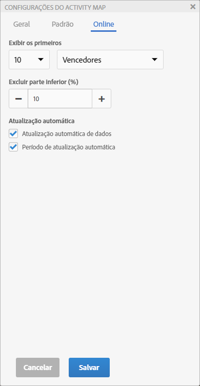
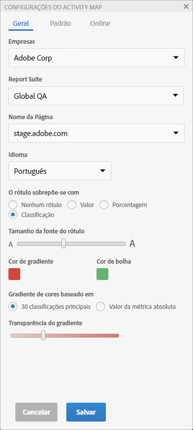

# Definir configurações do Activity Map

O painel Configuração do Activity Map permite modificar as configurações e propriedades para todos os tipos de visualizações de sobreposição.

Acesse o painel Configurações do Activity Map, clicando no ícone de engrenagem na barra de ferramentas do Activity Map.

O painel Configurações exibe um conteúdo diferente com base no modo de aplicativo selecionado. A guia Outro contém as configurações gerais.

| Padrão | **[!UICONTROL Sobreposições de gradiente]** ou **[!UICONTROL em bolha]** |
|---|---|
| Ao vivo | **[!UICONTROL Sobreposições de ganhadores e perdedores]**, **[!UICONTROL de gradiente]** e **[!UICONTROL em bolha]** |
| Outro | Seleção do Conjunto de relatórios e Idioma |

## Configurações da sobreposição em modo Padrão {#section_24DB95376E1A448494ECF3F57743FC19}

<table id="table_0244107DE6D142F2A1DA4882E0ED9826"> 
 <thead> 
  <tr> 
   <th colname="col2" class="entry"> Configurações </th> 
   <th colname="col3" class="entry"> Descrição </th> 
  </tr> 
 </thead>
 <tbody> 
  <tr> 
   <td colname="col2">  Sobreposições de Rótulo com </td> 
   <td colname="col3"> 
    <ul id="ul_13AD02789F2D4904A35215A8FA230F3E"> 
     <li id="li_8DB71636D2074C69B0D94D3FB0CAFE28"> <b>Sem Rótulo</b>: aplicável somente para a sobreposição de gradiente. Nesse caso, a cor da sobreposição vai informar um sentido para o ranking do link </li> 
     <li id="li_39C98D7EA9514C1D8731B9D21C0E73A6"> <b>Valor</b>: o total bruto da métrica para esse link </li> 
     <li id="li_A5F583E45BCD4F2399398F9DCC7FE382"> <b>Porcentagem</b>: a porcentagem da métrica para esse link na métrica total da página. </li> 
     <li id="li_E4BF7D3B863E4B6C8E737CF29ADA9D67"> <b>Classificação</b>: classificação desse link em todos os links presentes na página renderizada </li> 
    </ul> </td> 
  </tr> 
  <tr> 
   <td colname="col2">  Tamanho da fonte do rótulo </td> 
   <td colname="col3"> Permite aumentar/diminuir o tamanho da fonte do rótulo de sobreposição, usando um controle deslizante para melhorar a leitura. </td> 
  </tr> 
  <tr> 
   <td colname="col2">  Exibir </td> 
   <td colname="col3">Selecione Superior, Inferior ou Todos os links para exibir na sobreposição. Se você selecionar Superior ou Inferior, também deverá selecionar o número de links para serem exibidos. </td> 
  </tr> 
  <tr> 
   <td colname="col2"> Ocultar as sobreposições para links que não receberam visitas </td> 
   <td colname="col3"> Esta caixa de seleção permite ocultar as sobreposições para links que não receberam visitas para reduzir a desordem na interface. </td> 
  </tr> 
  <tr> 
   <td colname="col2">  Cores do gradiente / Cores da bolha </td> 
   <td colname="col3">Escolha entre uma variedade de cores para exibir as classificações do link de sobreposição para as visualizações de sobreposição de Gradiente ou em Bolha. </td> 
  </tr> 
  <tr> 
   <td colname="col2">  Gradiente colorido com base em </td> 
   <td colname="col3"> 
    <ul id="ul_1B5C2A44A9EB465D8B8E9AD91AF79D69"> 
     <li id="li_C983CB68B90B492BB0774254292B5961">  30 principais classificações: a intensidade da cor é normalizada para os 30 valores principais. </li> 
     <li id="li_1E83431C8C734AB0BC82B5A66AED1189">  Valor absoluto da métrica: a intensidade da cor é uma função do valor absoluto da métrica. </li> 
    </ul> </td> 
  </tr> 
  <tr> 
   <td colname="col2">  Transparência do gradiente </td> 
   <td colname="col3">Selecione o nível de transparência para as sobreposições de Gradiente. 
Essa configuração não afeta as sobreposições em Bolha. 
 </td> 
  </tr> 
 </tbody> 
</table>

## Configurações para as sobreposições em modo Online {#section_D30F6E62FB5D404090B588F396A460AF}

| Configurações | Descrição |
|---|---|
| **[!UICONTROL Exibir os principais]** | Selecione o número de links para serem exibidos (ou todos) e os **[!UICONTROL Ganhadores]** ou **[!UICONTROL Perdedores]** (ou ambos) para exibir como sobreposições. |
| **[!UICONTROL Excluir os inferiores (%)]** | Selecione para eliminar os links de Ganhadores-Perdedores com dados insuficientes. Para mostrar ganhos ou perdas relevantes, filtre a porcentagem inferior das alterações do link para exibir apenas os links com dados suficientes. A porcentagem é calculada com base no número de links na página. Por exemplo, filtrar os últimos 10% de uma lista de 200 links, filtraria os últimos 20 links. |
| **[!UICONTROL Atualização automática de dados]** | Permite decidir se os dados do Analytics mostrados na interface devem ser atualizados automaticamente quando um novo período é calculado, ou não. |
| **[!UICONTROL Período de atualização automática]** | Quando selecionado, atualiza a página da Web a cada nova recuperação de dados para que os links na página possam ser sincronizados juntamente com os dados coletados. |

## Outras configurações {#section_697A12F099494D699A4BF498598178C5}

<table id="table_0F560236F8844FA0928CBB9C50D5ABEF"> 
 <tbody> 
  <tr> 
   <td colname="col1"> Conjunto de relatórios </td> 
   <td colname="col2"> 
A lista de conjuntos de relatórios que você pode acessar não é mais limitada aos conjuntos de relatórios definidos na tag de página da web. Agora você pode substituir o conjunto de relatórios selecionado (correspondente a uma das tags na página) por outro conjunto de relatórios. Não é necessário que o novo conjunto de relatórios corresponda a uma tag na página. Se você alterar o conjunto de relatórios selecionado nas Configurações do Activity Map, o processo para Salvar fará com que todos os relatórios do Analytics afetados sejam atualizados. 
 
 
Importante: os Conjuntos de relatórios virtuais não são compatíveis com o modo Online, somente com o modo Padrão. Se você estiver no modo Online para um Conjunto de relatórios padrão, mas selecionar um Conjunto de relatórios virtuais nessa caixa de diálogo, após clicar em OK, o modo Padrão será exibido. 
 
 
Além disso, o controle Calendário será reinicializado para corresponder ao tipo de calendário do conjunto de relatórios (gregoriano, varejo, personalizado, etc.). 
 </td> 
  </tr> 
  <tr> 
   <td colname="col1"> Idioma </td> 
   <td colname="col2"> A seleção corresponde aos idiomas oferecidos para o Adobe Analytics. </td> 
  </tr> 
  <tr> 
   <td colname="col1"> Sobre </td> 
   <td colname="col2"> Indica o nome e número da versão do aplicativo. </td> 
  </tr> 
 </tbody> 
</table>

