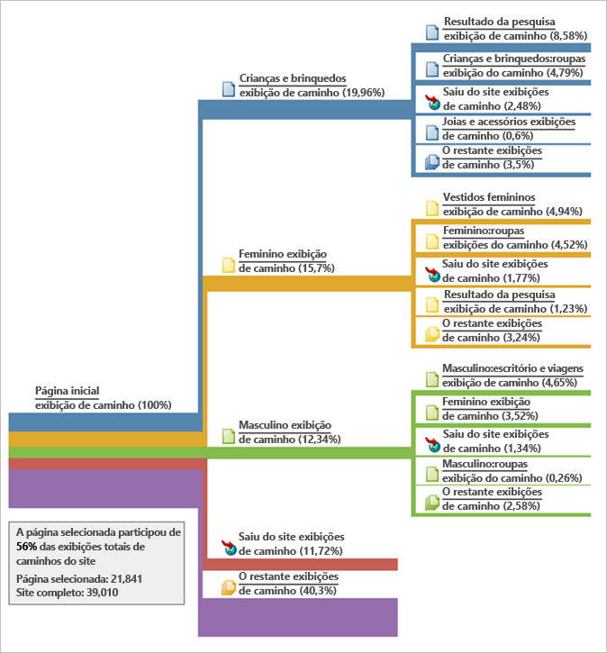

# Detalhes da página

A guia Detalhes da página exibe o Relatório de página como uma tabela e o Relatório de fluxo de página é mostrado como um relatório bow-tie (gravata borboleta).

## Page report {#section_2335A9EFE57B4A7687B397DF2098CC6B}

Este painel mostra as métricas de tráfego relacionadas à página da Web que é visitada. O Painel não será exibido se você acessar uma página da Web que não tenha a tag de página Análise implementada.

## Page Flow report {#section_D6EDE78CF7124758BF846E57ADABA234}

O lado esquerdo mostra as Páginas anteriores e os Referenciadores (externos), que podem ser ampliados como alternativa para mostrar as quatro entradas principais para cada categoria.

O lado direito mostra as quatro Próximas páginas principais e o número de saídas.

Se um URL for rastreado por alguma página interna exibida nessa seção, a página será exibida como um link. Dessa forma, é possível clicar na página e continuar até o caminho das páginas com mais afinidade. Esse relatório permite, assim, que você navegue interativamente por suas propriedades da Web com uma perspectiva de análise.

O Relatório de fluxo de página está disponível apenas no modo Padrão.

| **Fluxo de página** | **Descrição** |
|---|---|
| Referências externas | O URL de outros sites que fazem referência à página atual. |
| Páginas anteriores | Nomes da página interna no conjunto de relatórios antes da página atual. |
| Próximas páginas | A página visitada depois de sair da página atual. |
| Saídas do site | Número de visitantes que saíram do site completamente após a exibição da página. |

