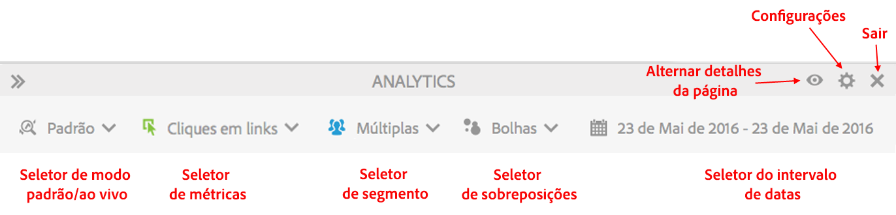
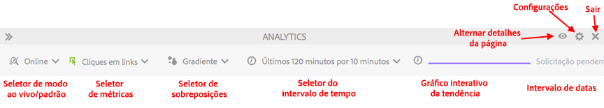

# Modo Padrão vs. modo Online

O Activity Map disponibiliza dois modos básicos para fornecer relatórios complementares da atividade principal.

* Modo Padrão, no qual os [Links na página](/help/analyze/activity-map/activitymap-links-report.md) mostram os dados do link, de um único dia a vários dias, agregados ao longo do período integral.
* O modo Online exibe as tendências de atividades em tempo real.

Os dois modos podem ser alternados, clicando no botão Modo na barra de ferramentas.

## Modo Padrão {#section_0C755F30B7EC4A13A62AB9A391AF51E6}

No **Modo padrão**, é possível selecionar o intervalo de datas na barra de ferramentas, como mostrado abaixo.

Nesse modo, métricas de Comércio que não tiverem “Participação” ativada são alocadas linearmente. Suponhamos que um usuário clique em um link “iPod mini” na tela inicial, e em seguida navegue por outras 3 páginas. Na quarta página, ele compra um iPad mini por $200. O link “iPod mini” receberá $200 de receita de participação e $50 ($200/4) de receita (receita alocada linearmente).

P: E se uma página tiver links com o mesmo nome em regiões separadas? Os links receberão crédito separadamente por estarem em diferentes regiões, mas terem o mesmo nome de link em uma página?

R: Depende de como os dados do link são agregados. No Activity Map, observamos a ID|Região do link referentes a uma certa página, para que os dados alocados sejam referentes à combinação "ID|Região do link". Nesse caso em que a região é diferente, link|região seriam distintos, e portanto qualquer receita alocada para o primeiro link|região seria diferente de toda a receita alocada referente ao segundo link. Porém, na interface do usuário do Adobe Analytics, pode-se observar somente o relatório de ID do link (em vez do relatório de Link|Região) referente a uma página específica (página detalhada por Link). Nesse outro caso, a receita seria agregada em ambas as regiões.

## Modo Online {#section_D619B77D89A840F0B1C2DEA2715A516A}

No **Modo online**, os dados do Analytics são mostrado em incrementos de 1 a 15 minutos, em uma forma de tendência. Esse modo destina-se à análise e ao acompanhamento das tendências de curto prazo na página da Web.

O modo Online responde às necessidades das empresas de publicação.  Essas empresas precisam monitorar as microtendências na popularidade do link dentro de algumas páginas principais. A capacidade de discernir com rapidez quais links estão abaixo do desempenho ou estão se tornando populares é fundamental para os negócios de publicação.

>[!IMPORTANT]
>
>Os Conjuntos de relatórios virtuais não são compatíveis com o Modo Online, somente com o Modo Padrão.

