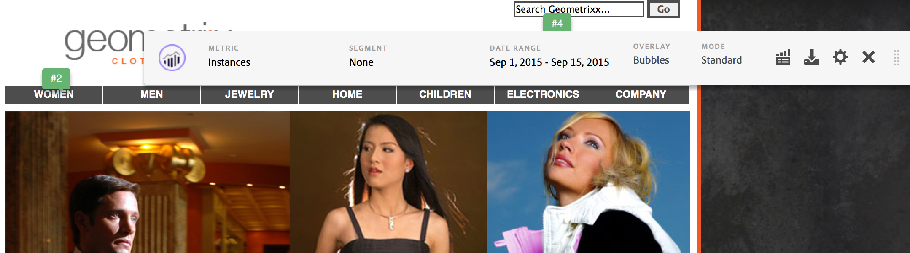
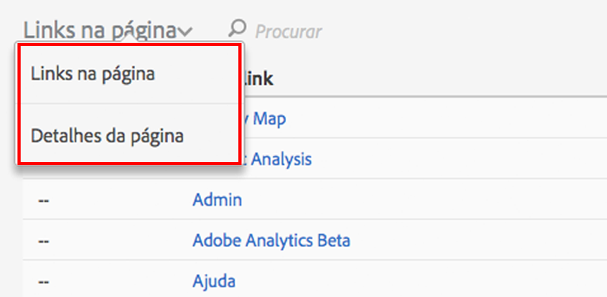

# Interface do usuário do Activity Map

A interface do usuário do Activity Map é composta de duas partes:

* A janela superior com a página da Web e as sobreposições e barra de ferramentas inseridas.
* Um painel na parte inferior para os relatórios.

## Painel superior {#section_2DA8ACD35D4C4ACBA32C13EFB5317E7C}

Na parte superior, é possível visualizar a página da Web com a [barra de ferramentas](/help/analyze/activity-map/activitymap-standard-live.md) e as [sobreposições do link](/help/analyze/activity-map/activitymap-gainerslosers.md) inseridas. As classificações em bolha são exibidas em links para permitir a identificação do número total de cliques.

Detalhes adicionais do link podem ser acessados ao passar o mouse sobre cada sobreposição do link:

## Painel de relatórios na parte inferior {#section_21B129D69B7A4F918E975E8E66DB02EE}

Na parte inferior da página, é possível visualizar os relatórios de [Links na página](/help/analyze/activity-map/activitymap-links-report.md) e [Detalhes da página](/help/analyze/activity-map/activitymap-page-flow.md), que permitem exibir um resumo de suas estatísticas de página da Web atual, bem como as informações de fluxo da página.

O Relatório de links na página fornece uma exibição em planilha dos links na página atual, incluindo as informações de clique adicionais. O Relatório de detalhes da página apresenta os dados analíticos relacionados às páginas que foram visitadas, antes e depois de navegar para a página exibida no momento.

