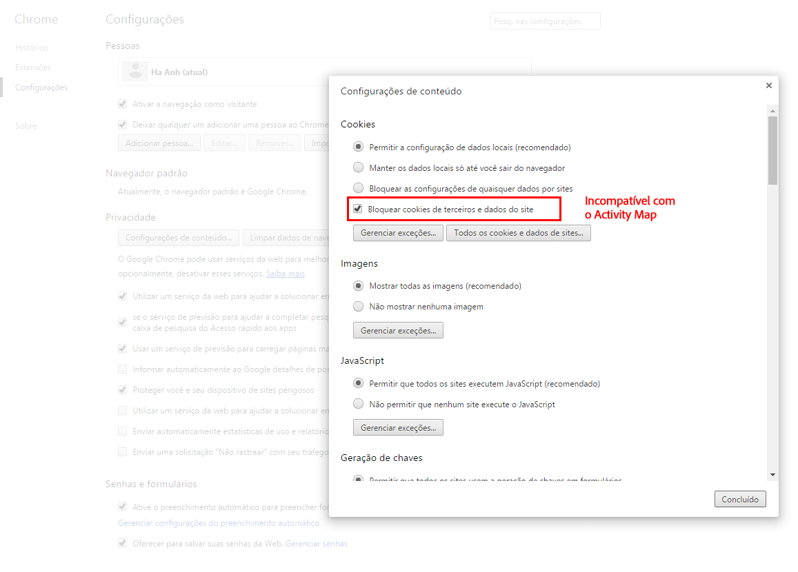

# Solução de problemas de extensões de navegador

Exibe os parâmetros do navegador que não são compatíveis com a utilização do Activity Map. Você deve desativar essas configurações.

## Chrome

## Firefox

## Safari

## Internet Explorer

