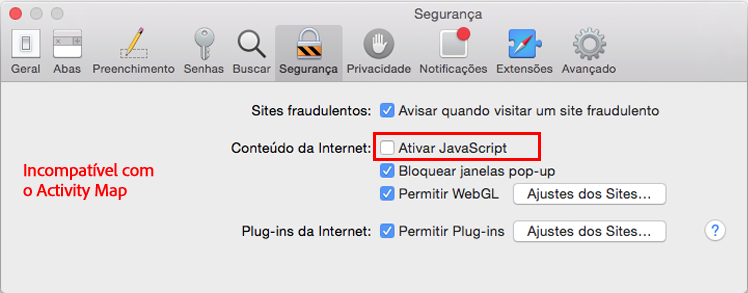
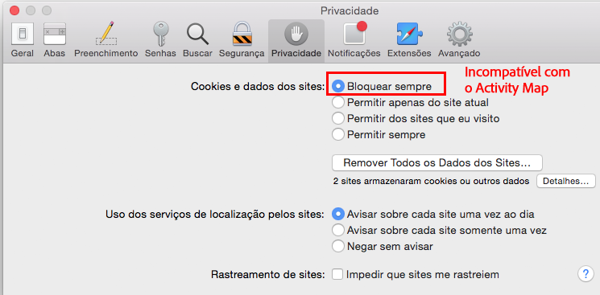

# Solução de problemas de coleta de dados do Activity Map

Se você não vir dados para dimensões de Activity Map, use esta página para ajudar a determinar por quê.

## Confirmar a coleta de dados usando o depurador

Primeiro, verifique se o AppMeasurement coleta corretamente os dados de Activity Map.

1. Baixe e instale a [Extensão Chrome do Adobe Experience Cloud Debugger](https://experienceleague.adobe.com/pt-br/docs/experience-platform/debugger/home).
2. Navegue até a página da Web e clique em um link.
3. Quando a página subsequente for carregada, abra o depurador. Confirme se você vê variáveis de dados de contexto de Activity Map agrupadas entre `activitymap.` e `.activitymap`:

## Possíveis motivos pelos quais dados de Activity Map não estão presentes

Verifique cada um dos seguintes itens para ter certeza de que os componentes de Activity Map estão presentes:

* **versão do AppMeasurement**: há suporte para Activity Map na v1.6 e posterior. Muitos problemas de caso de borda são resolvidos ao atualizar para a versão estável mais recente do AppMeasurement.
* **módulo Activity Map**: verifique se o módulo `AppMeasurement_Module_Activity_Map` está presente no arquivo `AppMeasurement.js`. Se sua implementação usar o Adobe Experience Platform para coletar dados, verifique se **[!UICONTROL Habilitar ClickMap]** está marcado ao configurar a extensão do Analytics em **[!UICONTROL Rastreamento de link]**.
* **O cookie `s_sq`**: Activity Map depende do cookie `s_sq` para a coleta de dados.
   * Verifique se a variável `cookieDomainPeriods` está definida corretamente, especialmente para domínios regionais como `*.co.uk` ou `*.co.jp`.
   * Verifique se a variável `linkInternalFilters` está definida com os valores desejados. Se um link clicado não corresponder aos filtros internos, o Activity Map o considerará um link de saída e não coletará dados.
* **sobreposição de Activity Map em execução**: o AppMeasurement não rastreia dados de cliques da sua página da Web quando a sobreposição de Activity Map está habilitada.

Exibe os parâmetros do navegador que não são compatíveis com a utilização do Activity Map. O Adobe recomenda desabilitar essas configurações.

## Chrome

## Firefox

## Safari

## Internet Explorer

**Validação**

Interaja com chamadas usando a guia Rede do Developer Console:

1. Carregue o script Development Launch no site.
1. Ao clicar em Elementos, procure por “/ee” na guia Rede

Adobe Experience Platform Debugger:

1. Baixe e instale o [Adobe Experience Platform Debugger](https://chromewebstore.google.com/detail/adobe-experience-platform/bfnnokhpnncpkdmbokanobigaccjkpob).
1. Acesse [!UICONTROL Logs] > [!UICONTROL Edge] > [!UICONTROL Conectar ao Edge].

* **A chamada interativa não está sendo acionada na guia Rede**: A coleta de dados de cliques em uma chamada de coleta, filtre com `"/ee"` ou `"collect?"`.
* **Não há Exibição de Carga para a chamada de coleta**: a chamada de coleta foi projetada de forma que o rastreamento não afete a navegação para outros sites, portanto, o recurso de descarregamento do documento é aplicável para as chamadas de coleta. Esse recurso não afetará sua coleção de dados, mas se você precisar validar na página, adicione `target="_blank"` ao respectivo elemento. O link é aberto em uma nova guia.
