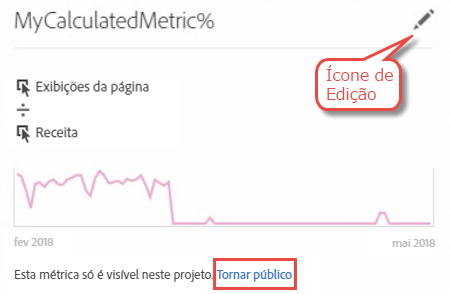

# Perguntas frequentes do Conversor de projetos

## Perguntas frequentes do Conversor de projetos {#topic_8231595303AD403E9322645A63632D57}

* [Problemas de conversão conhecidos](/help/analyze/ad-hoc-analysis/c-aha-project-converter/aha2aw-converter-faq.md#section_39C922A58B2E49C9877B363042801361)
* [Perguntas frequentes sobre conversão](/help/analyze/ad-hoc-analysis/c-aha-project-converter/aha2aw-converter-faq.md#section_1E53FE373AF045978F939916124E194E)

## Problemas de conversão conhecidos {#section_39C922A58B2E49C9877B363042801361}

| Problema | Descrição |
|--- |--- |
| Granularidade de minuto com detalhamentos ou em colunas | Quando a granularidade de minutos tem detalhamentos aplicados a ela ou se a granularidade de minutos estiver presente em colunas, o projeto não poderá ser convertido para a Analysis Workspace. Uma solução alternativa é remover o detalhamento em granularidade de minutos, removê-lo das colunas e, em seguida, converter o projeto. Em seguida, você pode aplicar detalhamentos em granularidade de minutos na Analysis Workspace. |
| Métrica calculada interna usada junto com um segmento de coluna | Se estiver usando uma métrica calculada interna junto com um segmento de coluna, o projeto não poderá ser convertido para a Analysis Workspace. Para contornar esse problema, remova as métricas calculadas internas do projeto antes da conversão e adicione-as novamente na Analysis Workspace. |

## Perguntas frequentes sobre conversão {#section_1E53FE373AF045978F939916124E194E}

<table id="table_48CC119236C94835A6A512E989BE4200"> 
 <thead> 
  <tr> 
   <th colname="col1" class="entry"> Pergunta </th> 
   <th colname="col2" class="entry"> Resposta </th> 
  </tr>
 </thead>
 <tbody> 
  <tr> 
   <td colname="col1"> 
<b>P: Há algum recurso da Ad Hoc Analysis que não seja suportado pela Analysis Workspace?</b> 
 </td> 
   <td colname="col2"> 
R: O Relatório de análise do site não é suportado pela Analysis Workspace. Além disso, há algumas pequenas diferenças entre outras visualizações na Ad Hoc Analysis e no Workspace. Consulte as perguntas abaixo para obter mais detalhes. 
 </td> 
  </tr> 
  <tr> 
   <td colname="col1"> 
<b>P: Como as configurações de tabela são convertidas?</b> 
 </td> 
   <td colname="col2"> 
    <ul id="ul_A645A004FB094A1593439A6607FE9A6B"> 
     <li id="li_033CA771F08A4BC3B0BC52CDCCA03FF4"><b>Número de linhas exibidas</b>: a Workspace é paginada para mostrar apenas 10 linhas (personalizável para exibir até 400 linhas por vez), enquanto a Ad Hoc mostra até 50.000 linhas em uma página. Observe que os dados ainda estão na Workspace, apenas paginados em um padrão de 10 linhas. </li> 
     <li id="li_A8B8890149334032A56D8D1C0F8691EA"><b>Pesquisa avançada:</b> diversas opções de pesquisa simultânea não são suportadas, mas uma única opção de pesquisa (como Todas essas palavras, A expressão exata, Qualquer uma dessas palavras ou Nenhuma dessas palavras) será convertida para a Analysis Workspace. </li> 
    </ul> </td> 
  </tr> 
  <tr> 
   <td colname="col1"> 
<b>P: Como os gráficos são convertidos?</b> 
 </td> 
   <td colname="col2"> 
R: Observe que os gráficos são chamados de “visualizações” na Workspace. 
 
    <ul id="ul_597F5AB826EF434295D0CABD0313CAD5"> 
     <li id="li_AFB2805418034721A9519D999128C0A8"><b>Configurações</b>: as configurações de visualização como “Número de itens” ou “Número de barras” não são suportadas pela Workspace. </li> 
     <li id="li_D5C7EA8815344EDB8585CBB8E1AF583E"><b>Gráfico de pizza</b>: exportado como uma visualização <a href="https://marketing.adobe.com/resources/help/pt_BR/analytics/analysis-workspace/donut.html"  >Rosca</a>. Esta visualização é limitada a 19 seções na Workspace. </li> 
     <li id="li_91659FBFD77C4B3393D78447D658B7B4"><b>Gráfico de bolhas</b>: exportado como uma visualização <a href="https://marketing.adobe.com/resources/help/pt_BR/analytics/analysis-workspace/scatterplot.html"  >Gráfico de dispersão</a>. Por padrão, o gráfico de dispersão desenha a primeira métrica no eixo x e a segunda no eixo y. Se houver apenas uma métrica, os gráficos de bolhas serão convertidos em visualizações em Linha. </li> 
     <li id="li_FA05085FFB1747EBAF63616AC2B8D59C"><b>Histograma</b>: suporta uma lógica de particionamento diferente na Workspace em comparação com a Ad Hoc Analysis. Sendo assim, é convertido em uma visualização <a href="https://marketing.adobe.com/resources/help/pt_BR/analytics/analysis-workspace/bar.html"  >Barra</a>. </li> 
     <li id="li_959499D20796459CA0F6BBC8F0A8D808"><b>Gráfico de dispersão</b>: em projetos exportados na Analysis Workspace, o eixo Y é definido como a primeira coluna, o eixo X como a segunda e o diâmetro como a terceira. </li> 
     <li id="li_14E06D7A5106405A89A07B44FFD9A92D"><b>Tabelas de fallout</b>: para mostrar tabelas de fallthrough ou de fallout, clique com o botão direito do mouse no ponto de verificação e selecione uma opção de detalhamento. </li> 
     <li id="li_240F43C386F04111A7632A8FCA37832C"><b>Intervalos de data de fallout a nível de relatório</b>: os intervalos de data de relatório personalizados ainda não foram aplicados a visualizações Fallout. </li> 
     <li id="li_1FF5B3FD9E424E7190AF03FD4DD9D654"><b>Relatório de fluxo</b>: o fluxo será movido para um painel separado para preservar intervalos de data e segmentação. </li> 
     <li id="li_BE8F8F6EC2EA49E18EF52539BC1700E0"><b>Funil de conversão</b>: será convertido em uma tabela de forma livre pois não é suportado pela Analysis Workspace. A visualização Fallout é uma substituição recomendada para o Funil de conversão, mas se comportará de maneira um pouco diferente. </li> 
    </ul> </td> 
  </tr> 
  <tr> 
   <td colname="col1"> 
<b>P: Como os segmentos são convertidos?</b> 
 </td> 
   <td colname="col2"> 
    <ul id="ul_15D5B17461E2402DB07DF8B0A10AAC37"> 
     <li id="li_CF9C3D235A664B15B21D9F89DC5EF7D3">Os segmentos são internos ao projeto convertido (não públicos). É possível escolher torná-los públicos, como mostrado abaixo: 
 
 </li> 
     <li id="li_AE61DAEC5C0047349DD192EFEEDB0BF9">Os segmentos no nível do espaço de trabalho da Ad Hoc Analysis são aplicados no nível do projeto/espaço de trabalho na Workspace. </li> 
     <li id="li_B1559E2C18724FE189AF87D0BEF16811">Os segmentos no nível de relatório da Ad Hoc Analysis são aplicados no nível de coluna de tabela na Workspace. </li> 
     <li id="li_0E6DF6D44EA448A4A212BA2BB8E342CF">Os segmentos de tabela da Ad Hoc Analysis são aplicados no nível de coluna na Workspace. </li> 
    </ul> 
É possível editar segmentos no <a href="https://marketing.adobe.com/resources/help/pt_BR/analytics/segment/"  >Construtor de segmentos</a>. 
 </td> 
  </tr> 
  <tr> 
   <td colname="col1"> 
<b>P: Como os intervalos de data são convertidos?</b> 
 </td> 
   <td colname="col2"> 
    <ul id="ul_A24AB597F3CE4847AF00D49A9A72A395"> 
     <li id="li_24FD18AF64114445939C4FBC03F2D406">Os intervalos de data do tipo “Último dia X” na Ad Hoc Analysis <i>excluem</i> hoje, enquanto na Analysis Workspace <i>incluem</i> hoje. Dessa forma, os intervalos de data como “últimos 90 dias” podem não corresponder exatamente entre as ferramentas. Use intervalos de data personalizados para recuperar o mesmo período de tempo na Analysis Workspace. </li> 
     <li id="li_AA4390470C494748B4B12030B1226720">O intervalo de datas no nível do espaço de trabalho da Ad Hoc Analysis é aplicado no nível do projeto/espaço de trabalho na Workspace. </li> 
     <li id="li_B8F0CDD413154856A315D087FEC4D418">O intervalo de datas no nível de relatório da Ad Hoc Analysis é aplicado no nível de coluna de tabela na Workspace. </li> 
    </ul> 
É possível editar os intervalos de data personalizados em Analytics &gt; Componentes &gt; Intervalos de data. 
 </td> 
  </tr> 
  <tr> 
   <td colname="col1"> 
<b>P: Como as métricas calculadas são convertidas?</b> 
 </td> 
   <td colname="col2"> 
    <ul id="ul_ADA380D5D09B4223AAE4853D4C64F679"> 
     <li id="li_010572F793F54680ABE64117DAB7E800">As métricas calculadas são internas ao projeto exportado (não públicas). É possível escolher torná-las públicas ao clicar com o botão direito do mouse na métrica e, em seguida, em Tornar pública. 
 
 </li> 
     <li id="li_930546EC8FEB432C8810FAF93556FC9A">Todos os tipos de métricas calculadas são suportadas para exportação. </li> 
     <li id="li_DFF7C6F8BB2344928D49194DA0F6EC38"><b>Tipos de alocação</b>: mesmo que a Analysis Workspace não mostre o tipo de alocação de uma métrica calculada explicitamente, a exportação cria e corresponde ao tipo de alocação que estava presente na Ad Hoc Analysis. </li> 
    </ul> 
É possível editar o tipo de alocação no <a href="https://marketing.adobe.com/resources/help/pt_BR/analytics/calcmetrics/"  >Construtor de métricas calculadas</a> ao clicar no ícone editar (lápis). 
 </td> 
  </tr> 
  <tr> 
   <td colname="col1"> 
<b>P: Como as configurações de dados globais na Ad Hoc são aplicadas a projetos convertidos?</b> 
 </td> 
   <td colname="col2"> 
As configurações de dados globais podem fazer com que o mesmo projeto exportado duas vezes se comporte de outra forma: 
 
    <ul id="ul_E3827883DD8045FAAB359D7E85E3EEFA"> 
     <li id="li_1056CA4813C44638BEB070228AE6914C"><b>Contar instâncias repetidas.</b> Qualquer configuração aplicada no momento da exportação é aplicada ao projeto exportado na Analysis Workspace. </li> 
     <li id="li_D5405E2862CF434CA82AA9DE000F4BBC"><b>Fontes de dados.</b> Na Analysis Workspace, todos os dados do Analytics são mostrados, inclusive as fontes de dados. </li> 
    </ul> </td> 
  </tr> 
  <tr> 
   <td colname="col1"> 
<b>P: Se meu projeto da Ad Hoc Analysis estiver agendado, o agendamento será convertido para a Analysis Workspace?</b> 
 </td> 
   <td colname="col2"> 
Não, os agendamentos não são convertidos. Na Analysis Workspace, abra o projeto que deseja agendar e navegue até Compartilhar &gt; Enviar arquivo agendado para definir um novo agendamento. Certifique-se de cancelar o projeto agendado na Ad Hoc Analysis. 
 </td> 
  </tr> 
  <tr> 
   <td colname="col1"> 
<b>P: Há diferenças de nomeação entre as duas ferramentas?</b> 
 </td> 
   <td colname="col2"> 
R: Sim. Consulte <a href="https://marketing.adobe.com/resources/help/pt_BR/analytics/analysis-workspace/adhocanalysis_vs_analysisworkspace.html"  >Comparação da terminologia principal</a> na documentação da Analysis Workspace. 
 </td> 
  </tr> 
 </tbody> 
</table>

