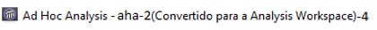
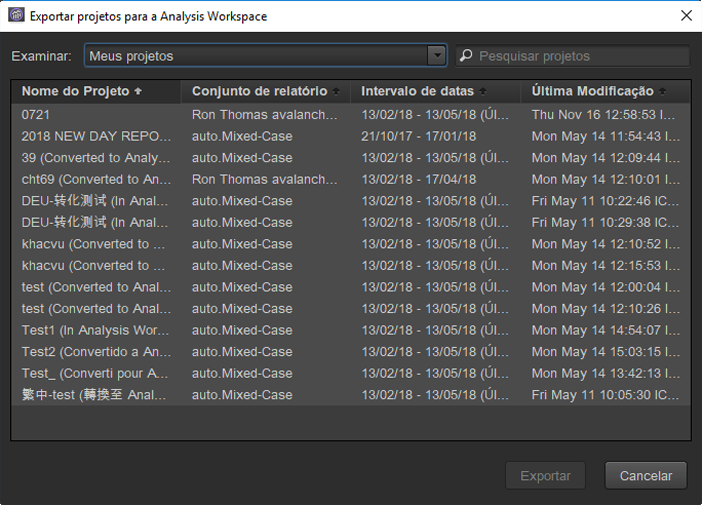
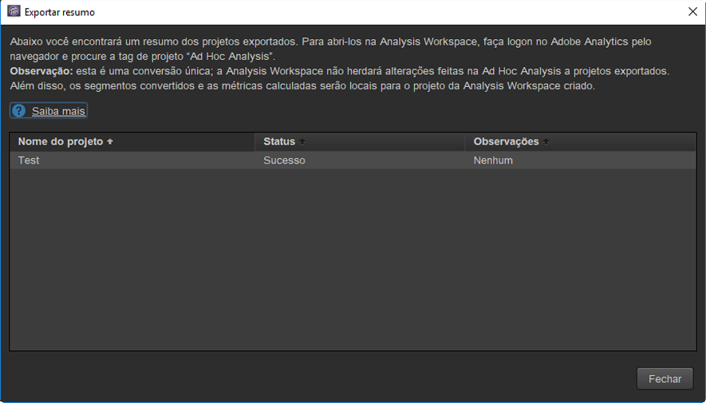
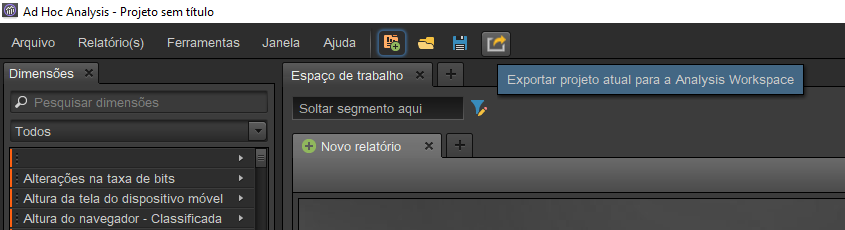

# Converter projetos na Análise ad hoc

## Convert your projects in Ad Hoc Analysis {#topic_5A55F73488704C5D8E42CDD04B5984DE}

Antes de converter seus projetos, observe o seguinte:

* Para converter projetos, é necessário ter feito logon na Ad Hoc Analysis como um administrador ou como um não administrador com permissão para usar a Analysis Workspace.
* Como é uma conversão única, qualquer alteração posterior feita nos projetos da Ad Hoc convertidos não será refletida na Analysis Workspace. Há, no entanto, a opção de converter o projeto novamente.
* Qualquer projeto convertido da Ad Hoc Analysis continuará a existir na Ad Hoc, com parênteses no título que indicam que ele foi convertido e quantas vezes. Exemplo:

   

Há 2 opções no que diz respeito à conversão de projetos da Ad Hoc Analysis:

* Selecionar projetos para conversão em uma lista.
* Converter apenas o projeto aberto no momento.

**Selecionar projetos em uma lista**

1. In Ad Hoc Analysis, click **[!UICONTROL File]** &gt; **[!UICONTROL Convert Projects to Analysis Workspace]**.

   

1. In the **[!UICONTROL Convert Projects to Analysis Workspace]** dialog, select the project to convert or press  +  to select the entire list.

   

1. Clique em **[!UICONTROL Converter]**.
1. Um [!UICONTROL Resumo de conversão] agora lista todos os projetos que foram convertidos, além de uma coluna de status que indica Sucesso ou Falha na conversão, junto com o código de erro. Entre em contato com o Atendimento ao cliente da Adobe para obter um diagnóstico com "`Error-Id: <Error-Code>`".

   

**Converter projeto atual**

1. Na Ad Hoc Analysis, abra um projeto que deseje converter.
1. Clique em **[!UICONTROL Converter projeto atual para a Analysis Workspace.]** 

1. Um [!UICONTROL Resumo de conversão] agora lista todos os projetos que foram convertidos, além de uma coluna de status que indica Sucesso ou Falha na conversão, junto com o código de erro. Entre em contato com o Atendimento ao cliente da Adobe para obter um diagnóstico com "`Error-Id: <Error-Code>`".
