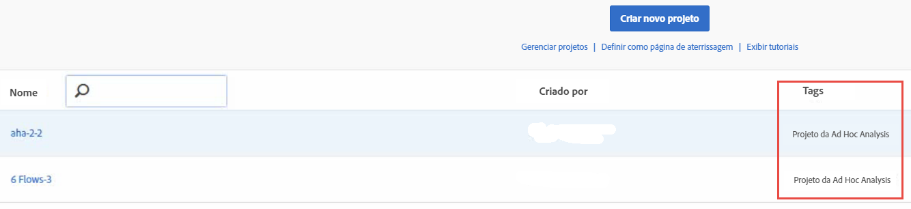

# Exibir projetos convertidos na Analysis Workspace

Antes de exibir seus projetos na Workspace, consulte as [Perguntas frequentes](../../../analyze/ad-hoc-analysis/c-aha-project-converter/aha2aw-converter-faq.md#topic_8231595303AD403E9322645A63632D57) e revise as [diferenças na terminologia](../../../analyze/ad-hoc-analysis/c-aha-project-converter/aha2aw-converter-faq.md#topic_8231595303AD403E9322645A63632D57) entre a Ad Hoc Analysis e a Workspace.

1. Navigate to **[!UICONTROL Analytics]** &gt; **[!UICONTROL Workspace]**. Observe que os projetos convertidos da Ad Hoc Analysis são marcados como “Projeto da Ad Hoc Analysis”.

   

1. Clique no nome do projeto para exibí-lo.
1. Faça alterações posteriores no projeto, se desejar. Observe que essas alterações não serão refletidas na Ad Hoc Analysis.

