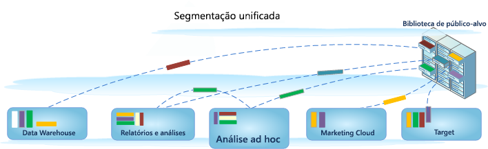

# Construir segmentos

A Análise ad hoc é integrada ao ambiente de Segmentação do Analytics, permitindo que você crie, compartilhe, gerencie e aplique segmentos de visitantes nos produtos da Adobe. A Análise ad hoc oferece uma interface de usuário baseada em Java para o Construtor de segmentos e o Gerenciador de segmentos idêntica às ferramentas baseadas na Web usadas por outras ferramentas do Analytics, correspondendo às chamadas do servidor e fornecendo os mesmos recursos e funcionalidades de um console baseado em Java.

A Ad Hoc Analysis inclui recursos já conhecidos para a criação de segmentos e novas atualizações de recursos, como o [Gerenciador de segmentos](https://marketing.adobe.com/resources/help/en_US/analytics/segment/seg_manage.html), usado para configurar um [fluxo de trabalho](https://marketing.adobe.com/resources/help/en_US/analytics/segment/seg_workflow.html) do gerenciamento de segmentos. Como sempre, você pode criar e salvar segmentos no [Construtor de segmentos](https://marketing.adobe.com/resources/help/en_US/analytics/segment/seg_build.html) ou [gerar segmentos a partir de um relatório de Fallout](https://marketing.adobe.com/resources/help/en_US/analytics/segment/t_seg_fallout.html) do console de Ad Hoc Analysis e depois salvar os segmentos novos ou estendidos na biblioteca de público-alvo para aplicativos e acessos gerais. 

## Segmentação Unificada na Ad Hoc Analysis {#section_5FA03A06DE054448AD519CE30C39E294}

Para obter informações e instruções sobre como criar e gerenciar segmentos no ambiente de Segmentação Unificada, incluindo recursos da análise ad hoc, consulte a documentação da [Segmentação Unificada](https://marketing.adobe.com/resources/help/en_US/analytics/segment/index.html).

* [Novos recursos](/help/analyze/ad-hoc-analysis/c-content-ref.md#section_BD58629D1A9346BF879E229FA6BEC7A2)
* [Mudanças na definição dos segmentos](https://marketing.adobe.com/resources/help/en_US/analytics/segment/seg_definition.html)
* [O que aconteceu com meus segmentos existentes?](/help/analyze/ad-hoc-analysis/c-content-ref.md#section_76CF47142D1A4FB6A0718AD9073049FE)
* [O que aconteceu com as pastas de segmentos existentes?](/help/analyze/ad-hoc-analysis/c-content-ref.md#section_FB04DCF775694E69B761DCA53F301C30)
* [Posso gerenciar todos os segmentos do Analytics no Gerenciador de segmentos?](/help/analyze/ad-hoc-analysis/c-content-ref.md#section_AF5EDD72C74A4739BD40C4AF125CE489)
* [O que é um Contêiner de ocorrências? Ele é diferente de um Contêiner de exibições da página?](/help/analyze/ad-hoc-analysis/c-content-ref.md#section_65BBE60A836C4001938830DDA15DC256)
* [Quais direitos e privilégios são necessários para que eu possa usar, criar e gerenciar segmentos?](/help/analyze/ad-hoc-analysis/c-content-ref.md#section_648DFA3A882146C485A84ED014EEC707)
* [O que devo fazer com segmentos duplicados que têm o...](/help/analyze/ad-hoc-analysis/c-content-ref.md#section_E2C3A1B4B4274D1B86CAA9C0359D049C)
* [Como a Adobe recomenda que eu limpe os segmentos?](/help/analyze/ad-hoc-analysis/c-content-ref.md#section_3AC2D265F9084557A24C6FB39DC6EE49)
* [Por que não posso excluir esse segmento?](/help/analyze/ad-hoc-analysis/c-content-ref.md#section_0FEB6711031A4ABCA915CDA745ECF38D)
* [Mais informações sobre o que acontece com os segmentos existentes](/help/analyze/ad-hoc-analysis/c-content-ref.md#section_83ACAB256F394DCD8B424D8920BDD853)

## Recursos {#section_BD58629D1A9346BF879E229FA6BEC7A2}

* Os [segmentos](https://marketing.adobe.com/resources/help/en_US/analytics/segment/seg_overview.html) são universais para todos os conjuntos de relatórios. Anteriormente, os segmentos eram específicos ao conjunto de relatórios.
* O [Gerenciador de segmentos](https://marketing.adobe.com/resources/help/en_US/analytics/segment/seg_manage.html) permite que você configure [fluxos de trabalho](https://marketing.adobe.com/resources/help/en_US/analytics/segment/seg_workflow.html) com verificação, marcação, compartilhamento de segmentos e recursos de aprovação.

* O [Construtor de segmentos](https://marketing.adobe.com/resources/help/en_US/analytics/segment/seg_build_ui.html) foi atualizado para simplificar a criação de segmentos.
* Você pode [adicionar tags a segmentos](https://marketing.adobe.com/resources/help/en_US/analytics/segment/seg_tag.html) para organizar e pesquisar depois, em vez de usar pastas. Anteriormente, as pastas eram usadas (na [!DNL ad hoc analysis]) para organizar os segmentos.

* Você pode criar [Segmentos sequenciais](https://marketing.adobe.com/resources/help/en_US/analytics/segment/seg_sequential.html) fora da Ad Hoc Analysis.
* 

>[!NOTE]
>
>Na Análise ad hoc, não é possível adicionar intervalos de datas a segmentos. Esse recurso está disponível na Analysis Workspace. Além disso, não é possível usar a sequência Somente Antes/Somente depois na Ad Hoc Analysis.

## O que aconteceu com meus segmentos existentes? {#section_76CF47142D1A4FB6A0718AD9073049FE}

Seus segmentos existentes continuarão a funcionar da mesma maneira que faziam antes da introdução da Segmentação do Analytics. Todos os relatórios com esses segmentos aplicados continuarão funcionando da forma correta.

Os segmentos do conjunto e os pré-definidos mais antigos serão migrados como [modelos de segmentos](https://marketing.adobe.com/resources/help/en_US/analytics/segment/seg_templates.html) no construtor de segmentos. Os modelos de segmentos são usados para criar rapidamente segmentos personalizados com públicos comuns. Os modelos de segmentos não podem se aplicados diretamente em um relatório, mas podem ser salvos em um segmento personalizado de forma fácil.

## O que aconteceu com as pastas de segmentos existentes? {#section_FB04DCF775694E69B761DCA53F301C30}

Em vez de pastas (Ad Hoc Analysis), o Gerenciador de segmentos usa [tags](https://marketing.adobe.com/resources/help/en_US/analytics/segment/seg_tag.html). Os nomes das pastas são convertidos automaticamente em tags, que são aplicadas aos respectivos segmentos.

## Posso gerenciar todos os segmentos do Analytics no Gerenciador de segmentos? {#section_AF5EDD72C74A4739BD40C4AF125CE489}

No Gerenciador de segmentos da Ad Hoc Analysis, é possível visualizar somente os seus segmentos (ou seja, aqueles criados por você) e os segmentos que foram compartilhados especificamente com você.

## O que é um Contêiner de ocorrência? Ele é diferente de um Contêiner de exibições da página? {#section_65BBE60A836C4001938830DDA15DC256}

O contêiner de Visualização de página foi renomeado para contêiner de Ocorrência para indicar que esse contêiner segmenta todos os tipos de dados e não apenas visualizações de página. Por exemplo, chamadas de rastreamento de links e chamadas [!DNL trackAction] de SDKs móveis são todas incluídas ou excluídas pelo contêiner de ocorrências.

Observe que não ocorreu uma alteração na forma como esse contêiner funciona; ele foi apenas renomeado.

## Quais direitos e privilégios são necessários para que eu possa usar, criar e gerenciar segmentos? {#section_648DFA3A882146C485A84ED014EEC707}

Todos os usuários podem criar e editar segmentos pessoais. Esses segmentos podem ser compartilhados diretamente com qualquer outro usuário do Analytics.

Os administradores podem editar e [compartilhar segmentos](https://marketing.adobe.com/resources/help/en_US/analytics/segment/t_seg_share.html) com grupos e [definir os direitos](https://marketing.adobe.com/resources/help/en_US/analytics/segment/seg_rights.html) de acesso da organização aos segmentos.

## O que devo fazer com segmentos duplicados que possuem o mesmo nome, mas podem ter definições diferentes? {#section_E2C3A1B4B4274D1B86CAA9C0359D049C}

Uma vez que os segmentos funcionam em vários conjuntos de relatórios, você pode acabar descobrindo que possui vários segmentos com o mesmo nome. Recomendamos que você

* Renomeie os segmentos com o mesmo nome, mas com diferentes definições, ou
* Exclua os segmentos que não são mais necessários.

## Como a Adobe recomenda que eu limpe os segmentos? {#section_3AC2D265F9084557A24C6FB39DC6EE49}

* Marque todos os segmentos com uma tag legada.
* Analise todos os seus segmentos.
* Quando apropriado, adicione-os à biblioteca de segmentos.
* Aprove os segmentos canônicos.
* Marque os segmentos de acordo com as práticas recomendadas.

## Por que não posso excluir esse segmento? {#section_0FEB6711031A4ABCA915CDA745ECF38D}

Se o segmento foi [publicado na Experience Cloud](https://marketing.adobe.com/resources/help/en_US/mcloud/t_publish_audience_segment.html), você não pode excluí-lo ou editá-lo. Entretanto, é possível copiá-lo e editar a versão copiada.

## Mais informações sobre o que acontece com os segmentos existentes {#section_83ACAB256F394DCD8B424D8920BDD853}

<table id="table_0AE814A64D2A48ABB28402C4303F420E"> 
 <thead> 
  <tr> 
   <th colname="col1" class="entry"> Categoria de segmentos </th> 
   <th colname="col2" class="entry"> O que acontece com esses segmentos? </th> 
  </tr> 
 </thead>
 <tbody> 
  <tr> 
   <td colname="col1"> Segmentos favoritos (Ad Hoc Analysis) </td> 
   <td colname="col2">Esses segmentos da análise ad hoc são exibidos como segmentos regulares no Adobe Analytics. 
Eles não devem ser confundidos com o recurso Favoritos no Gerenciador de segmentos, que permite que você marque os segmentos como favoritos. 
 </td> 
  </tr> 
  <tr> 
   <td colname="col1">Segmentos pré-configurados: 
    <ul id="ul_BBF3C3F4D41A40AF98DA9DA6D299AD03"> 
     <li id="li_B65A004BDF8743FDABCD3332AEB8A010">Visitas únicas à página </li> 
     <li id="li_908CF5F964154C9D9EBBAC2A900DCB49">Visitas de dispositivos móveis </li> 
     <li id="li_4A715F49AA374463B501D731261A3A4C">Visitas da pesquisa natural </li> 
     <li id="li_67CE51237EC34FD4B33942BA14584EBF">Visitantes da pesquisa paga </li> 
     <li id="li_C3820743178A4E9F9E5E5B5C47401DF2">Visitantes com cookie de ID do visitante </li> 
    </ul> </td> 
   <td colname="col2"> 
Esses segmentos serão migrados como <a href="https://marketing.adobe.com/resources/help/en_US/analytics/segment/seg_templates.html"  >modelos de segmentos</a> no construtor de segmentos. 
 
Os relatórios com esses segmentos aplicados continuarão funcionando da forma correta. 
 </td> 
  </tr> 
  <tr> 
   <td colname="col1">Segmentos da Experience Cloud (Suite): 
    <ul id="ul_6968AFF6DEDA4BC8A7885B07CC1F57DF"> 
     <li id="li_073D9496F0C64AEB855855D01E65C1BA">Não compradores </li> 
     <li id="li_8958FD4272A14E16A9AA08216E8BC573">Compradores </li> 
     <li id="li_1436D7C9651D4AC38E10662DEDDD2B95">Novas visitas </li> 
     <li id="li_69F42B4F6107407792B0014804A8AF7B">Visitas de sites sociais </li> 
     <li id="li_29CA111186BE475C943E9F8450BDE8C8">Visitas de mais de 10 minutos* </li> 
     <li id="li_1FEF207959DC4D2E9FC925DD43177AA0">Visitas com mais de cinco visitas anteriores* </li> 
     <li id="li_219AB1D4FD7E469C9076A23D2CCC7C2C">Visitas do Facebook* </li> 
    </ul> </td> 
   <td colname="col2"> 
 A maioria desses segmentos (exceto os marcados com um asterisco *) serão transferidos como  <a href="https://marketing.adobe.com/resources/help/en_US/analytics/segment/seg_templates.html"  >modelos de segmento no construtor de segmentos. </a> Além disso, vários novos modelos de segmento foram adicionados. 
 
Os relatórios com esses segmentos aplicados continuarão funcionando da forma correta. 
 </td> 
  </tr> 
  <tr> 
   <td colname="col1">Segmentos do administrador 
(também conhecidos como segmentos "Globais") 
 </td> 
   <td colname="col2"> 
 Os segmentos do <b>administrador</b> serão migrados na nova interface de segmentos e serão exibidos como segmentos compartilhados com todos. 
 
O proprietário desses segmentos está definido como o administrador com a conta mais antiga na lista de usuários administradores da empresa de logon, no entanto, todos os Administradores podem excluir, editar e compartilhar esses segmentos. 
 
A interface de gerenciamento de segmento no Admin Console, onde os administradores criaram e gerenciaram esses segmentos globais, não está mais disponível. Agora, os administradores devem usar o novo construtor de segmentos para criar segmentos e compartilhá-los com os indivíduos ou grupos apropriados ou com todo mundo. 
 </td> 
  </tr> 
 </tbody> 
</table>

