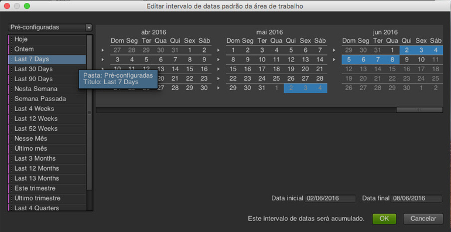

# Datas e intervalos de datas

No calendário, você pode especificar datas e intervalos de datas ou selecionar uma predefinição. É possível fazer seleções no calendário em níveis de projeto, espaço de trabalho e relatório. O intervalo de datas de um projeto é a data padrão. No entanto, um intervalo de datas de um espaço de trabalho sobrescreve o intervalo de datas do projeto. Da mesma maneira, um intervalo de datas de um relatório sobrescreve as configurações de data de um espaço de trabalho ou projeto. Não é possível selecionar um intervalo de datas fora do seu intervalo de disponibilidade de dados.

## Datas e intervalos de datas {#concept_AB32765013F449908B5964AB622C75FF}

No calendário, você pode especificar datas e intervalos de datas ou selecionar uma predefinição. É possível fazer seleções no calendário em níveis de projeto, espaço de trabalho e relatório. O intervalo de datas de um projeto é a data padrão. No entanto, um intervalo de datas de um espaço de trabalho sobrescreve o intervalo de datas do projeto. Da mesma maneira, um intervalo de datas de um relatório sobrescreve as configurações de data de um espaço de trabalho ou projeto. Não é possível selecionar um intervalo de datas fora do seu intervalo de disponibilidade de dados.

Uma opção ativada **[!UICONTROL Limpar Data]** indica que um intervalo de datas é especificado no nível de relatório.

Também é possível arrastar datas (e dimensões de tempo) no relatório ou no [!UICONTROL Construtor de Tabelas]. É possível selecionar dias, semanas, meses e anos específicos ou uma data do acumulado. Se você usa o calendário personalizado em relatórios e análises de marketing, um conjunto de relatórios herda essas configurações e atualiza o relatório de acordo.

Ao selecionar um intervalo de datas durante a criação de um projeto, usar a opção Pré-configurado à esquerda definirá a data atual, enquanto o uso do calendário à direita não. Uma maneira fácil de saber se o intervalo de datas está atualizado é a afirmação “Este intervalo de datas será atualizado” ao lado do botão **[!UICONTROL OK]**.

> [!NOTE] Se precisar de ajuda para executar relatórios herdados, entre em contato com o Gerente de contas.

## Frações de data herdadas {#concept_53AA34DB3CE647608CAF4B41D6EAF45E}

Na segunda metade de 2010, a Adobe começou a migração de conjuntos de relatórios para uma plataforma de dados unificada para melhorar o processamento e o armazenamento. Os dados existentes antes da migração são considerados dados herdados (ou históricos) que são restritos a um calendário trimestral ou anual.

<!-- 

c_legacy_data.xml

 -->

**Para acessar as frações de data herdadas**

1. [Criar](/help/analyze/ad-hoc-analysis/c-getting-started.md) ou abrir um projeto.
1. Abra o [calendário](/help/analyze/ad-hoc-analysis/c-dates.md) e selecione **[!UICONTROL Trimestral]** ou **[!UICONTROL Anual]**.

> [!NOTE] As frações de datas históricas permanecem restritas a trimestral ou anual. Não é possível visualizar dados que ultrapassam os limites entre as frações herdadas e a nova plataforma de processamento. As variações de datas podem deixar os dois resultados com erro. Além disso, as variações de data são aplicáveis apenas ao calendário Gregoriano e não ao calendário personalizado.

