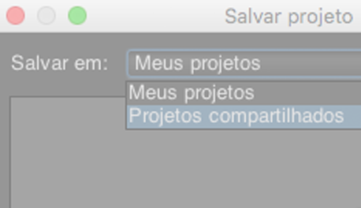

# Introdução à Ad Hoc Analysis {#concept_48936BA28FAE42DB81F1B2CD4726EB17}

>[!IImportante]
>Em 6 de agosto de 2018, a Adobe anunciou a intenção de encerrar a vida útil da Ad Hoc Analysis. Uma data para o fim da vida útil será compartilhada assim que estiver disponível. Para obter mais informações, incluindo quais versões do Java serão compatíveis durante esse período, visite [https://adobe.ly/discoverworkspace](https://adobe.ly/discoverworkspace).

Você pode executar análise instantânea e avançada na atividade do site. Você pode visualização vários relatórios simultaneamente e aplicar segmentos em várias dimensões. Você pode analisar os dados das perspectivas micro e macro para visualização do impacto sobre suas métricas de negócios importantes.

Esses recursos permitem que você responda perguntas sobre tráfego do site, demografia do visitante, receita e movimentação do produto. Você pode filtrar, classificar e segmentar seus dados para encontrar as respostas para perguntas precisas. Os resultados são retornados quase instantaneamente, permitindo que você analise rapidamente os efeitos de uma combinação de fatores.

<table id="table_C9C0444687FC418580F996E1D2ADB61A"> 
 <thead> 
  <tr> 
   <th colname="col1" class="entry"> Introdução às Tarefas </th> 
   <th colname="col2" class="entry"> Descrição </th> 
  </tr> 
 </thead>
 <tbody> 
  <tr> 
   <td colname="col1"> 
1. Faça logon no Adobe Analytics. 
 </td> 
   <td colname="col2"> 
Acesse <a href="https://marketing.adobe.com"  >marketing.adobe.com</a> e faça logon usando suas credenciais do Adobe Analytics. 
 </td> 
  </tr> 
  <tr> 
   <td colname="col1"> 
2. Inicie a Ad Hoc Analysis. 
 </td> 
   <td colname="col2">Clique em Adobe Analytics &gt; Ferramentas &gt; Ad Hoc Analysis e, em seguida, clique no botão Iniciar Ad Hoc Analysis. 
 
Observação: se você não visualizar o botão <b>Iniciar Ad Hoc Analysis</b> nessa página, verifique se o administrador adicionou você ao grupo de <i>Usuário da licença da Ad Hoc Analysis</i> nas Ferramentas administrativas. 
 
 </td> 
  </tr> 
  <tr> 
   <td colname="col1"> 
3. Crie um projeto. 
 </td> 
   <td colname="col2"> 
Na página de início, selecione um conjunto de relatórios e depois clique em Criar projeto. 
 
Consulte <a href="/help/analyze/ad-hoc-analysis/c-getting-started.md"   > Projetos e espaços de trabalho</a>. 
 </td> 
  </tr> 
  <tr> 
   <td colname="col1"> 
4. Abra um relatório. 
 </td> 
   <td colname="col2"> 
Procure um relatório usando o menu de relatório padrão da Cloud. Você também pode escolher um modelo. 
 
Consulte <a href="/help/analyze/ad-hoc-analysis/c-getting-started.md"   > Modelos</a>de relatório. 
 </td> 
  </tr> 
  <tr> 
   <td colname="col1"> 
5. Configure o relatório. 
 </td> 
   <td colname="col2"> 
Configure relatórios executando tarefas, como: 
 
    <ul id="ul_0D2E8C614F2A4899A376BCEECEA374C6"> 
     <li id="li_FA925D52A8FD4DFAB0C88B797B24E72B"> Criar segmentos para pesquisar mais a fundo nos dados </li> 
     <li id="li_5E91632551D2473BA8BD0637CDC1A9F6"> Adição de métricas, dimensões e segmentos à  <a href="/help/analyze/ad-hoc-analysis/c-tablebuilder.md"   > Criador de tabela</a> </li> 
     <li id="li_019316C9A94B4A8C8A77D07C04E50278">Configuração <a href="/help/analyze/ad-hoc-analysis/c-dates.md"   > de intervalos de datas</a> </li> 
     <li id="li_2B33B325D5EE420AB412B73AD1D231C5"> <a href="/help/analyze/ad-hoc-analysis/c-schedule.md"   > Programação</a> de entrega de relatório </li> 
    </ul> 
Busque no sistema de ajuda para localizar a assistência que necessita. 
 </td> 
  </tr> 
 </tbody> 
</table>

## Recomendações do sistema {#concept_6691331B45174290BD9B839806A9B52D}

Embora os relatórios devam funcionar adequadamente com os navegadores da Web mais populares, eles parecem e funcionam melhor em sistemas que atendem a algumas recomendações.

<!-- 

c_sys_reqs.xml

 -->

>[!NOTE]A partir de julho de 2018, a Ad Hoc Analysis oferecerá suporte somente ao Java 8 ou superior. Se você optar por executar a Ad Hoc Analysis no Java 7 após a versão de manutenção de julho de 2018, a Adobe deixará de oferecer suporte a sua implementação da Ad Hoc Analysis.

* Placa de vídeo compatível com OpenGL 2.0
* Cookies: Obrigatório
* Sistema operacional: Windows e Mac OS.
* Macromedia Flash Player: versão 6 ou posterior
* Resolução do monitor: 800 x 600 (1024 x 768 recomendado)
* Profundidade de cor: 16 bits ou maior
* JavaScript: Ativado
* Versão do Java: Java 1.7 ou posterior (consulte a observação acima)

   Se você não tiver a versão correta do Java instalada, ela será instalada para você. Se você tiver uma versão incompatível do Java instalada, a Análise ad hoc baixará e solicitará que você instale as atualizações.

## Instruções de atualização do Java  {#section_E4C0C6492FF24636A0FF71A59331111D}

A partir de julho de 2018, a Ad Hoc Analysis oferecerá suporte somente ao Java 8 ou superior. Se você optar por executar a Ad Hoc Analysis no Java 7 após a versão de manutenção de julho de 2018, a Adobe deixará de oferecer suporte a sua implementação da Ad Hoc Analysis.

Nossos arquivos .jar são assinados com uma criptografia segura de 256 bits que não é suportada pelas versões Java anteriores à 1.7.0_76. Esse certificado de 256 bits nos permite oferecer segurança aprimorada.

Se você ainda possuir o Java 7 instalado, faça a atualização antes da versão de manutenção de julho de 2018. Veja como:

* Se você tiver permissão para instalar programas em sua máquina:

   1. Acesse https://www.java.com.
   1. Clique em **[!UICONTROL Free Java Download]**.
   1. Clique em **[!UICONTROL Agree and Start Free Download]**.
   1. Instale a versão mais recente do Java específica para o seu sistema operacional.

* Se você **não** tiver permissão para instalar programas em sua máquina:

   1. Trabalhe com seu departamento de TI para obter a versão mais recente do Java instalada.

## Iniciar Ad Hoc Analysis {#concept_B1CE3C1E6D1A4311B9835BEB69812E55}

<!-- 

c_login.xml

 -->

Você pode fazer logon pela [!DNL Experience Cloud] ou por um URL. Se você fizer logon pelo Relatórios e análises, estará conectado automaticamente. Fazer logon usando um URL é necessário somente se você acessar o URL da análise ad hoc de outro local, como um link ou um menu de favoritos.

## Fazer logon pela Experience Cloud {#task_128ED319F3AE49ED886EA3DFA8D0987F}

Etapas que descrevem como fazer logon pela [!DNL Experience Cloud].

<!-- 

t_login_suite.xml

 -->

1. Em um navegador, navegue para [!DNL marketing.adobe.com].
1. Type your company name, your username, and your password. Then click **[!UICONTROL Sign In]**.
1. Clique em **[!UICONTROL Adobe Analytics]** > **[!UICONTROL Tools]** > **[!UICONTROL Ad Hoc Analysis]**.

   Se você não visualizar o botão **Iniciar Ad Hoc Analysis** nessa página, verifique se o administrador adicionou você ao grupo de *Usuário da licença de Ad Hoc Analysis* nas Ferramentas administrativas.
1. Clique em **[!UICONTROL Launch Ad Hoc Analysis]**.
1. Salve o arquivo [!DNL discover.jnlp] localmente.

   Você pode executar esse arquivo salvo quando quiser iniciar a Ad Hoc Analysis.

## Projetos e espaços de trabalho {#concept_FAE346335B0347A192C6C806C775D72B}

Um projeto define o conjunto de dados importado, incluindo um conjunto de relatórios e um intervalo de datas. Um projeto consiste em qualquer número de relatórios com todas as métricas, configurações, dimensões e segmentos. Você pode iniciar um novo projeto, carregar um projeto salvo ou carregar o projeto que salva automaticamente.

<!-- 

c_projects.xml

 -->

Você agrupa relatórios em um *espaço de trabalho*. Um projeto pode conter vários espaços de trabalho e um espaço de trabalho pode conter vários relatórios. A relação entre esses itens é melhor entendida como uma relação aninhada:

Você pode abrir apenas um projeto por vez. No entanto, você pode abrir vários espaços de trabalho em um projeto. Em cada espaço de trabalho, você pode ter vários relatórios abertos.

O intervalo de datas padrão para um novo projeto é [!UICONTROL Last 90 Days].

## Inicie um projeto {#task_918A4539134E4E62B00486DCB8D3D403}

Etapas que descrevem como iniciar um projeto.

<!-- 

t_project_start.xml

 -->

1. Fazer Logon.
1. Open a saved project or click **[!UICONTROL Create Project]**.
1. Pesquise por um relatório ou escolha um modelo.

## Abra um espaço de trabalho recentemente salvo {#task_DE4A54180BC24E9DAEC98E2171DC6B40}

Etapas que descrevem como abrir espaços de trabalho salvos recentemente.

<!-- 

t_recent_workspace.xml

 -->

1. Clique em **[!UICONTROL File]** > **[!UICONTROL Recent Workspace]**.

   É possível abrir até cinco espaços de trabalho recentes. Espaços de trabalho recentes não estão disponíveis após sair da sessão.

## Compartilhamento de projetos {#task_5911780D90164F3A8A677C8BC719750D}

Os projetos compartilhados estarão disponíveis para todos os usuários da Ad Hoc Analysis na empresa.

<!-- 

t_share_projects.xml

 -->

1. Vá para **[!UICONTROL File]** > **[!UICONTROL Save As]**.
1. Selecione **[!UICONTROL Shared Projects]** no menu **[!UICONTROL Save in:]** suspenso.

   

1. Click **[!UICONTROL Save]** to save the project.

   Os projetos compartilhados podem ser abertos via **[!UICONTROL File]** > **[!UICONTROL Open]** > **[!UICONTROL Shared Projects]**.

   >[!NOTE]
   >
   >É possível excluir seus próprios projetos compartilhados na mesma caixa de diálogo dos projetos de compartilhamento, selecionando um ou mais projetos.

## Renomear um espaço de trabalho {#task_0DB177DD6DB54B7F9FE60A0B3FC7CFC3}

Etapas que descrevem como renomear um espaço de trabalho.

<!-- 

t_rename_workspace.xml

 -->

1. Clicar com o botão da direita no nome do espaço de trabalho.
1. Escolher **[!UICONTROL Rename Workspace]**.
1. Escreva um nome e clique em **[!UICONTROL OK]**.

## Abrir um projeto local {#task_1B3EF63A80C74776B24B99D80EAC74AC}

Etapas que descrevem como abrir uma cópia local de um projeto.

<!-- 

t_open_local_project.xml

 -->

1. Clique em **[!UICONTROL File]** > **[!UICONTROL Open Local Copy]**.
1. Navigate to the local [!DNL .dproj] file, then click **[!UICONTROL Open]**.

## Modelos de Relatório {#concept_370F674C5B4C45368731AA801C5A45F8}

Os modelos são pontos de partida para o tipo de análise que você deseja executar. Um modelo pode ser uma tela em branco, como um relatório Classificado ou de Fallout. Ou o modelo é um relatório que start com métricas e dimensões padrão.

<!-- 

c_templates.xml

 -->

You can access templates when creating a project ( **[!UICONTROL File]** > **[!UICONTROL New Project]**), or by adding a workspace or report.

| Modelo | Descrição |
|--- |--- |
| Classificado | Fornece uma tela em branco onde é possível construir uma tabela. Por exemplo, um relatório de Páginas classifica as páginas do site com base no tráfego. A tabela de detalhes mostra os percentuais e os números de métricas como Exibições de página e Receita. |
| De tendência | Permite examinar como as conversões e os eventos tendem ao longo de uma granularidade de tempo selecionada (Hora, Dia, Semana, Mês, Trimestre ou Ano) durante um período de relatórios. |
| Totais | Um relatório de nível executivo que mostra os números de base. Ele contém dados para Receita total, Visualizações de página e Pedidos. |
| Fallout | Permite que você construa um funil que exibe as taxas de conversão e fallout entre os pontos de verificação. Por exemplo, você pode rastrear pontos de fallout de um visitante durante um processo de compra. |
| Fluxo | Mostra os caminhos mais comuns que os usuários tomam em páginas, seções de sites e servidores. |
| Funil de conversão | Mostra as porcentagens de conversão entre eventos de métrica específicos. Você pode usar esse relatório para entender o número de click-throughs que geram vendas e o número de unidades vendidas. |
| Análise do site | Uma ferramenta tridimensional de definição de caminho de site que exibe como os visitantes se movem por páginas e eventos especificados. |
| Grupo de foco virtual | Realiza uma visita aleatória a partir de suas visitas e mostra uma grande quantidade de dados sobre a visita. Você pode usar o relatório para criar grupos de foco da sua população de visitantes. |

## Execute um relatório. {#task_0AC455CDA198497AA546622FB05F300D}

Você pode abrir um relatório ou modelo ao criar um projeto, ou de dentro de um projeto existente. Use um modelo para configurar um relatório do zero.

<!-- 

t_reports_opening.xml

 -->

Várias maneiras estão disponíveis para abrir um relatório:

* Na [!UICONTROL New Report] página, procure um relatório ou escolha um modelo.
* Clique **[!UICONTROL Reports]** no menu e selecione um relatório ou modelo de relatório.
* Launch a report from a dimension: right-click a dimension name, then select **[!UICONTROL Run Report]** > **`report name`**.
