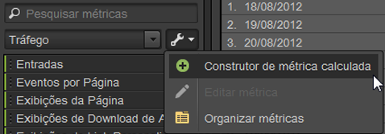
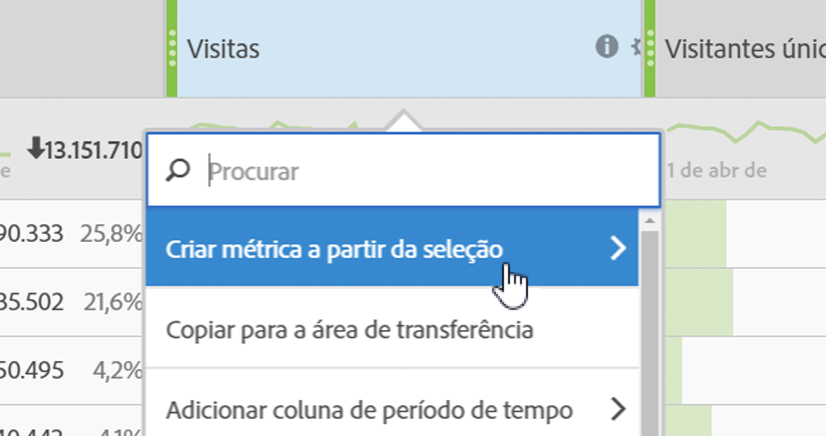

# Métricas

As métricas são informações quantitativas sobre a atividade do visitante, como exibições, click-throughs, recarregamentos, tempo médio gasto, datas, unidades, ordens, receita, e assim por diante. As métricas e dados associados são exibidos nas colunas dos relatórios.

## Métricas {#concept_46A67930CFDB4A078225C5B189688AF3}

As métricas são informações quantitativas sobre a atividade do visitante, como exibições, click-throughs, recarregamentos, tempo médio gasto, datas, unidades, ordens, receita, e assim por diante. As métricas e dados associados são exibidos nas colunas dos relatórios.

As métricas padrão incluem:

* **Tráfego**: Exibe dados sobre o volume de visitantes.
* **Conversão**: Exibe dados sobre os eventos bem-sucedidos no seu site. Os eventos bem-sucedidos podem incluir compras, downloads ou qualquer outra ação que você deseja que os usuários executem em seu Web site.
* **Calculadas**: Métricas personalizadas criadas com base na combinação de outras métricas. Por exemplo, é possível criar uma métrica que subtraia da receita o custo da palavra-chave e o custo dos bens para obter a receita líquida. Esse valor pode então ser dividido pelo número total de pedidos para obter a média da receita líquida por pedido.

Consulte [Definições de métrica](https://marketing.adobe.com/resources/help/en_US/reference/index.html?f=metrics) nas *Referências analíticas* para obter mais informações sobre como as métricas são usadas na [!DNL Experience Cloud].

Você pode utilizar a ferramenta [!UICONTROL Organizar métricas] para criar novas pastas para suas métricas. Agrupe suas métricas da forma que desejar. O organizador permite que você copie as métricas existentes para suas pastas personalizadas usando o arrastar e soltar.

Durante a criação de pastas, nomeie e organize as métricas da forma que desejar. No entanto, não é possível alterar as pastas padrão, exceto pelas pastas Favoritos e Métricas calculadas.

## Organizar métricas {#task_17C844A9387042EAA9983E1E554846B1}

Etapas que descrevem como organizar métricas e criar pastas de métricas.

<!-- 

t_organize_metrics.xml

 -->

1. No painel de ferramentas [!UICONTROL Métricas], clique em **[!UICONTROL Mais ações]**. (  

   )
1. Click **[!UICONTROL Organize Metrics]**.
1. Click **[!UICONTROL New]** to create a folder.
1. Selecione métricas em outras pastas e arraste a seleção para a nova pasta.
1. Clique em **[!UICONTROL OK]**.

   >[!NOTE]
   >
   >Ao excluir uma pasta, todas as métricas na pasta são excluídas do projeto atualmente selecionado.

## Adicionar métricas a um relatório {#task_747DD1718B3F4776B83A115D0BE8754C}

Etapas que descrevem como adicionar métricas no relatório.

<!-- 

t_add_metrics_dsc.xml

 -->

1. No painel de ferramentas [!UICONTROL Métricas], localize a métrica.

   Você pode localizar as métricas no campo de pesquisa ou com exercícios nas pastas de métrica.

1. Arraste a métrica para a tabela de relatório ou para o [!UICONTROL Criador de tabela].

   É possível especificar as métricas padrão previamente em [!UICONTROL Configurações], se desejar reduzir a necessidade de adicionar métricas repetidamente no relatório.

   Consulte [Guia Classificado - Definições](../../analyze/ad-hoc-analysis/c-global-settings.md#reference_FB9BADD7E3DA42C1BB2A02A6E9D5C1CF).

## Criador de métricas calculada {#concept_F8E213CE786A43FB93847C5BA883A29C}

Agora, o Construtor de métrica calculada da Ad Hoc Analysis está vinculado às Métricas calculadas unificadas da análise. A interface do usuário lembra a interface do Construtor de métrica calculada no Analytics.

<!-- 

c_calc_metric_builder.xml

 -->

Para obter mais informações sobre como as Métricas calculadas são criadas e gerenciadas, consulte o [Guia de métricas calculadas](https://marketing.adobe.com/resources/help/en_US/analytics/calcmetrics/).

Veja como acessar o Construtor de métrica calculada na Ad Hoc Analysis:

1. No painel [!UICONTROL Métricas], clique em **[!UICONTROL Mais opções]** e em **[!UICONTROL Construtor de métrica calculada]**.

   

1. A interface Construtor de métrica calculada permite arrastar e soltar métricas, segmentos e funções para criar suas métricas personalizadas:

   

