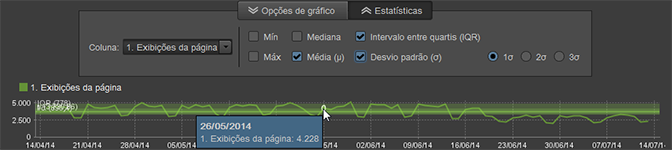

# Visão geral dos relatórios

Os relatórios padrão exibem dados de atividades do site e de visitante, padrões de tráfego, dados de referências, campanhas publicitárias, retenção de visitante, dados de produto e muito mais. É possível executar relatórios e então acessar as ferramentas para configurar segmentos, métricas e comparações de relatório.

## Reports overview {#concept_41459A705F2048EEA4EFA80F6BD9FFAB}

Os relatórios padrão exibem dados de atividades do site e de visitante, padrões de tráfego, dados de referências, campanhas publicitárias, retenção de visitante, dados de produto e muito mais. É possível executar relatórios e então acessar as ferramentas para configurar segmentos, métricas e comparações de relatório.

É possível coletar dados personalizados para criar relatórios específicos para o seu Web site. Por exemplo: Se o seu site possui um recurso de busca, você pode rastrear os termos de busca submetidos e criar um relatório que exibe estes termos e os resultados das buscas.

O conjunto de relatórios padrão cobre temas comuns a qualquer site. Os relatórios incluem (mas não se limitam a):

* Dados do Web site
* Dados do visitante
* Padrões de tráfego
* Dados de referências
* Campanhas publicitárias
* Retenção de visitante
* Informações do produto

Se você usar relatórios e análises de marketing, os tipos de relatórios e menus serão familiares. A Ad Hoc Analysis categoriza relatórios com base nos seguintes tipos:

**Relatórios de resumo**

Inclui relatórios como o de [!UICONTROL Totais], que mostra os dados projetados para uma rápida visão geral. Eles são voltados para executivos que desejam ter uma visão geral dos dados.

**Relatórios de conversão**

Relatórios de conversão fornecem análises completas, precisas e detalhadas das atividades dos clientes. Métricas como gerenciamento de campanha, ciclo de vendas, desistências e conversão de cliente permitem medir as transações de comércio eletrônico, fontes de vendas, eficácia dos anúncios, fidelidade do cliente, etc.

**Relatórios de tráfego**

Relatórios de tráfego fornecem um insight detalhado sobre como os visitantes interagem do site da Web.

* Analisar os aspectos essenciais do comportamento dos visitantes.
* Monitorar e entender os padrões de tráfego.
* Identificar o conteúdo mais popular do site.
* Segmentar os visitantes por qualquer critério mensurável.

## Campanhas {#concept_A407CDF1D4AA49BAB396A1666E67FC87}

Exibe informações sobre a eficácia de seus esforços de publicidade. Você pode ver que tipos de esforços publicitários proporcionam mais tráfego e qual entre seus funcionários é responsável por tais esforços.

<!-- 

c_reports_campaigns.xml

 -->

Esses relatórios geralmente são personalizados e, por consequência, diferentes para cada análise. Consulte o [Gerente de campanha](https://marketing.adobe.com/resources/help/en_US/reference/index.html?f=campaign_manager_admin) na ajuda do [!DNL Admin Console] para obter mais informações.

## Cálculos estatísticos {#concept_83FF70DB7895435E985699FE9012D585}

Você pode personalizar as estatísticas padrão para serem exibidas em um relatório classificado.

<!-- 

c_Statistical_Calculation_ad_hoc.xml

 -->

Os cálculos estatísticos padrão adicionais podem ser adicionados aos relatórios classificados, baseados para serem exibidos ao executar o relatório, incluindo média, medianiz, desvio padrão e outros cálculos matemáticos avaliados nos dados, com base em suas necessidades específicas de relatórios.

**Para abrir os cálculos estatísticos para Relatórios classificados:**

1. Select **[!UICONTROL Tools]** &gt; **[!UICONTROL Ranked]** from the menu.

1. Selecione **[!UICONTROL Configurações]**.
1. Selecione **[!UICONTROL Estatísticas padrão]**.

**[!UICONTROL Ignorar os zeros em cálculos estatísticos]**. Selecione essa opção para ignorar os zeros e garantir que ao adicionar outra métrica, as médias já calculadas não serão alteradas. Todas as estatísticas foram afetadas por essa configuração (embora a soma não tenha sido afetada).

| Cálculo | Descrição |
|--- |--- |
| Máx | Identifica o valor máximo em todas as linhas para um conjunto de dados específico. |
| Mín | Identifica o valor mínimo em todas as linhas para um conjunto de dados específico. |
| Soma | Um cálculo de todos os valores para cada linha no conjunto de dados.  Por exemplo, a soma agrega todas as visitas de uma pessoa em vez de contar essa pessoa somente uma vez (independente do número de visitas). É um total abrangente dos pontos de dados coletados. |
| Média | A média é a média aritmética dos valores das linhas em um conjunto de dados, calculada pela soma dividida pela contagem (soma/contagem). A média é influenciada pelos dados remotos, diferente da média, que normalmente é usada para distribuições enviesadas. |
| Desvio padrão | O desvio padrão mostra quantas variações existem a partir da média esperada. Um desvio padrão inferior mostra os pontos de dados próximos à média. Um desvio padrão superior mostra que os pontos de dados estão distribuídos por uma ampla gama de valores. |
| Medianiz | A medianiz é o valor numérico que separa a metade superior de dados da metade inferior para as linhas em um conjunto de dados. Diferente da média, normalmente ela é utilizada para evitar valores remotos. |
| Quartil | Um quartil é o conjunto de valores no conjunto de dados identificado por três pontos que dividem o conjunto de dados em quatro grupos iguais, cada um incluindo um quarto do conjunto de dados. O primeiro quartil é 25% e o terceiro quartil é 75%. (O segundo quartil é a Média e o quarto quartil é a Soma.) |
| Contagem | Retorna o número de linhas em um conjunto de dados. |

## Exemplo de cálculos totais de média vs. métrica {#section_7C49196503964FB0A429FA347BC92D09}

A função de média é calculada de forma similar às colunas de dados no Microsoft Excel. Em particular, isso significa que a **Média** de uma proporção (como determinar a taxa média de rejeição) seria a média de proporções, não a proporção de médias. A proporção das médias inclui o **Total** da taxa média de rejeição.

<table id="table_9EC56B15C6A340DA8917CB0DBCAC2355"> 
 <thead> 
  <tr> 
   <th colname="col1" align="center" class="entry"> Data </th> 
   <th colname="col2" align="center" class="entry"> Visitas únicas </th> 
   <th colname="col3" align="center" class="entry"> Entradas </th> 
   <th colname="col4" align="center" class="entry"> Taxa de rejeição </th> 
   <th colname="col5" align="center" class="entry"> </th> 
  </tr>
 </thead>
 <tbody> 
  <tr valign="top"> 
   <td colname="col1"> 
Junho de 2013 
 
Julho de 2013 
 
Agosto de 2013 
 </td> 
   <td colname="col2" align="center"> 
344 
 
297 
 
41 
 </td> 
   <td colname="col3" align="center"> 
1000 
 
1000 
 
1000 
 </td> 
   <td colname="col4" align="center"> 
34,4% 
 
29,7% 
 
41,0% 
 </td> 
   <td colname="col5"> </td> 
  </tr> 
  <tr valign="top"> 
   <td colname="col1" align="center" valign="middle"><b>Média</b> </td> 
   <td colname="col2" valign="middle"> (344+297+41)/3 </td> 
   <td colname="col3" valign="middle"> (1000+1000+100)/3 </td> 
   <td colname="col4" valign="middle" align="right"> (34,4 + 29,7 + 41,0) / 3 = <b>35,0</b>% </td> 
   <td colname="col5" valign="middle"><b>Média de proporções</b> </td> 
  </tr> 
  <tr valign="top"> 
   <td colname="col1" align="center" valign="middle"><b>Métrica total</b> </td> 
   <td colname="col2" valign="middle"> 682 </td> 
   <td colname="col3" valign="middle"> 2100 </td> 
   <td colname="col4" valign="middle" align="right"> 682 / 2100 = <b>32,0</b>% </td> 
   <td colname="col5" valign="middle"><b>Proporção de médias</b> </td> 
  </tr> 
 </tbody> 
</table>

## Sobreposições de cálculos estatísticos {#concept_97E1B32DAC734C7B9F8899717283CEEC}

As análises ad hoc agora oferecem visualizações sobrepostas de cálculos estatísticos para relatórios que exibem dados ao longo do tempo (minutos, horas, dias, semanas).

<!-- 

c_overlay_calculations.xml

 -->

Em um relatório que identifica dados durante um período de tempo, o botão **[!UICONTROL Estatísticas]permite que você selecione os cálculos que serão exibidos como sobreposições na linha de tempo do relatório.**

In addition to standard [Statistical Calculations](../../analyze/ad-hoc-analysis/c-overview-standard-reports.md#concept_83FF70DB7895435E985699FE9012D585), you can select the 1st, 2nd, and 3rd standard deviations in the overlays.

## Gerenciador do grupo {#concept_E1433974A61144858E87334C006982B2}

Rather than using a single page in a report, you can group multiple pages and use them as categories for starting, intermediate, or destination location in the [!UICONTROL Fallout] and [!UICONTROL Site Analysis] reports. É possível editar grupos pelo menu principal ou de dentro do relatório. Categorias criadas em relatórios e análises de marketing também aparecem na lista [!UICONTROL Seletor de ponto de verificação].

<!-- 

c_groups.xml

 -->

Click **[!UICONTROL Tools]** &gt; **[!UICONTROL Group Manager]**.
