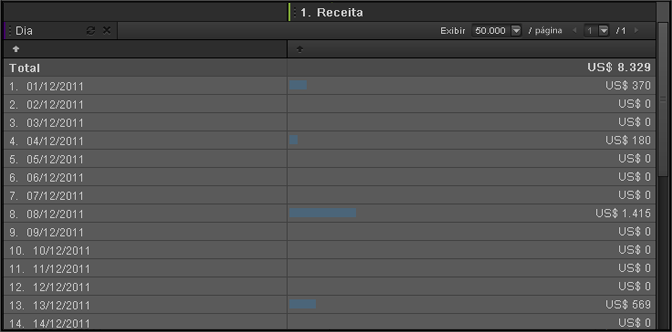

# Hora

O Tempo é uma dimensão de relatório que é útil para a tendência em horas, dias, semanas e intervalos de datas. Por exemplo, um Relatório de produtos mostra quanta receita um produto criou durante um intervalo de datas selecionado. Você pode adicionar uma dimensão de Dia para ver a tendência em cada dia do período do relatório. O Tempo oferece configurações de granularidade para Hora, Dia, Semana, Mês, Trimestre e Ano. As predefinições de intervalos de data incluem configurações como Hoje, Ontem e Últimos 7 dias.

## Hora {#concept_CB64A0A2150C471FB0B0B42516905887}

O Tempo é uma dimensão de relatório que é útil para a tendência em horas, dias, semanas e intervalos de datas. Por exemplo, um Relatório de produtos mostra quanta receita um produto criou durante um intervalo de datas selecionado. Você pode adicionar uma dimensão de Dia para ver a tendência em cada dia do período do relatório. O Tempo oferece configurações de granularidade para Hora, Dia, Semana, Mês, Trimestre e Ano. As predefinições de intervalos de data incluem configurações como Hoje, Ontem e Últimos 7 dias.

Para adicionar dimensões de Tempo, arraste um ou vários intervalos de datas do painel de ferramentas Tempo para a tabela de relatório ou o Criador de tabela.

Este exemplo mostra uma dimensão de Dia de tendência com receita.

## Tempo - Definições {#reference_6E718B78E437438E825DB9262086A987}

No painel de Tempo, você pode selecionar intervalos de datas e predefinições de tendência e arrastar suas seleções para o [!UICONTROL Criador de tabela] ou grade de relatório.

<!-- 

r_time_panel.xml

 -->

| Campo | Definição |
|--- |--- |
| Intervalos de datas | Permite que você selecione um ou mais períodos e arraste-os para o Criador de tabela ou grade de relatório. Visualiza períodos de tempo como divisões em uma linha ou como cabeçalhos de colunas. Você pode selecionar períodos como dia, semana, mês ou intervalos de dados personalizados. Se você usar um Calendário personalizado SiteCatalyst, seus conjuntos de relatórios herdam estas configurações. |
| Tendência | Permite que você crie relatórios de tendências de hora, dia, semana e assim por diante. Quando você arrasta itens das Tendências para o relatório, você está visualizando dados de uma configuração de tempo que é governado por um intervalo de dados especificado no calendário. |