# Visão geral da Analysis Workspace

A Analysis Workspace remove todas as limitações típicas de um único relatório do Analytics. Ela oferece uma tela robusta e flexível para criar projetos de análise personalizados. Arraste e solte qualquer número de tabelas de dados, visualizações e componentes (dimensões, métricas, segmentos e granularidades de tempo) em um projeto. Crie detalhamentos e segmentos instantaneamente, crie coortes para análise, crie alertas, compare segmentos, faça análises de fluxo e de fallout e prepare e programe relatórios para compartilhamento com qualquer pessoa na sua empresa.

**[!UICONTROL Analytics]** &gt; **[!UICONTROL Espaço de trabalho]**

## Overview video {#section_B99BF8A326D94ECB91BD69C9888AD10C}

>[!VIDEO](https://www.youtube.com/watch?v=IHOy-QsvVcA)

Lista de reprodução completa do YouTube disponível [aqui](https://www.youtube.com/playlist?list=PL2tCx83mn7GuNnQdYGOtlyCu0V5mEZ8sS).

>[!NOTE]
>
>See [What&#39;s New in Analysis Workspace](../../analyze/analysis-workspace/new-features-in-analysis-workspace.md#concept_EDB651D6F41E4F7BB4EB5E1EBB95D195) for updates about features.

## Full control over project elements and components {#section_B7E3EDA3EDEE407D833F4FDB69646EEC}

A Analysis Workspace oferece liberdade e flexibilidade para:

* Arrastar e soltar os componentes (dimensões, métricas, segmentos e granularidades de tempo)
* Arrastar e soltar várias visualizações no projeto
* Mover, redimensionar e empilhar as visualizações onde desejar em um projeto

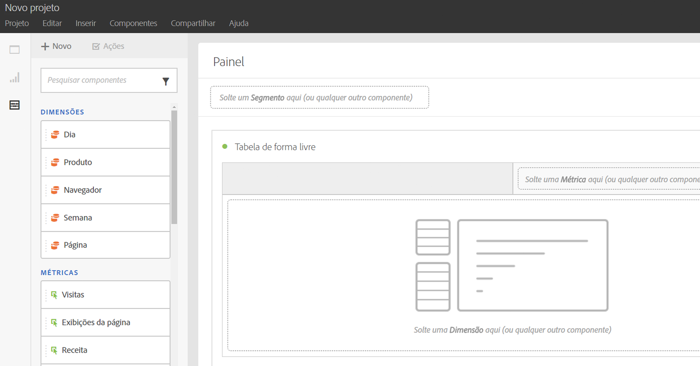

Consulte [Criar um projeto da Analysis Workspace](../../analyze/analysis-workspace/build-workspace-project/t-freeform-project.md#task_C2C698ACC7954062A28E4784911E6CF2) para obter mais informações.

## Multiple visualizations in a project {#section_B7670740C2D44130B21DAF0873280DA5}

Arraste e solte muitas visualizações no projeto que desejar.

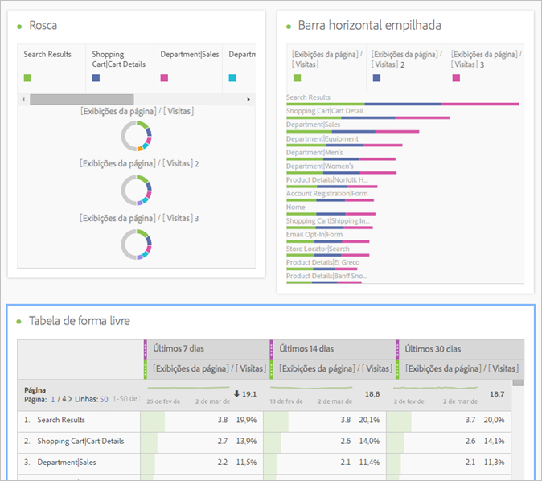

Crie um projeto que mostra a porcentagem de alteração, com várias visualizações correspondendo às células em uma tabela de dados de forma livre.

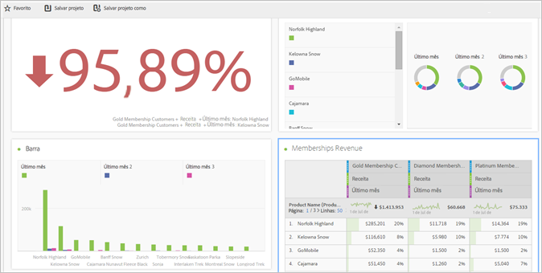

Consulte [Criar um projeto da Analysis Workspace](../../analyze/analysis-workspace/build-workspace-project/t-freeform-project.md#task_C2C698ACC7954062A28E4784911E6CF2) para obter mais informações.

## Intra-linking to panels and visualizations {#section_253EA04E067F4A29A8B54CE2B7631086}

In conjunction with the [rich text editing](../../analyze/analysis-workspace/visualizations/text.md#concept_2315D97E27364E3194AC1C459B654B2F) capabilities of Analysis Workspace, you can link down to specific panels and visualizations within a project from a text box, such as to create a project&#39;s table of contents. É possível compartilhar essas vinculações da mesma maneira usada para compartilhar um link de projeto, a fim de direcionar alguém a uma visualização ou um painel específico em um projeto. Adição de novas opções do menu de clique com o botão direito do mouse chamadas “Obter link do painel” e “Obter link da visualização”. Para adicionar intravinculação ao seu projeto:

1. Arraste uma visualização de texto ao projeto, talvez próximo a uma visualização ou tabela que precise de contexto.
1. Preencha a caixa de texto com, por exemplo, uma tabela de conteúdo. Em seguida, destaque um item que deseja vincular ao painel ou à visualização, como Métricas de sucesso, por exemplo.

   

1. Role para esse painel ou visualização e clique com o botão direito no cabeçalho do painel.
1. Role para baixo e selecione **[!UICONTROL Obter link do pinel]** ou **[!UICONTROL Obter link da visualização]**:

   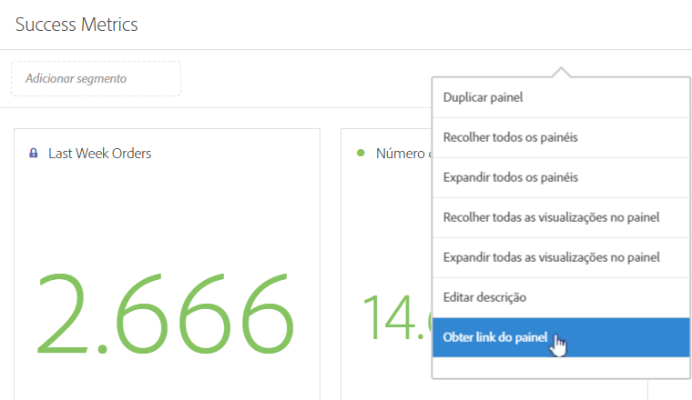

1. Copie o link e adicione-o ao hiperlink Métricas de sucesso na visualização de texto. Clique na marca de seleção para salvar o texto.

Caso tenha painéis ou visualizações recolhidos no projeto, clique no link para expandir o painel/visualização, para que os usuários possam visualizá-lo.

>[!NOTE]
>
>You can also use this feature within the **[!UICONTROL Edit Description]** right-click option.

## Link to other projects {#section_AE886C367C3E4F189B65B1BD9BCDBD8C}

You can link users to other projects that may be of interest to them by going to  **[!UICONTROL Share]** &gt; **[!UICONTROL Get Project Link]** and embedding this link in project descriptions, for example.

## Dynamic visualization of selected cells {#section_182CEC285E4547EBA4608D5F70C9D5D7}

Selecione as células individuais e veja as visualizações mudarem dinamicamente. [Sincronize e bloqueie](../../analyze/analysis-workspace/analysis-workspace-features.md#section_9D66A001586F49CEB0C565581E44957C) uma visualização com as células selecionadas.

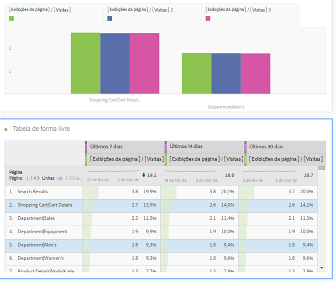

## Lock selected items or positions {#section_9D66A001586F49CEB0C565581E44957C}

O bloqueio de visualizações permite controlar quais fontes da tabela de dados de forma livre correspondem às visualizações.

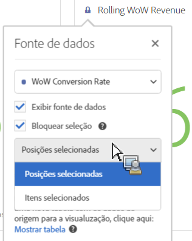

Consulte [Gerenciar fontes de dados](../../analyze/analysis-workspace/visualizations/t-sync-visualization.md#task_A73B065DC3834AFCA422E364A1468099).

## Trend visualizations from selected cells {#section_34930C967C104C2B9092BA8DCF2BF81A}

Crie uma visualização de células selecionadas. (Clique com o botão direito do mouse em &gt; **[!UICONTROL Seleção de tendências]**.)

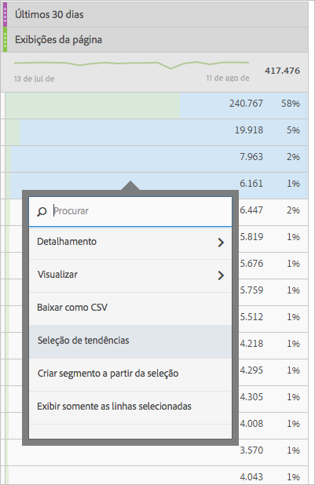

As seleções de tendências agora estão **vinculadas** à tabela abaixo; desta forma, se você selecionar uma linha diferente, o gráfico de tendências refletirá essa linha.

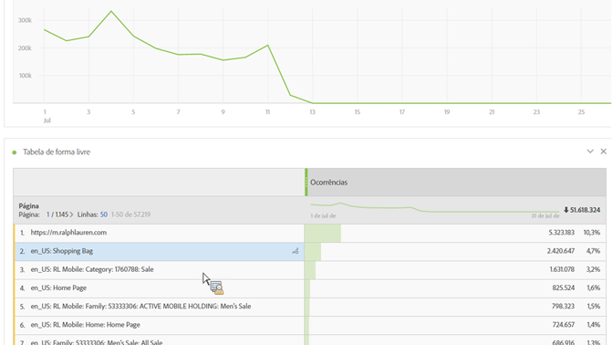

## Dimensions and dimension item breakdowns {#section_1380C1F9E51E4BFB8C5D35E7A53BC70D}

Como revendedor, você pode se aprofundar mais do que nunca em suas campanhas para entender a melhor forma de envolver os seus clientes. Analise os seus dados de formas ilimitadas, de acordo com as suas necessidades específicas; crie consultas usando métricas, dimensões, segmentos, linhas do tempo e outros valores de detalhamento de análise relevantes.

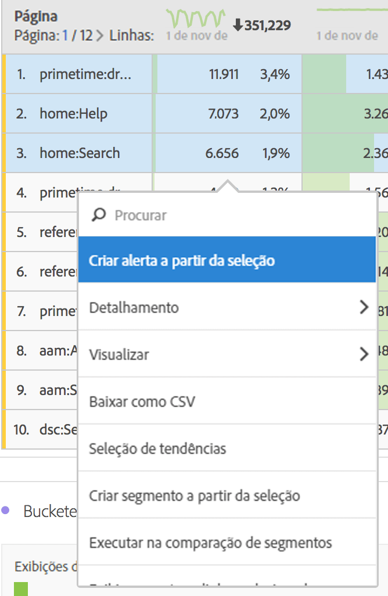

See [Break down dimensions](../../analyze/analysis-workspace/components/dimensions/t-breakdown-fa.md#task_B594DA2476E84DFDA8279E831F0BD9C4).

## Segments from table selections {#section_73BC3688089B426D969B3D5B606DA970}

Selecione as células na tabela de dados de forma livre e crie um segmento da seleção.

Compare vários segmentos, crie e aplique instantaneamente os segmentos. Você pode aplicar vários segmentos para se concentrar em clientes específicos com base no comportamento e interação e, em seguida, compará-los e contrastá-los.

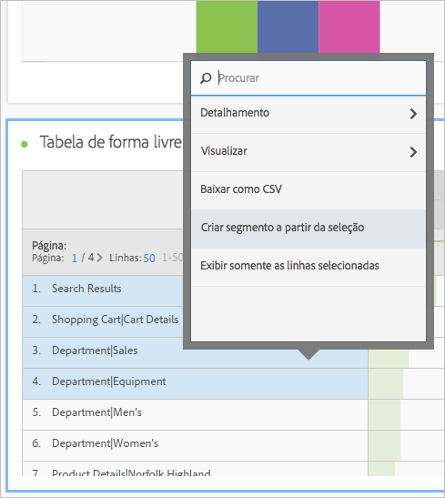

Solte um segmento no painel de forma livre, no nível do projeto, e o segmento será aplicado em todo o projeto.

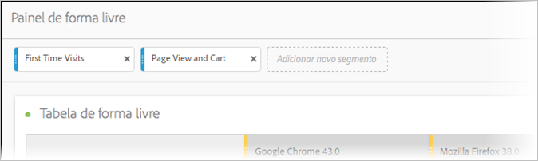

Consulte  [Segmentos](../../analyze/analysis-workspace/components/t-freeform-project-segment.md#task_11C6A2C7717B48049E5750B9D20FEC80).

## Project and component tagging {#section_F54D688132A541F2982326D5E022B90D}

Você pode aplicar tags aos projetos e componentes na Analysis Workspace:

* Aplique ou crie tags em nível de projeto no painel Informações. (

* Clique com o botão direito do mouse nos componentes para marcá-los (ou crie tags) no painel Componentes.
* Use # no campo de Pesquisa para localizar as tags.

## Component actions {#section_CBF4D0A5F63E4B0883077B8D852B800B}

Execute ações a nível de componente no menu de Ações na parte superior do trilho de componentes à esquerda. Selecione um componente e clique em **[!UICONTROL Ações]para ver as ações.**

| Ação de componente | Descrição |
|--- |--- |
| Adicionar tag | Organize ou gerencie componentes aplicando guias. Em seguida, ele é exibido no gerenciador de componente respectivo, como Analytics &gt; Componentes &gt; Segmentos, ou Analytics &gt; Componentes &gt; Projetos |
| Marcar como favorito | Adicione o componente à sua lista de favoritos. Em seguida, ele é exibido no gerenciador de componente respectivo, como Analytics &gt; Componentes &gt; Segmentos, ou Analytics &gt; Componentes &gt; Projetos  . |
| Aprovar | Aprove o componente para torná-lo canônico. Em seguida, ele é exibido no gerenciador de componente respectivo, como Analytics &gt; Componentes &gt; Segmentos, ou Analytics &gt; Componentes &gt; Projetos |
| Compartilhar | Aplica-se somente a segmentos. |
| Excluir | Aplica-se somente a segmentos. |

Consulte [Exibições](../../analyze/analysis-workspace/visualizations/freeform-analysis-visualizations.md#concept_09242627629147A88A68F1506954C276) para mais informações.

## Additional feature descriptions {#section_5F06AE43C0194CFDBCA7EE0EA3C30B05}

**O que você pode arrastar e empilhar**

Componentes

* Dimensões
* Segmentos
* Métricas
* Intervalos de data
* Granularidades de tempo (Hora, dia, semana, etc.).

**Várias tabelas de forma livre e visualizações**

Não há limite técnico para o número de tabelas de forma livre e visualizações que você pode adicionar ao painel. Além disso, você pode executar uma nova exibição (ou exportar para CSV) de cada tabela de forma livre ou das linhas selecionadas de uma tabela.

**Organização, classificação e cópia da coluna**

* Classifique as predefinições do intervalo de datas (não inclui os intervalos de datas personalizados).
* Pressione CTRL (ou Command) + clique, para arrastar uma coluna e copiá-la, e ao arrastar a cópia, ela é colada na nova posição na tabela.

Consulte [Teclas de atalho disponíveis na Analysis Workspace](../../analyze/analysis-workspace/build-workspace-project/fa-shortcut-keys.md#concept_9A6356084DBC4D468E265E7A65B3E051) para obter mais informações.

**Seleções e ações**

Você pode selecionar as linhas e colunas da mesma forma usada no Excel. Em seguida, é possível usar essas seleções. Por exemplo:

* Criar visualizações das seleções
* Copiar para a área de transferência (CTRL ou Command + C)
* Analisar várias linhas selecionadas. Selecione as linhas, em seguida, arraste uma dimensão para a seleção. Ou, clique com o botão direito do mouse na seleção e use o menu Detalhamento.

**Alterações salvas automaticamente e não salvas**

Você será solicitado a salvar as alterações, se tentar fechar o navegador (ou usar o botão Voltar) e o projeto não foi salvo. Se o sistema falhar, você receberá um alerta para restaurar para o estado anterior do projeto ao carregá-lo.

Projetos já existentes (e não os novos) serão salvos automaticamente apenas quando o navegador travar ou sob outra circunstância a qual não foi dada a chance de salvá-los.

**Todas as visitas**

Um segmento padrão exclusivo para a Analysis Workspace. *`All Visits`* é um recurso que exibe os totais dos componentes adicionados a tabela.

**Métricas calculadas**

Use os cálculos da mesma forma que você usa as métricas padrão.

Consulte [Métricas calculadas](https://marketing.adobe.com/resources/help/en_US/analytics/calcmetrics/).
