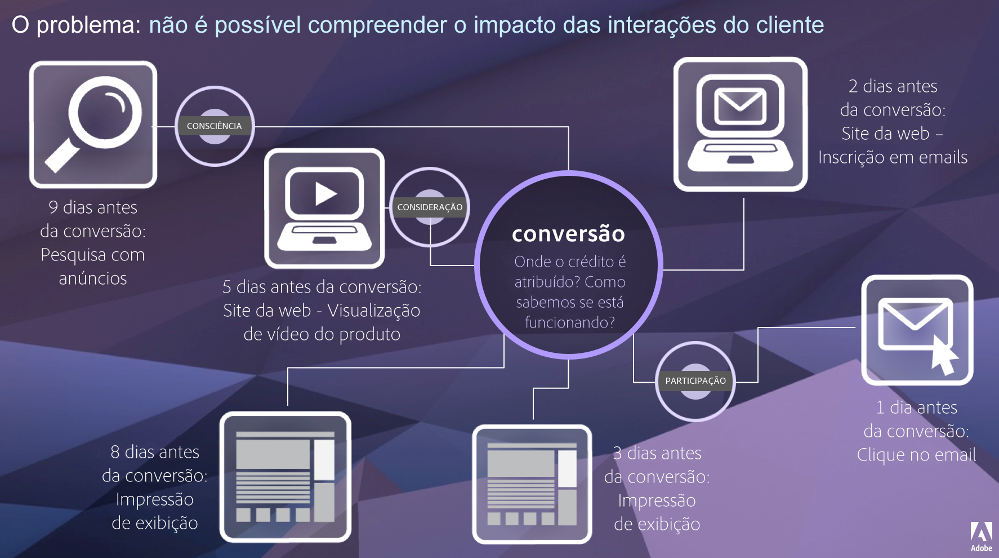

# Attribution IQ

O Attribution IQ é um conjunto de recursos no Adobe Analytics que fornece insight adicional sobre como os esforços de marketing contribuem para uma conversão.

A jornada do cliente não é linear e é muitas vezes imprevisível. Cada cliente atua no seu ritmo e com frequência voltam, param, reiniciam ou adotam outros comportamentos não lineares. Essas ações orgânicas dificultam a identificação do impacto dos esforços de marketing na jornada do cliente. Também dificultam os esforços para unir vários canais de dados.

O Attribution IQ do Adobe Analytics permite que as equipes de inteligência atuais entendam como ocorre o engajamento ao longo da jornada do cliente, identificando pontos de inflexão que conduzem os clientes em direção aos resultados desejados. Compreender esse aspecto da jornada do cliente otimiza as iniciativas de marketing de maneira eficaz.

O Adobe Analytics aprimora a atribuição ao permitir:

* Definir atribuição além de mídias com anúncios: qualquer dimensão, métrica, canal ou evento pode ser aplicado a modelos (ex: pesquisa interna), além de campanhas de marketing.
* Utilizar comparação ilimitada de modelos de atribuição: compare dinamicamente quantos modelos desejar.
* Evitar alterações de implementação: com processamento de tempo de relatório e sessões contextuais, o contexto da jornada do cliente pode ser incorporado e aplicado no tempo de execução.
* Construir a sessão que melhor corresponde ao seu cenário de atribuição.
* Detalhar atribuições por segmentos: compare facilmente o desempenho de seus canais de marketing entre segmentos importantes (ex: Clientes Novos vs. Repetidos, Produto X vs. Produto Y, Nível de fidelidade ou CLV).
* Inspecionar canais cruzados e análises de multitoque: usando diagramas e histogramas de Venn e resultados de atribuição de tendência.
* Analisar visualmente as principais sequências de marketing: explore visualmente caminhos que levaram à conversão usando as visualizações de fluxo de múltiplos nós e de fallout.
* Criar métricas calculadas: use a quantidade de métodos de alocação de atribuição que desejar.

## Recursos {#features}

O Attribution IQ inclui os seguintes recursos:

* [Painel de atribuição:](c-panels/attribution/attribution.md)
