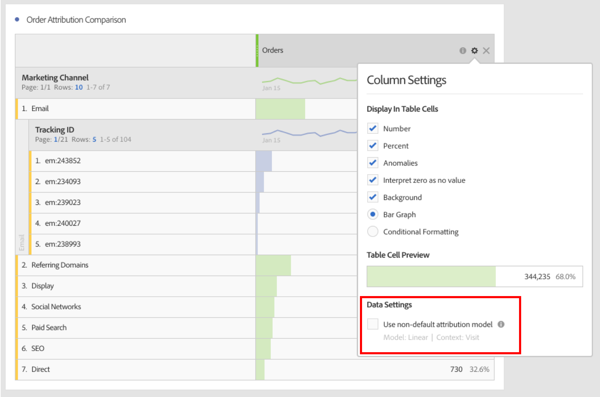

# Usar o Attribution IQ na Analysis Workspace

O Attribution IQ na Analysis Workspace permite comparar quaisquer modelos de atribuição compatíveis entre si, visualizar as sequências de marketing principais que levam a uma conversão com visualizações avançadas de fallout e de fluxo, colocar em tendência qualquer canal de marketing ou campanha com facilidade para exibir o desempenho ao longo do tempo, encontrar anomalias de estatística no desempenho de canal/campanha, e ser alertado quando há uma queda ou aumento no desempenho.

## Use attribution in freeform tables {#section_F2F72AE840EB4EA781302A559726E6F4}

Tabelas de forma livre da Analysis Workspace suportam modelos de atribuição que podem ser usados em quase qualquer métrica. Modelos de atribuição podem ser definidos em uma métrica de coluna de Tabela de forma livre nas Configurações de coluna:

1. Clique no ícone de Configurações (engrenagem) em uma coluna de Tabela de forma livre.

   

1. Em **[!UICONTROL Configurações de dados]**, marque a opção **[!UICONTROL Usar modelo de atribuição não-padrão]**. Para obter mais informações sobre os diferentes modelos de atribuição, consulte [Visão geral do Attribution IQ](../../../analyze/analysis-workspace/attribution-iq/attribution.md#section_4B9E7F83AE0B451A992397E55C3F5871).

   

## Apply attribution models to breakdowns {#section_ED1E7532CF084B5AB0942BD80B4770C9}

Qualquer detalhamento em uma Tabela de forma livre também pode ter qualquer modelo de atribuição aplicado a ele, podendo ser o mesmo ou um diferente da coluna principal. Por exemplo, se você desejar analisar Pedidos lineares em sua dimensão de Canais de marketing mas deseja aplicar Pedidos de forma de U aos códigos de rastreamento específicos em um Canal. Para editar o modelo de atribuição aplicado a um detalhamento, passe o mouse sobre o modelo de detalhamento e clique em “Editar”:

## Compare one attribution model to another {#section_1D74C09549CC4EC8A952A7392C76D375}

Se você deseja comparar um modelo a outro rapidamente e com facilidade, clique com o botão direito do mouse em uma métrica e selecione **[!UICONTROL Adicionar modelo de atribuição comparativo]**:

Isso permite que você compare dois modelos de atribuição sem precisar arrastar uma métrica e configurá-la duas vezes.

## Attribution panel and visualizations {#section_6B02F28182F14ECC9FC5020F224726E6}

O painel de atribuição é uma maneira fácil para criar uma análise comparando vários modelos de atribuição. Para acessar o Painel de atribuição, 

1. Clique no ícone do painel localizado na extrema esquerda.
1. Arraste o Painel de atribuição para seu projeto da Analysis Workspace.

   

1. Adicione uma métrica de sucesso que você deseja atribuir e adicione uma dimensão de canal para a qual atribuir (como Canais de marketing ou Promoções internas).

   

1. Selecione os [modelos de atribuição](../../../analyze/analysis-workspace/attribution-iq/attribution.md) que você deseja comparar e a [janela de lookback](../../../analyze/analysis-workspace/attribution-iq/attribution.md).

   O Painel de atribuição retornará um conjunto avançado de dados e visualizações para ajudá-lo a compreender como seus Canais de marketing (ou outras dimensões) trabalham juntos:

   

   Veja a seguir uma descrição de cada visualização:

| Visualização | Descrição |
|--- |--- |
| Métrica total | O número total de conversões que ocorreram ao longo da janela de tempo de relatório. Essas são as conversões atribuídas pela dimensão selecionada. |
| Gráfico de barras de comparação de atribuição de métricas | Permite comparar visualmente as conversões atribuídas entre cada um dos itens de dimensão a partir da dimensão selecionada. A cor de cada barra representa um modelo de atribuição distinto que foi selecionado. |
| Tabela de forma livre de atribuição de métricas | Mostra os mesmos dados do gráfico de barras - selecionando colunas ou linhas diferentes nesta tabela filtrarão o gráfico de barras, bem como várias das outras visualizações no painel. Esta tabela atua como qualquer outra Tabela de forma livre no Workspace - permitindo que você adicione métricas, segmentos, detalhamentos, etc. |
| Gráfico de sobreposição de dimensões | Um diagrama de Venn exibindo os três itens de dimensão principais (por exemplo, Canais) e a frequência com a qual participam juntos em uma conversão. Por exemplo, o tamanho da sobreposição entre as bolhas indica com que frequência as conversões ocorreram quando um visitante foi exposto a ambos os itens de dimensão (ex: Canais). Selecionar outras linhas na tabela de Forma livre atualizará a visualização para refletir sua seleção. |
| Pontos de contato de marketing por jornada | Um Histograma que indica o número de pontos de contato de marketing (ou qualquer outra dimensão) de um visitante no intervalo de datas de relatório. Isso é útil para descobrir o impacto da atribuição de multi toque em seu conjunto de dados. Se quase todos os visitantes tiverem somente um ponto de contato, diferentes modelos de atribuição não terão resultados muito diferentes. |
| Detalhes de desempenho de canal de marketing | Permite comparar até três modelos de atribuição visualmente usando um gráfico de dispersão. |
| Fluxo de canal de marketing | Permite ver com quais canais há mais interação, e em que ordem, em uma jornada do cliente. |
