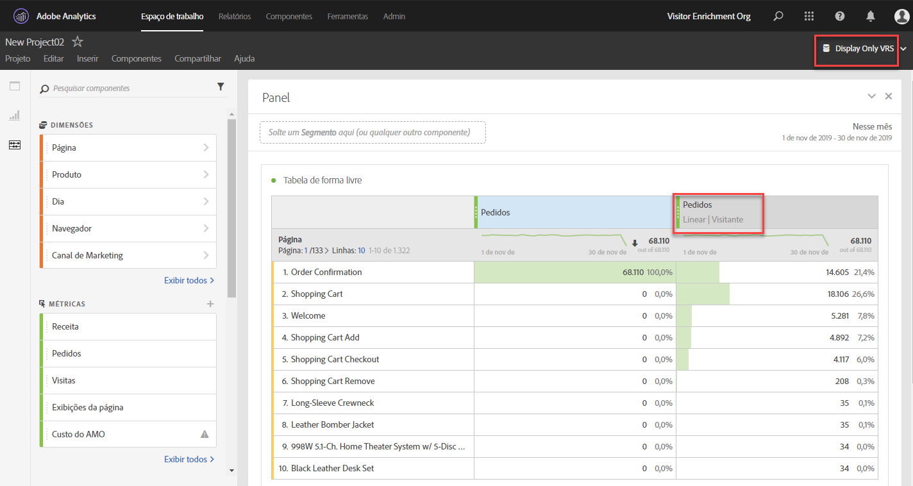

# Perguntas frequentes sobre Atribuição

**O que é o item de linha “Nenhum” na atribuição?**

O item de linha “Nenhum” é um item “catch-all” (global) que representa todas as conversões que ocorreram sem nenhum ponto de contato na janela de retrospectiva. Para reduzir o número de conversões atribuídas ao item de linha “Nenhum”, tente usar uma janela de pesquisa personalizada com um período de pesquisa posterior mais longo.

**Por que às vezes vejo datas fora da minha janela de relatórios ao usar modelos de atribuição?**

Essas datas extras aparecem devido à janela de retrospectiva do visitante. Consulte [Dados que aparecem fora da janela de relatórios](https://helpx.adobe.com/br/analytics/kb/data-appearing-outside-reporting-window.html) na base de conhecimento (KB) do Analytics para obter mais informações.

**Quando devo usar retrospectiva de visita, visitante ou atribuição personalizada?**

A escolha da retrospectiva de atribuição depende do seu caso de uso. Se as conversões normalmente levam mais tempo do que uma visita única, recomenda-se a retrospectiva de visitante ou personalizada. Para ciclos de conversão mais longos, as janelas de retrospectiva personalizadas são melhores, pois são o único tipo que pode extrair dados antes da janela de relatórios

**Como funciona a comparação de props e eVars na atribuição?**

A atribuição é recalculada no tempo de execução do relatório, portanto, não há diferença entre prop e eVar (ou qualquer outra dimensão) para fins de modelagem de atribuição. As props podem persistir usando qualquer janela de retrospectiva ou modelo de atribuição, e as configurações de alocação/expiração de eVar são ignoradas.

**Os modelos de atribuição estão disponíveis em outros recursos do Analytics, como Feeds de dados ou Data Warehouse?**

Não. Os modelos de atribuição usam o processamento de tempo do relatório, que só está disponível no Analysis Workspace. Consulte [Processamento de tempo do relatório](/help/components/vrs/vrs-report-time-processing.md) para obter mais informações.

**Os modelos de atribuição estão disponíveis somente se uso um conjunto de relatórios virtual com o processamento de tempo ativado?**

Os modelos de atribuição estão disponíveis fora dos conjuntos de relatórios virtuais. Estes usam o processamento de tempo do relatório no backend, enquanto os modelos de atribuição estão disponíveis tanto para os conjuntos de relatórios padrão como para os conjuntos de relatórios virtuais.

**Que dimensões e métricas são incompatíveis?**

O painel de atribuição é compatível com todas as dimensões. As métricas não compatíveis incluem as seguintes:

* Visitantes únicos
* Visitas
* Ocorrências
* Exibições de página
* Métricas do A4T
* Métricas de tempo gasto
* Rejeições
* Taxa de rejeição
* Entradas
* Saídas
* Páginas não encontradas
* Pesquisas
* Visitas únicas à página
* Acesso único

**A atribuição funciona com classificações?**

Sim, as classificações são totalmente compatíveis.

**A atribuição funciona com fontes de dados?**

Sim, a maioria das fontes de dados é compatível. A atribuição não é possível com fontes de dados de nível de resumo porque elas não se vinculam a um identificador de visitante do Analytics. Fontes de dados de ID de transação também são compatíveis, a menos que sejam usadas em um conjunto de relatórios virtual com o processamento de tempo de relatório ativado.

**A atribuição funciona com a integração do Advertising Analytics?**

As dimensões de metadados, como tipo de correspondência e palavra-chave, funcionam com atribuição. No entanto, as métricas (incluindo impressões, custo, cliques, posição média e pontuação de qualidade média) usam fontes de dados de nível de resumo e, portanto, são incompatíveis.

**Como a atribuição funciona com canais de marketing?**

Quando os canais de marketing foram introduzidos pela primeira vez, eles só contavam com as dimensões de primeiro e último contato. As dimensões explícitas de primeiro/último toque não são mais necessárias com a versão atual da atribuição. A Adobe fornece dimensões genéricas de &quot;Canal de marketing&quot; e &quot;Detalhes do canal de marketing&quot; para que você possa usá-las com o modelo de atribuição desejado. Essas dimensões genéricas se comportam de forma idêntica às dimensões do Canal de último contato, mas são rotuladas de forma diferente para evitar confusão em caso de uso de canais de marketing com um modelo de atribuição diferente.

Como as dimensões do canal de marketing dependem de uma definição de visita tradicional (conforme definido por suas regras de processamento), a definição de visita não pode ser alterada usando conjuntos de relatórios virtuais.

**Como a atribuição funciona com variáveis de vários valores, como vars de lista?**

Algumas dimensões do Analytics podem conter vários valores em uma só ocorrência. Exemplos comuns incluem list vars e a variável products.

Quando a atribuição é aplicada a ocorrências de vários valores, todos os valores na mesma ocorrência recebem o mesmo crédito. Como muitos valores podem receber esse crédito, o total do relatório pode ser diferente se você somar cada item de linha individual. O total do relatório é desduplicado, enquanto cada item de dimensão individual recebe o crédito adequado.

**Como a atribuição funciona com a segmentação?**

A atribuição sempre é executada antes da segmentação e a segmentação é executada antes da aplicação dos filtros do relatório. Esse conceito também se aplica a conjuntos de relatórios virtuais (VRS) que usam segmentos.

Por exemplo, se você criar um VRS com um segmento “Exibir ocorrências” aplicado, poderá ver outros canais em uma tabela usando alguns modelos de atribuição.

>[!NOTE]
>
>Se um segmento suprimir ocorrências que contenham sua métrica, essas instâncias de métrica não serão atribuídas a nenhuma dimensão. No entanto, um filtro de relatório semelhante simplesmente ocultará alguns itens de dimensão, sem qualquer impacto nas métricas processadas de acordo com o modelo de atribuição. Como resultado, um segmento pode retornar valores menores que um filtro com uma definição comparável.
