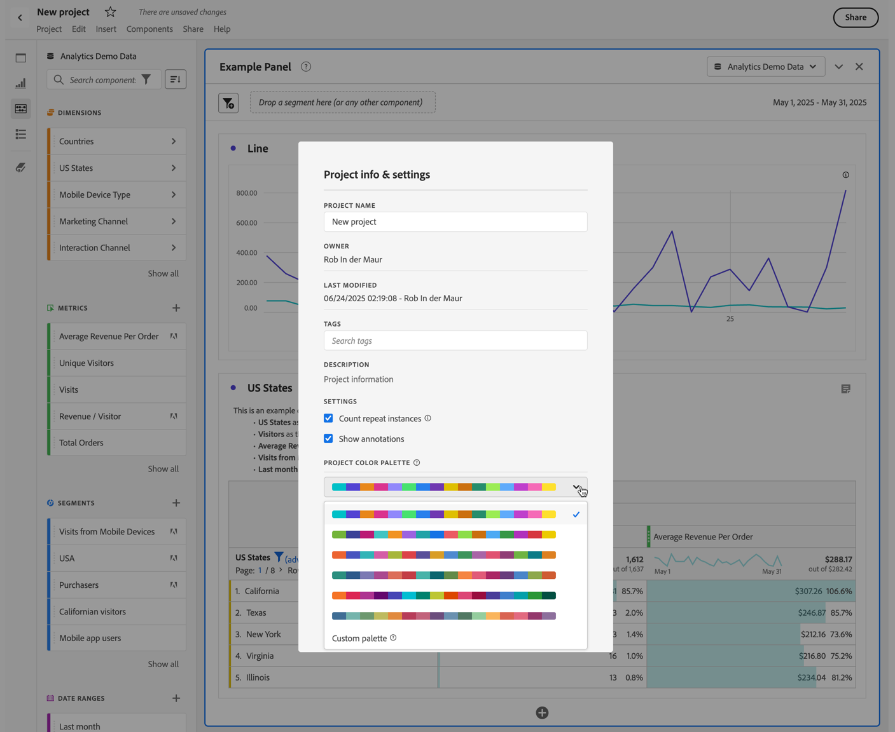
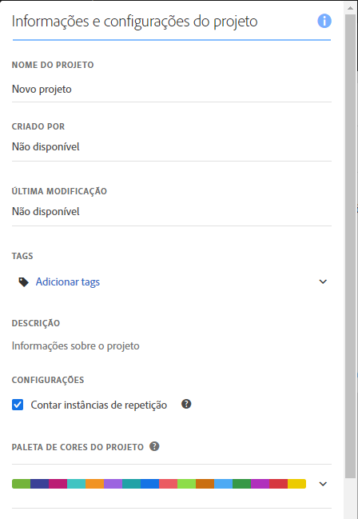
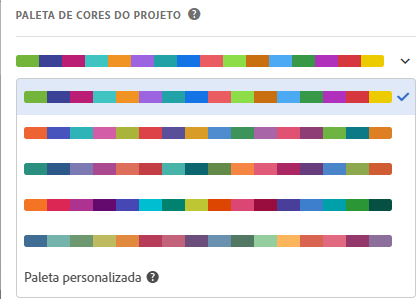

# Paletas de cores de visualização {#visualization-color-palette}

<!-- markdownlint-disable MD034 -->

>[!CONTEXTUALHELP]
>id="workspace_project_colorpalette"
>title="Paleta de cores do projeto"
>abstract="Alterar a paleta de cores usada neste projeto."

<!-- markdownlint-enable MD034 -->

É possível alterar a paleta de cores da visualização usada no Workspace. Você pode selecionar uma paleta de cores predefinida ou especificar uma própria que corresponda às cores da identidade visual da sua empresa. Esse recurso afeta a maioria das visualizações no Espaço de trabalho, mas **não** afeta o Resumo de alterações, a formatação condicional nas tabelas de Forma livre, nem a visualização de Mapa.

>[!NOTE]
>
>O suporte para a paleta de cores não está habilitado para o Internet Explorer 11.

Lembre-se:

* Há seis paletas de cores predefinidas para escolher. A paleta padrão e a segunda listada foram otimizadas para obter o melhor contraste e são mais acessíveis para daltônicos.
* As outras paletas foram otimizadas para aprimorar a harmonia de cores.

## Para alterar a paleta de cores:

1. Navegue até **[!UICONTROL Workspace]** > **[!UICONTROL Projeto]** > **[!UICONTROL Informações e configurações do projeto]**.
1. No menu suspenso **[!UICONTROL Paleta de cores do projeto]**, você pode escolher um dos esquemas de cores predefinidos.
1. Para especificar sua própria paleta, selecione **[!UICONTROL Paleta personalizada]** abaixo das opções predefinidas.
1. Especifique até 16 valores hexadecimais delimitados por vírgulas (por exemplo, `#00a4e4`) para criar sua própria paleta de cores. Caso especifique, por exemplo, apenas quatro valores, as cores serão repetidas automaticamente em visualizações que contêm mais cores.

<!--
# Visualization Color Palettes {#visualization-color-palettes}

>[!CONTEXTUALHELP]
>id="workspace_project_colorpalette"
>title="Project color palette"
>abstract="Change the color palette used in this project."

You can change the visualization color palette used in Workspace by choosing a different color palette or by specifying your own palette that could match your company's branding colors. This feature affects most visualizations in Workspace, but it does **not** affect [!UICONTROL Summary Change], conditional formatting in [!UICONTROL Freeform] tables, and the [!UICONTROL Map] visualization.

>[!NOTE]
>
>Color palette support is not enabled for Internet Explorer 11.

Keep in mind:

* There are five pre-set color palettes to choose from. The default palette and the one below have been optimized for optimal contrast and are both more accessible for those who are color blind.
* The third to the fifth color palettes below the top two have been optimized for color harmony.

## Change your [!UICONTROL color palette]:

>[!BEGINSHADEBOX]

See  [Using a custom color palette](https://video.tv.adobe.com/v/23876?quality=12&learn=on){target="_blank"} for a demo video.

>[!ENDSHADEBOX]

1. Navigate to **[!UICONTROL Workspace]** > **[!UICONTROL Project]** > **[!UICONTROL Project Info & Settings]**.
1. From the **[!UICONTROL Project Color Palette]** drop-down list, you can pick one of five pre-set color schemes.

   

1. To specify your own palette, select **[!UICONTROL Custom Palette]** below the pre-set options.
1. Specify up to 16 comma-separated hexadecimal values (for example, #00a4e4) for the colors you intend to use. If, for example, you want to use only four values, these colors will automatically be repeated in visualizations that contain more colors.
-->