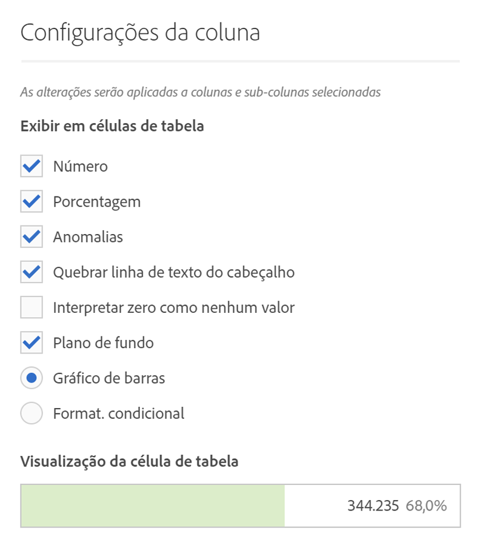
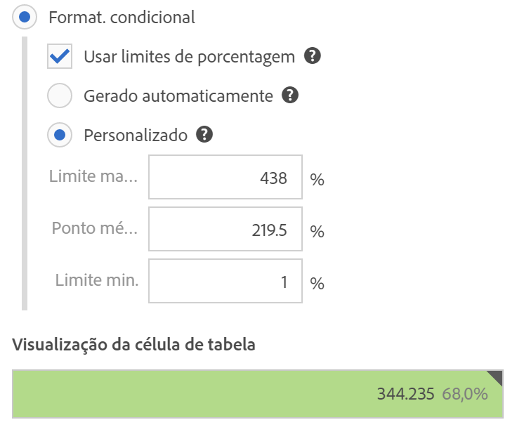

# Configurações de coluna

As configurações de coluna permitem que você configure a formatação da coluna; alguns elementos podem ser condicionais.

## Configurações de coluna {#section_C5A9C13553BF4BFDAD7FACE0139AECA3}

Para acessar [!UICONTROL Configurações de coluna], arraste uma Tabela de forma livre para o projeto e clique no ícone de engrenagem no cabeçalho da coluna.

É possível editar as configurações de **diversas colunas de uma só vez**. Basta selecionar várias colunas e clicar no ícone de configurações de qualquer uma dessas colunas. Todas as alterações feitas serão aplicadas a todas as colunas com as células selecionadas.

| Elemento | Descrição |
|--- |--- |
| Número | Determina se uma célula exibe ou oculta o valor numérico para a métrica. Por exemplo, se a métrica for Exibições de página, o valor numérico será o número de exibições de página para o item da linha. |
| Porcentagem | Determina se uma célula exibe ou oculta o valor percentual para a métrica. Por exemplo, se a métrica for Exibições de página, o valor percentual será o número de exibições de página para o item da linha dividido pelo total de exibições de página para a coluna.  Observação: podemos apresentar percentuais maiores que 100%, para maior precisão. Também fixamos o limite superior como 1.000% para garantir que as colunas possam aumentar em largura. |
| Anomalias | Determina se a detecção de anomalias é executada nos valores desta coluna. |
| Quebrar linha do texto do cabeçalho | Permite quebrar o texto de cabeçalho em tabelas de forma livre para tornar os cabeçalhos mais legíveis e as tabelas mais compartilháveis. Essa opção é útil para renderização de .pdf e para métricas com nomes compridos. Ativado por padrão. |
| Interpretar o zero como valor inexistente | Para células com valor 0, determina se exibirá um 0 ou uma célula em branco. Isso é útil para observar dados diários de um mês que ainda não tenha terminado.  Em vez de mostrar 0 para as datas futuras, pode-se exibir células em branco. Essa configuração também aplica-se a gráficos (ou seja, eles não exibem uma linha ou uma barra com valores de 0 quando essa configuração estiver selecionada). |
| Histórico | Determina se uma célula exibe ou oculta todas as formatações de célula, incluindo o gráfico de barras e a formatação condicional. |
| Gráfico de barras | Exibe um gráfico de barras horizontal que representa o valor da célula relativo ao total da coluna. |
| Formatação condicional | Consulte a seção abaixo. |
| Visualização de célula de tabela | Mostra uma visualização de como cada célula é exibida com a aplicação das opções de formatação atuais selecionadas. |

## Formatação condicional {#section_3DD847151DA14914888A70FC4FD7BDFB}

A formatação condicional aplica formatação a limites superiores, intermediários e inferiores que você pode definir. A aplicação de formatação condicional (cores, etc.) nas tabelas de forma livre também é ativada automaticamente nos detalhamentos, a menos que sejam selecionados limites “Personalizados”.

| Elemento | Descrição |
|--- |--- |
| Formatação condicional | Aplica as seguintes cores a células, com base nos valores dos dados: <ul><li>Verde: valores altos</li><li>Amarelo: valores intermediários</li><li>Vermelho: valores baixos</li></ul> Substituir uma dimensão na tabela redefine os limites da formatação condicional. Substituir uma métrica recalcula os limites da coluna (na qual haja uma métrica no eixo X e uma dimensão no eixo Y). |
| Usar limites de porcentagem | Permite usar limites superiores, medianos e inferiores com base nos valores de porcentagem para cada métrica. Isso funciona com métricas exclusivamente baseadas em porcentagem (como a Taxa de retorno), além de métricas que possuem uma contagem e uma porcentagem (como Exibições de página). |
| Gerado automaticamente | Gera automaticamente limites de formatação condicional. O limite superior é o valor mais alto na coluna. O limite inferior é o menor valor e o ponto intermediário é a média entre os limites superior e inferior. |
| Personalizado | Você pode atribuir os valores manualmente para os campos de limite Superior, Intermediário e Inferior para formatação condicional. Isso oferece a flexibilidade de determinar quando o valor de uma coluna se torna bom, médio ou ruim. |
| Visualização de célula de tabela | Mostra uma visualização de como cada célula é exibida com a aplicação das opções de formatação atuais selecionadas. |

>[!MORELIKETHIS]
>
>* [Gerenciar fontes de dados](/help/analyze/analysis-workspace/visualizations/t-sync-visualization.md)

