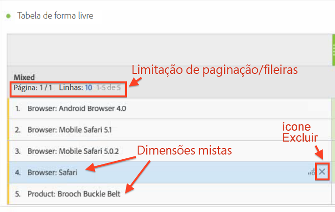
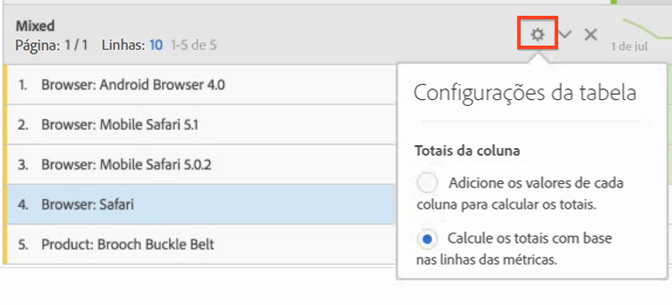

# Linhas estáticas vs. dinâmicas

Os gráficos da Analysis Workspace geram linhas “dinâmicas” quando você solta uma dimensão no gráfico - o que significa que todos os itens que correspondem à dimensão, para uma determinada métrica, são posicionados no gráfico.

Por exemplo, ao arrastar a dimensão de Navegador na tabela, todos os itens da dimensão (por exemplo, navegador do Android, Safari móvel, Firefox, etc.) são colocados de maneira dinâmica no gráfico.

Por outro lado, assim que você selecionar e arrastar manualmente uma métrica, segmento, intervalo de dados ou item de dimensão individual em um gráfico, o resultado é uma linha ou lista codificada ou “estática”. É possível interagir com uma linha estática destas maneiras:

* Clique no ícone de Visualização nas linhas estáticas que permite visualizar os segmentos, métricas, intervalos de datas.
* Clique no ícone de “x” para excluir a linha do gráfico.
* Restrinja quantas linhas deseja exibir e permita paginação.
* Adicione “itens de dimensões mistas”. Por exemplo, adicione um item de uma dimensão de navegador e outro item de uma dimensão de produto.

   Exemplo:

   

Além disso, (somente) quando você está em um modo de linha estática, agora é possível alterar como os totais da coluna são calculados. Clique no ícone de engrenagem e alterne entre estas duas opções:

| Opção | Descrição |
|---|---|
| Calcule as somas resumindo os valores que estão atualmente em cada coluna. | Esta opção calcula somente as linhas que estão atualmente no gráfico. (Cálculo do lado do cliente) |
| Calcule as somas com base em todas as linhas para cada métrica. | Esta opção inclui todos os itens de dimensão para esta dimensão, até mesmo aqueles que não estão listados no gráfico. (Cálculo do lado do servidor) |

