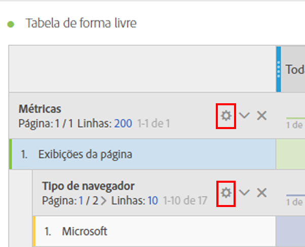
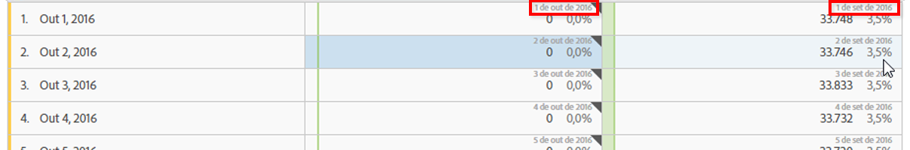

# Configurações de linha

As configurações de linha variam de acordo com qual componente foi arrastado para a tabela.

É possível, também, usar as [ações de clique com o botão direito](/help/analyze/analysis-workspace/visualizations/freeform-table.md) para gerenciar a(s) linha(s) selecionada(s).

Para acessar as configurações das linhas da tabela, clique o ícone de Configuração próximo a uma dimensão, segmento, métrica, período de tempo ou um detalhamento em cada uma dessas:

<table id="table_7ACE6413DB1F40349ED2860020F92E55"> 
 <thead> 
  <tr> 
   <th colname="col1" class="entry"> Configuração da linha </th> 
   <th colname="col2" class="entry"> Descrição </th> 
  </tr>
 </thead>
 <tbody> 
  <tr> 
   <td colname="col1"> 
<a href="/help/analyze/analysis-workspace/components/calendar-date-ranges/time-comparison.md"  > Comparações de datas</a> 
 </td> 
   <td colname="col2"> 
<b>Alinhar as datas de cada coluna para que todas iniciem na mesma linha. </b> 
 
Ao escolher alinhas das datas, por exemplo, em uma comparação de mês por mês entre outubro e setembro de 2016, a coluna da esquerda iniciará em 1° de outubro e a coluna da direita em 1° de setembro: 
 
 
 
Desabilitado por padrão. 
 </td> 
  </tr> 
  <tr> 
   <td colname="col1"> 
Porcentagens 
 </td> 
   <td colname="col2"> 
<b>Calcular os percentuais por linha</b> 
 
Força a tabela de forma livre a calcular as porcentagens de célula na linha, e não na coluna. Essa configuração é útil para porcentagens de tendência. Está ativada por padrão ao usar o ícone Visualizar. 
 </td> 
  </tr> 
  <tr> 
   <td colname="col1"> 
Totais de colunas 
 </td> 
   <td colname="col2"> 
Estas configurações aparecem apenas com  <a href="/help/analyze/analysis-workspace/build-workspace-project/column-row-settings/manual-vs-dynamic-rows.md"  > linhas manuais (estáticas)</a> (quando selecionamos um conjunto limitado de itens), não com linhas dinâmicas (quando soltamos em uma dimensão que mostra todos os itens). 
Observação: para linhas manuais de <i>métricas</i>, a configuração é desativada, já que não faz sentido adicionar métricas além das linhas atuais de uma tabela. 
 
 
<b>Calcule as somas resumindo os valores que estão atualmente em cada coluna (habilitada por padrão):</b> 
 
Esta opção calcula somente as linhas que estão atualmente no gráfico. (Cálculo do lado do cliente) 
 
<b>Calcule as somas baseadas em todas as linhas para cada métrica (desabilitada por padrão)</b> 
 
Esta opção inclui todos os itens de dimensão para esta dimensão, até mesmo aqueles que não estão listados no gráfico. (Cálculo do lado do servidor) 
 </td> 
  </tr> 
  <tr> 
   <td colname="col1"> 
Detalhamentos 
 </td> 
   <td colname="col2"> 
<b>Detalhamento por posição:</b> 
 
Você pode executar detalhamentos baseados em uma localização fixa em uma tabela de Forma livre. Por exemplo, você pode especificar que as sete primeiras fileiras superiores devam sempre estar detalhadas. 
 
(Anteriormente, a lista de valores no detalhamento era “bloqueada”, o que levava a uma situação em que, por exemplo, se você fizesse um detalhamento de  Data por Página, recebia uma lista das 50 primeiras páginas para o intervalo de data selecionado. Se salvasse o relatório e o executasse um mês depois, seria provável que as 50 páginas tivessem mudado. Entretanto, o Analysis Workspace usaria os resultados do detalhamento original e retornaria as mesmas páginas, porém com o mês atual como o intervalo de data.) 
 
Para executar detalhamentos baseados em um local fixo: 
 
    <ol id="ol_A396A11566AA4F52BC3ABBC373CEF477"> 
     <li id="li_BDAB1E9A48D44944A4F7C31F1182B923">Detalhar algumas linhas da tabela. </li> 
     <li id="li_C5610437D3714CCEB9F3C771864B4336">Clicar o ícone Configurações (engrenagem) próximo à linha da tabela que você deseja em um local fixo. </li> 
     <li id="li_675E429DC3B94201978166F9408D30B1">Marcar a caixa de seleção ao lado de Detalhamento por posição. </li> 
     <li id="li_E8A417D0D6D1438CAE825843BA0A7060">Mudar a ordem de classificação ou o intervalo de data e observar que os detalhamentos estão agora vinculados à posição da linha e não às linhas embutidas em código. </li> 
    </ol> 
Desabilitado por padrão. 
 </td> 
  </tr> 
 </tbody> 
</table>

