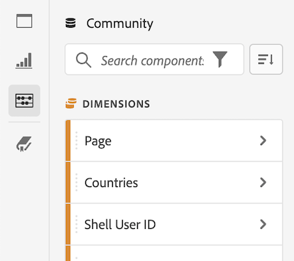

# Criar projetos no Analysis Workspace

Os [projetos](/help/analyze/analysis-workspace/build-workspace-project/freeform-overview.md) no Analysis Workspace permitem exibir análises vitais para os negócios que podem ser compartilhadas com as partes interessadas dentro ou fora da organização.

Para obter informações gerais sobre como começar a usar o Analysis Workspace, consulte a [Visão geral do Analysis Workspace](/help/analyze/analysis-workspace/home.md).

As seções a seguir descrevem como criar um projeto e começar a adicionar os elementos essenciais para qualquer projeto do Analysis Workspace: painéis, visualizações e componentes.

## Criar um projeto a partir de um projeto em branco ou de um relatório

1. No Adobe Analytics, selecione [!UICONTROL **Espaço de trabalho**].

1. Escolha se deseja criar um projeto em branco ou criar a partir de um relatório:

   +++Criar um projeto em branco

   1. Na guia [!UICONTROL **Espaço de trabalho**], selecione a guia [!UICONTROL **Projetos**] no lado esquerdo da página e clique em [!UICONTROL **Criar projeto**].

   1. Escolha se deseja criar um projeto em branco ou um cartão de pontuação móvel em branco

      * Selecione **Projeto em branco** se planeja compartilhar sua análise usando o navegador
      * Selecione [**Cartão de pontuação móvel em branco**](/help/analyze/mobile-app/curator.md) se planeja compartilhar sua análise usando o aplicativo móvel de painéis do Adobe Analytics.

   1. Selecione [!UICONTROL **Criar**].

+++

   +++Criar um projeto a partir de um relatório

   1. Na guia [!UICONTROL **Espaço de trabalho**], selecione a guia [!UICONTROL **Relatórios**] no lado esquerdo da página.

   1. Procure ou navegue até o relatório que deseja usar e selecione-o quando ele aparecer.

      Um conjunto de relatórios comuns está disponível por padrão. Além disso, você pode escolher relatórios personalizados criados por sua organização.

   1. Selecione [!UICONTROL **Projeto**] > [!UICONTROL **Salvar**] para salvar o relatório como um novo projeto.

      Para obter mais informações, consulte “Navegar pela guia Relatórios” na [página de destino do Adobe Analytics](/help/analyze/landing.md).

+++

1. Em seguida, você precisa adicionar painéis, visualizações e componentes ao seu projeto. Primeiro, adicione painéis ao seu projeto no Analysis Workspace, conforme descrito em [Adicionar painéis ao projeto](#add-panels-to-the-project). Em seguida, é possível adicionar visualizações a qualquer painel. Por fim, é possível adicionar componentes a qualquer painel ou visualização.

## Adicionar painéis ao projeto {#panels}

Os [painéis](https://experienceleague.adobe.com/docs/analytics/analyze/analysis-workspace/panels/panels.html?lang=pt-BR) são a base de qualquer projeto no Analysis Workspace. Os painéis são usados para organizar o conteúdo (visualizações e componentes) de um projeto.

Muitos dos painéis fornecidos no Analysis Workspace geram um conjunto completo de análises com base em algumas informações inseridas pelo usuário.

Para adicionar um painel:

1. Selecione o ícone [!UICONTROL **Painéis**] no menu esquerdo.

   

1. Pesquise o painel que deseja adicionar. Quando ele aparecer no menu à esquerda, arraste-o para o projeto.

1. Adicione visualizações ao painel, conforme descrito em [Adicionar visualizações ao projeto](#add-visualizations-to-the-project).

   Alternativamente, você pode adicionar componentes diretamente a um painel, conforme descrito em [Adicionar componentes ao projeto](#add-components-to-the-project).

## Adicionar visualizações ao projeto

As [visualizações](https://experienceleague.adobe.com/docs/analytics/analyze/analysis-workspace/visualizations/freeform-analysis-visualizations.html?lang=pt-BR) (como uma tabela de forma livre, um gráfico de barras ou um gráfico de linhas) podem ser usadas para dar vida aos dados.

>[!TIP]
>
>As tabelas de forma livre são o tipo mais comum de visualização e são a base para a análise interativa de dados. Para obter mais detalhes sobre como trabalhar com tabelas de forma livre no Analysis Workspace, consulte [Tabela de forma livre](/help/analyze/analysis-workspace/visualizations/freeform-table/freeform-table.md).

Adicionar uma visualização:

1. Selecione o ícone **[!UICONTROL Visualizações]** no menu esquerdo.

   

1. Pesquise a visualização que deseja adicionar. Quando ela aparecer no menu à esquerda, arraste-a para um painel dentro do projeto.

1. Adicione componentes à visualização, conforme descrito em [Adicionar componentes ao projeto](#add-components-to-the-project).

## Adicionar componentes ao projeto

Os [componentes](/help/analyze/analysis-workspace/components/analysis-workspace-components.md) compõem os dados reais de qualquer projeto. É possível adicionar componentes a visualizações ou painéis.

>[!TIP]
>
>Para obter informações sobre cada componente, selecione o ícone Informações ao lado do nome de um componente no menu esquerdo ou consulte [Guia de componentes do Analytics](/help/components/home.md).

Para adicionar um componente:

1. Clique no ícone **[!UICONTROL Componentes]** no menu esquerdo.

   

1. Procure o componente que deseja adicionar. Quando ele aparecer no menu à esquerda, arraste-o para um painel ou uma visualização no seu projeto.

1. (Opcional) Compartilhe o projeto conforme descrito em [Salvar e compartilhar o projeto](#save-and-share-the-project).

## Salvar e compartilhar o projeto

Conforme você cria uma análise no Analysis Workspace, seu trabalho é [salvo automaticamente](/help/analyze/analysis-workspace/build-workspace-project/save-projects.md).

Quando terminar de criar o projeto e ele estiver reunindo insights acionáveis, o projeto estará pronto para ser consumido por outras pessoas. Você pode compartilhar o projeto com usuários e grupos em sua organização ou até mesmo com pessoas de fora da organização. Para obter informações sobre como compartilhar um projeto, consulte [Compartilhar projetos](/help/analyze/analysis-workspace/curate-share/share-projects.md).
