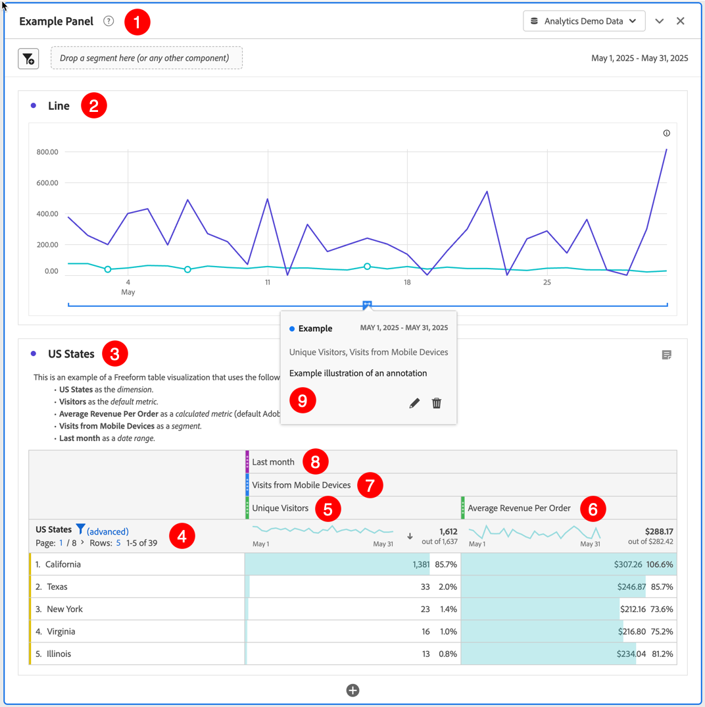

# Criar projetos {#create-projects}

Os [projetos](/help/analyze/analysis-workspace/build-workspace-project/freeform-overview.md) do Analysis Workspace permitem que você crie e visualize análises vitais para os negócios.  Essas análises podem ser compartilhadas com as partes interessadas dentro ou fora da organização.

1. No Adobe Analytics, selecione **[!UICONTROL Espaço de trabalho]**.

1. Selecione **[!UICONTROL Projetos]** no painel esquerdo e clique em **[!UICONTROL Criar projeto]**.

1. Selecione **Projeto do espaço de trabalho em branco** para criar o projeto usando um navegador.

   Consulte [Cartão de pontuação para dispositivos móveis em branco](/help/analyze/mobile-app/curator.md) para obter mais informações sobre como criar um projeto de Cartão de pontuação para dispositivos móveis que você pode compartilhar com outras partes interessadas usando um aplicativo para dispositivos móveis.

1. Selecione [!UICONTROL **Criar**].

Agora que você criou um projeto do espaço de trabalho em branco, certifique-se de que saiba usar a interface do [Analysis Workspace](/help/analyze/analysis-workspace/home.md). Quando estiver tudo pronto, você pode criar o seu projeto. Para fazer isso:

* Adicionar [painéis](/help/analyze/analysis-workspace/c-panels/panels.md) ao seu projeto. Por exemplo, o **[!DNL Example Panel]** ➊.

* Adicione [visualizações](/help/analyze/analysis-workspace/visualizations/freeform-analysis-visualizations.md) aos seus painéis. Por exemplo:
   * Visualização de **[!DNL Line]** [linha](/help/analyze/analysis-workspace/visualizations/line.md) ➋
   * Visualização de **[!DNL US States]** [tabela de forma livre](/help/analyze/analysis-workspace/visualizations/freeform-table/freeform-table.md) ➌
* Adicionar [componentes](/help/analyze/analysis-workspace/components/analysis-workspace-components.md) às suas visualizações. Por exemplo:
   * [Dimensão](/help/components/dimensions/overview.md) de **[!DNL US States]** ➍
   * [Métrica](/help/analyze/analysis-workspace/components/apply-create-metrics.md) **[!DNL Unique Visitors]** ➎
   * [Métrica calculada](/help/components/c-calcmetrics/cm-overview.md) **[!DNL Average Revenue Per Order]** ➏
   * [Segmento](/help/components/segmentation/seg-overview.md) **[!DNL Visits from Mobile Devices]** ➐
   * [Intervalo de datas](/help/analyze/analysis-workspace/components/calendar-date-ranges/calendar.md) **[!DNL Last Month]** ➑
   * [Anotação](/help/analyze/analysis-workspace/components/annotations/overview.md) de **[!DNL Example]** ➒

## Informações e configurações do projeto {#project-info-settings}

>[!CONTEXTUALHELP]
>id="workspace_project_countrepeatinstances"
>title="Contar instâncias repetidas"
>abstract="Especifica se as instâncias repetidas devem ser contadas nos relatórios.  Observação: essa configuração não se aplica às visualizações de fluxo ou fallout."

>[!CONTEXTUALHELP]
>id="workspace_project_repeatinstances"
>title="Contar instâncias repetidas"
>abstract="Especifica se as instâncias repetidas devem ser contadas nos relatórios. Observação: essa configuração não se aplica às visualizações de fluxo ou fallout."

>[!CONTEXTUALHELP]
>id="workspace_project_commenting"
>title="Permitir comentários"
>abstract="Quando habilitado, uma área de comentários fica disponível no painel direito do projeto no Analysis Workspace."

As configurações do projeto fornecem informações sobre o projeto ativo no momento.

As configurações incluem:

| Configuração | Descrição |
|---|---|
| Nome do projeto | O nome fornecido ao projeto. Você pode clicar duas vezes no nome para editá-lo. |
| Proprietário | Nome do(a) proprietário(a) do projeto. |
| Última modificação | Data da última modificação do projeto. |
| Tags | Lista qualquer tag aplicada a um projeto para classificar com mais facilidade. |
| Descrição | Uma descrição é útil para esclarecer a finalidade de um projeto. Você pode clicar duas vezes na descrição para editá-la. |
| Contar instâncias repetidas | Especifica se as instâncias repetidas são contadas nos relatórios. Observação: essa configuração não se aplica às visualizações de fluxo ou fallout. |
| Mostrar anotações | Especifica se as anotações do projeto são exibidas ou não. |
| [Paleta de cores do projeto](/help/analyze/analysis-workspace/build-workspace-project/color-palettes.md) | É possível alterar a paleta de cores categórica usada no Espaço de trabalho escolhendo entre paletas predefinidas que foram otimizadas para a cegueira de cores ou especificando a paleta personalizada. Esse recurso afeta muitas coisas no Espaço de trabalho, incluindo a maioria das visualizações. |
| [Exibir densidade](/help/analyze/analysis-workspace/build-workspace-project/view-density.md) | Permite ver mais dados na tela ao reduzir o preenchimento vertical do painel esquerdo, das tabelas de forma livre e das tabelas de coorte. |

<!--
# Create projects in Analysis Workspace

[Projects](/help/analyze/analysis-workspace/build-workspace-project/freeform-overview.md) in Analysis Workspace allow you to view business-critical analyses that can be shared with stakeholders inside or outside your organization. 

For general information about how to get started using Analysis Workspace, see [Analysis Workspace overview](/help/analyze/analysis-workspace/home.md).

The following sections describe how to create a project and start adding the key building blocks for any Analysis Workspace project: panels, visualizations, and components.

## Create a project from a blank project or a report

1. In Adobe Analytics, select [!UICONTROL **Workspace**].

1. Choose whether to create a blank project or to create a project from a report:

   +++Create a blank project

   1. On the [!UICONTROL **Workspace**] tab, select the [!UICONTROL **Projects**] tab on the left side of the page, then select [!UICONTROL **Create project**].

   1. Choose whether to create a blank project or a blank mobile scorecard

      * **Blank project** if you plan to share your analysis from the browser 
      * [**Blank mobile scorecard**](/help/analyze/mobile-app/curator.md) if you plan to share your analysis from the Adobe Analytics dashboards mobile app.

   1. Select [!UICONTROL **Create**].

   +++

   +++Create a project from a report
   
      1. On the [!UICONTROL **Workspace**] tab, select the [!UICONTROL **Reports**] tab on the left side of the page.

      1. Search for or navigate to the report you want to use, then select it when it appears.

          A set of standard reports is available by default. In addition, your organization might have created custom reports for you to choose from.
          
      1. Select [!UICONTROL **Project**] > [!UICONTROL **Save**] to save the report as a new project.

          For more information about reports, see "Navigate the Reports tab" in [Adobe Analytics landing page](/help/analyze/landing.md).

   +++

1. Next, you need to add panels, visualizations, and components to your project. First, add panels to your project in Analysis Workspace, as described in [Add panels to the project](#add-panels-to-the-project). You can then add visualizations to any panels. Finally, you can add components to any panels or visualizations.

## Add panels to the project {#panels}

[Panels](https://experienceleague.adobe.com/docs/analytics/analyze/analysis-workspace/panels/panels.html?lang=pt-BR) are the foundation to any project in Analysis Workspace. Panels are used to organize the content (visualizations and components) of a project. 

Many of the panels provided in Analysis Workspace generate a full set of analyses based on a few user inputs. 

To add a panel:

1. Select the [!UICONTROL **Panels**] icon in the left rail.

   

1. Search for the panel you want to add. When it appears in the left rail, drag it into your project.

1. Add visualizations to your panel, as described in [Add visualizations to the project](#add-visualizations-to-the-project). 

   Alternatively, you can add components directly to a panel, as described in [Add components to the project](#add-components-to-the-project).

## Add visualizations to the project

[Visualizations](https://experienceleague.adobe.com/docs/analytics/analyze/analysis-workspace/visualizations/freeform-analysis-visualizations.html?lang=pt-BR) (such as a freeform table, a bar chart, or a line chart) can be used to visually bring data to life. 

>[!TIP]
>
>Freeform tables are the most common type of visualization, and are the foundation for interactive data analysis. For more details about how to work with Freeform tables in Analysis Workspace, see [Freeform table](/help/analyze/analysis-workspace/visualizations/freeform-table/freeform-table.md).

To add a visualization:

1. Select the **[!UICONTROL Visualizations]** icon in the left rail.

   

1. Search for the visualization you want to add. When it appears in the left rail, drag it to a panel within your project. 

1. Add components to the visualization, as described in [Add components to the project](#add-components-to-the-project).

## Add components to the project

[Components](/help/analyze/analysis-workspace/components/analysis-workspace-components.md) make up the actual data of any project. You can add components to visualizations or to panels.

>[!TIP]
>
>For information about each component, select the Info icon next to a component's name in the left rail, or see the [Analytics Components Guide](/help/components/home.md).

Following is basic information about how to add a component to a project in Analysis Workspace. For more detailed information about adding the various types of components (dimensions, metrics, segments, and date ranges), see [Use components in Analysis Workspace](/help/analyze/analysis-workspace/components/use-components-in-workspace.md).

To add a component to a project in Analysis Workspace:

1. Select the **[!UICONTROL Components]** icon in the left rail.

   

1. Scroll to or search for the component you want to add, then drag it to a panel or visualization within your project. 

   For example, you can drag a segment to the segment drop zone in a panel header.

   

   For more information about adding components to projects, see [Use components in Analysis Workspace](/help/analyze/analysis-workspace/components/use-components-in-workspace.md).

1. (Optional) Share the project as described in [Save and share the project](#save-and-share-the-project).

## Save and share the project

As you create an analysis in Analysis Workspace, your work is [automatically saved](/help/analyze/analysis-workspace/build-workspace-project/save-projects.md). 

When you finish building out the project and it's gathering actionable insights, the project is ready to be consumed by others. You can share the project with users and groups in your organization, or even with people outside your organization. For information about sharing a project, see [Share projects](/help/analyze/analysis-workspace/curate-share/share-projects.md).
-->