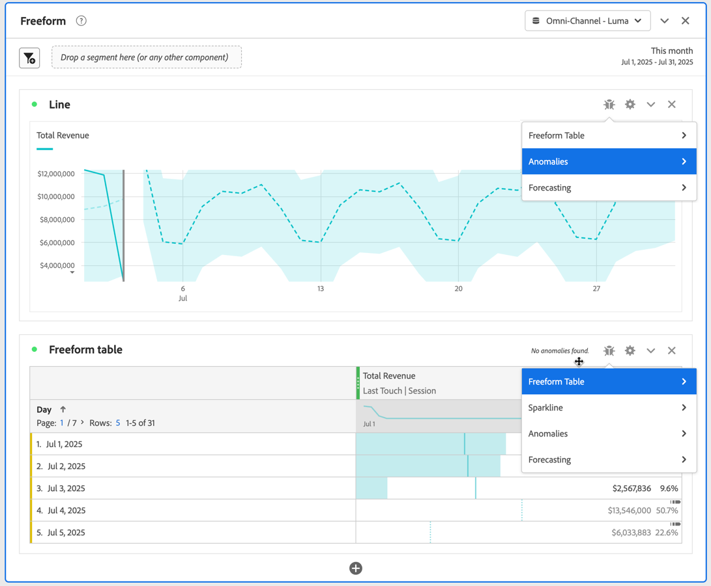
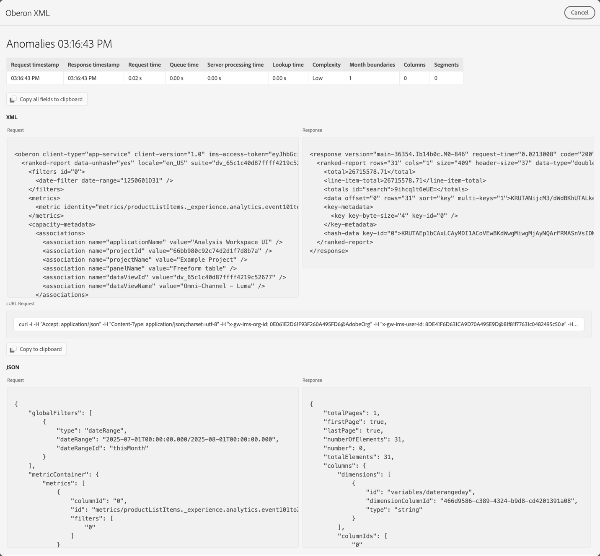

# Depurador de projetos

O depurador de projetos ajuda você e o Suporte da Adobe a solucionar problemas com seus projetos no Analysis Workspace. O Suporte da Adobe pode solicitar que você ative o depurador para solucionar problemas de tíquetes gerados com o Suporte da Adobe. Exemplos de problemas são tempo de carregamento de visualizações ou componentes quebrados em suas visualizações.

>[!NOTE]
>
>Para usar o depurador, você deve ter acesso de **Editar** ou **Copiar** ao projeto.
>

## Ativar o depurador

>[!IMPORTANT]
>
>Salve o projeto antes de ativar o depurador.
>

Para ativar o depurador:

1. Selecione **[!UICONTROL Ajuda]** > **[!UICONTROL Habilitar depurador]** no menu de projetos do Analysis Workspace.
1. Selecione **[!UICONTROL OK]** na caixa de diálogo **[!UICONTROL Habilitar Depurador]**.
1. Confirme quando o navegador solicitar que você recarregue a página ou o site.

## Usar depurador

Quando você habilita o depurador, todas as visualizações no seu projeto têm um ícone  adicional.

Para usar o depurador para uma visualização específica:

1. Selecione  na parte superior da visualização.

   

1. Selecione a ação apropriada no menu de contexto. As ações disponíveis dependem da visualização e indicam o tipo de depuração que você deseja executar. Por exemplo, se você selecionar **[!UICONTROL Anomalias]**, desejará depurar a funcionalidade de anomalias na visualização.
1. No submenu, selecione um carimbo de data e hora.
1. Uma janela de depuração **[!UICONTROL Oberon XML]** é aberta com detalhes da funcionalidade específica executada pela visualização. Consulte abaixo um exemplo da saída de uma solicitação de anomalia.

   

   Os detalhes são:

   * **[!UICONTROL Solicitar carimbo de data/hora]**
   * **[!UICONTROL Carimbo de data/hora de resposta]**
   * **[!UICONTROL Solicitar horário]**
   * **[!UICONTROL Tempo na fila]**
   * **[!UICONTROL Tempo de processamento do servidor]**
   * **[!UICONTROL Tempo de pesquisa]**
   * **[!UICONTROL Complexidade]**
   * **[!UICONTROL Limites mensais]**
   * **[!UICONTROL Colunas]**
   * **[!UICONTROL Segmentos]**
   * **[!UICONTROL XML]** **[!UICONTROL Solicitação]** e **[!UICONTROL Resposta]**
   * **[!UICONTROL Solicitação cURL]**
   * **[!UICONTROL JSON]** **[!UICONTROL Solicitação]** e **[!UICONTROL Resposta]**

1. Use  **[!UICONTROL Copiar todos os campos para a área de transferência]** para copiar todas as informações de depuração para a área de transferência. Cole as informações no editor ou na ferramenta de sua preferência. As informações consistem em:

   * XML (solicitação)
   * XML (resposta)
   * JSON (solicitação)
   * JSON (resposta)
   * Solicitação de cURL

1. Use  **[!UICONTROL Copiar para a área de transferência]** abaixo de **[!UICONTROL cURL Solicitar]** para copiar a solicitação para a área de transferência.
1. Passe o mouse sobre qualquer uma das áreas de texto **[!UICONTROL Solicitação]** ou **[!UICONTROL Resposta]** para revelar e selecione  **[!UICONTROL Copiar para a área de transferência]** para copiar o conteúdo dessa área de texto (XML ou JSON) para a área de transferência.

1. Troque qualquer informação que você tenha copiado e que o Suporte da Adobe solicitou para solucionar problemas de visualização em seu projeto do Analysis Workspace.

1. Selecione **[!UICONTROL Cancelar]** para fechar a janela de depuração do **[!UICONTROL Oberon XML]** e retornar ao seu projeto.

Repita as etapas acima para qualquer outra visualização que deseje solucionar problemas.

## Desativar depurador

>[!IMPORTANT]
>
>Antes de desativar o depurador, salve as alterações feitas no projeto e deseje manter como parte do exercício de depuração.
>

Para desativar o depurador:

1. Selecione **[!UICONTROL Ajuda]** > **[!UICONTROL Desabilitar depurador]** no menu de projetos do Analysis Workspace.
1. Selecione **[!UICONTROL OK]** na caixa de diálogo **[!UICONTROL Desabilitar depurador]**.
1. Confirme quando o navegador solicitar que você recarregue a página ou o site.
