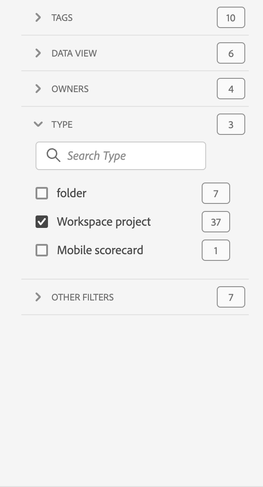

# Visão geral dos projetos

Os projetos do Workspace permitem combinar painéis, visualizações e componentes para criar e compartilhar a sua análise com qualquer pessoa da sua organização. Antes de iniciar o seu primeiro projeto, saiba como acessar, navegar e gerenciar os projetos.

Para acessar projetos na Adobe Analytics, selecione **[!UICONTROL Workspace]**.  O gerenciador de **[!UICONTROL Projetos]** lista todos os projetos que você possui ou que foram compartilhados com você. O Gerenciador de projetos com a lista Projeto também é a página inicial padrão do Adobe Analytics, a menos que você tenha configurado o contrário em Preferências.

## Área de título

Na área de título ➊, você pode criar um projeto, criar uma pasta, editar as suas preferências e mostrar ou ocultar um painel com blocos adicionais.

* Para mostrar ou ocultar um painel esquerdo que permita selecionar entre **[!UICONTROL Projetos]** e **[!UICONTROL Aprendizagem]**, selecione .
* O título mostra os projetos, opcionalmente adicionados com um caminho para a pasta selecionada. Por exemplo, [!UICONTROL Projetos] > **[!UICONTROL Pasta da empresa]**. Você pode selecionar partes individuais da subpasta para ir diretamente à pasta específica.
* Para mostrar blocos de um [**[!UICONTROL Projeto em branco]**](create-projects.md), [**[!UICONTROL Cartão de pontuação móvel em branco]**](/help/analyze/mobile-app/create-scorecard.md), **[!UICONTROL Abra a documentação]** e **[!UICONTROL Abra as notas de versão]**, selecione  **[!UICONTROL Mostrar mais]**. Para ocultar a área com blocos, selecione  **[!UICONTROL Mostrar menos]**.
* Com base no que você escolher mostrar, usando o [Seletor de exibição](#show-selector), é possível editar preferências e realizar ações na pasta atual visível em **[!UICONTROL Projetos]**:

  | Ação | Descrição |
  |---|---|
  | **[!UICONTROL Criar projeto]** | Selecione para [criar um novo projeto](create-projects.md). |
  | **[!UICONTROL Criar pasta]** | Selecione para [criar uma nova pasta](workspace-folders/create-folders.md). |
  |  **[!UICONTROL Editar preferências]** | [Editar preferências](/help/analyze/analysis-workspace/user-preferences.md) de todos os seus projetos. Quando a navegação estrutural resulta em um espaço limitado, esta ação faz parte do submenu . |
  | **[!UICONTROL Adicionar projetos]** | Selecione para [adicionar projetos](workspace-folders/add-projects.md) à pasta atual. Quando a navegação estrutural resulta em um espaço limitado, esta ação faz parte do submenu . |
  | **[!UICONTROL Renomear pasta]** | [Renomeia](workspace-folders/manage-folders.md#rename-folders) a pasta atual. |
  | **[!UICONTROL Mover pasta]** | [Move](workspace-folders/manage-folders.md#move-folders) a pasta atual. |
  | **[!UICONTROL Excluir pasta]** | [Exclui](workspace-folders/manage-folders.md#delete-folders) a pasta atual. |

## Lista de projetos

A lista de projetos ➋ exibe todos os projetos que você possui e que foram compartilhados com você. A lista tem as seguintes colunas:

| Coluna | Descrição |
| --- | --- | 
|  | Quando um ou mais projetos são selecionados, uma barra de ação azul aparece na parte inferior da interface “Projeto”. Consulte [Ações](#actions) para mais detalhes. |
|  | Selecione  para adicionar ou  para remover um projeto dos favoritos. |
| **[!UICONTROL Título e descrição]** | Para editar o projeto, selecione o link do título, que abrirá o [projeto do Workspace](/help/analyze/analysis-workspace/home.md). Projetos compartilhados com você são indicados com . Selecione  para exibir um menu pop-up com mais detalhes sobre o projeto. Selecione  para abrir um menu de contexto com ações. Consulte [Ações](#actions) para mais detalhes. |
| **[!UICONTROL Tipo]** | Um projeto do Workspace, uma pasta  ou um [cartão de pontuação móvel](/help/analyze/mobile-app/home.md). |
| **[!UICONTROL Tags]** | As tags aplicadas ao projeto.  |
| **[!UICONTROL Programado]** | Se um projeto está agendado para ser enviado por email aos destinatários. As opções são  **[!UICONTROL Ativado]** ou  **[!UICONTROL Desativado]**. Consulte [Enviar dados do projeto a outras pessoas](/help/analyze/analysis-workspace/curate-share/t-schedule-report.md). |
| **[!UICONTROL Link compartilhado (qualquer pessoa)]** | Se um projeto é compartilhado com alguém, mesmo com pessoas que não tenham acesso ao Analysis Workspace. As opções são  **[!UICONTROL Ativo]** ou  **[!UICONTROL Inativo]**. Consulte [Compartilhar um projeto com qualquer pessoa (sem necessidade de logon)](/help/analyze/analysis-workspace/curate-share/share-projects.md#share-a-project-with-anyone-no-login-required) em [Compartilhar projetos](/help/analyze/analysis-workspace/curate-share/share-projects.md) para mais informações. |
| **[!UICONTROL Função do projeto]** | A sua função no projeto. As opções são: editar, duplicar e exibir. Consulte [Funções do projeto](/help/analyze/analysis-workspace/curate-share/curate.md) para mais informações. |
| **[!UICONTROL Conjunto de relatórios]** | O conjunto de relatórios ao qual o projeto está associado. |
| **[!UICONTROL Proprietário]** | A pessoa que criou o projeto (você ou alguém que compartilhou o projeto com você.) |
| **[!UICONTROL Compartilhado com]** | Usuários com os quais o projeto foi compartilhado. |
| **[!UICONTROL Última modificação]** | Data e hora em que o projeto foi modificado pela última vez. |
| **[!UICONTROL Aberto pela última vez]** | Data e hora da última vez que o projeto foi aberto. |
| **[!UICONTROL ID de componente]** | A ID do componente. |
| **[!UICONTROL Intervalo de datas mais longo]** | O intervalo de datas mais longo de qualquer um dos painéis ou visualizações do projeto. |
| **[!UICONTROL Número de consultas]** | A quantidade total de consultas contidas no projeto. |
| **[!UICONTROL Localização]** | A pasta na qual o projeto reside. |

Passe o mouse sobre qualquer cabeçalho de coluna para exibir  e selecione no menu de contexto:

* **[!UICONTROL Classificação crescente]**
* **[!UICONTROL Classificação decrescente]**
* **[!UICONTROL Redimensionar coluna]**. Uma linha azul aparece para ajudar a redimensionar a coluna.

### Ações

É possível realizar ações em um ou mais projetos por meio do menu de contexto  ou da barra de ação azul.

| Ícone | Ação | Descrição |
|:---:| ---|---|
|  | **[!UICONTROL *x *selecionado(s)]** | Desmarque os projetos e pastas selecionados, e remova a barra de ação azul. |
|  | **[!UICONTROL Excluir]** | Exclua um ou mais projetos ou pastas. Uma confirmação será solicitada. |
|  | **[!UICONTROL Compartilhar]** | Compartilhar um projeto. Consulte [Compartilhar um projeto](/help/analyze/analysis-workspace/curate-share/share-projects.md) para mais informações. |
|  | **[!UICONTROL Renomear]** | Renomear um projeto. Abre uma caixa de diálogo **[!UICONTROL Renomear: *nome do projeto *]**. Digite o novo nome e selecione&#x200B;**[!UICONTROL Salvar &#x200B;]**. |
|  | **[!UICONTROL Copiar]** | Copiar um ou mais projetos. O projeto tem os mesmos nome e sufixo `(Copy)`. |
|  | **[!UICONTROL Fixar]** ou **[!UICONTROL Desafixar]** | Fixar ou desafixar um ou mais projetos ou pastas. Os projetos e pastas fixados aparecem na parte superior da lista, e ignoram a ordem de classificação especificada. |
|  | **[!UICONTROL Mover para cima]** | Mover um projeto ou uma pasta fixada para cima na lista de projetos. |
|  | **[!UICONTROL Mover para baixo]** | Mover um projeto ou uma pasta fixada para baixo na lista de projetos. |
|  | **[!UICONTROL Tag]** | Marcar um ou mais projetos ou pastas com tags. A caixa de diálogo **[!UICONTROL Componentes das tags]** aparece para seleção de uma ou mais tags. Clique em **[!UICONTROL Salvar]** para salvar as tags dos projetos ou pastas selecionadas. |
|  | **[!UICONTROL Aprovar]** ou **[!UICONTROL Desaprovar]** | Aprovar ou desaprovar um projeto. Somente administradores podem aprovar projetos. |
|  | **[!UICONTROL Exportar CSV]** | Exportar os projetos selecionados como um arquivo CSV com o nome `Project List.csv`. |
|  | **[!UICONTROL Adicionar projetos]** | Adicionar um ou mais projetos a uma pasta selecionada. Em **[!UICONTROL Adicionar projetos]**, é possível selecionar um ou mais projetos. Clique em **[!UICONTROL Adicionar]** para adicionar os projetos à pasta. Consulte [Adicionar projetos a pastas](workspace-folders/add-projects.md#from-inside-a-folder) para mais informações. |
|  | **[!UICONTROL Mover para]** | Mover um ou mais projetos selecionados para uma pasta. Em **[!UICONTROL Selecionar pasta]**, selecione a pasta para a qual deseja mover o projeto selecionado e clique em **[!UICONTROL Mover]**. Consulte [Adicionar projetos a pastas](workspace-folders/add-projects.md#from-the-project-list) para mais informações. |

## Seletor de exibição

É possível alternar a aparência da interface de projetos por meio dos seletores **[!UICONTROL Mostrar]** ➌. O seletor **[!UICONTROL Mostrar]** define quais opções estão disponíveis na [Área de título](#title-area) e quais colunas são exibidas na [Lista de projetos](#project-list).

* Para alterar as opções disponíveis para a [Área de título](#title-area), selecione **[!UICONTROL Mostrar]** **[!UICONTROL Todos os projetos]** ou **[!UICONTROL Mostrar]** **[!UICONTROL Pastas e projetos]**.

* Para definir quais colunas você quer exibir para a [Lista de projetos](#project-list), selecione  e, na caixa de diálogo **[!UICONTROL Personalizar tabela]**, marque ou desmarque colunas. Selecione **[!UICONTROL Aplicar]** para aplicar a personalização. Consulte [Lista de projetos](#project-list) para mais detalhes sobre as colunas.

## Painel de filtro

É possível filtrar os projetos e pastas da [Lista de projetos](#project-list) por meio do painel de filtros ➍. Para mostrar ou ocultar o painel de filtro, use .

O painel de filtro consiste nas seções a seguir.

### Tags

| Tags | Descrição |
|---|---|
| {width="300"} | A seção **[!UICONTROL Tags]** permite filtrar por tags. <ul><li>Utilize  *Pesquisar tags* para procurar as tags que deseja usar para filtrar.</li><li>É possível selecionar mais de uma tag. As tags disponíveis dependem das seleções feitas em outras seções no painel de filtro.</li><li>Os números indicam:<ul><li>**2︎⃣**: a quantidade de tags disponíveis para os projetos resultantes do filtro atual.</li><li>7︎⃣: a quantidade de projetos associados à tag específica.</li></ul></li></ul> |

### Conjuntos de relatórios

| Conjuntos de relatórios | Descrição |
|---|---|
| {width="300"} | A seção **[!UICONTROL Conjuntos de relatórios]** permite filtrar por conjuntos de relatórios. <ul><li>Você usa  *Pesquisar Conjuntos de Relatórios* para procurar conjuntos de relatórios que deseja usar para filtrar.</li><li>É possível selecionar mais de um conjunto de relatórios. Os conjuntos de relatórios disponíveis dependem das seleções feitas em outras seções no painel de filtro.</li><li>Os números indicam:<ul><li>**3︎⃣**: o número de conjuntos de relatórios disponíveis para os projetos resultantes do filtro atual.</li><li>4︎⃣: o número de projetos associados ao conjunto de relatórios específico.</li></ul></li></ul> |

### Proprietários

| Proprietário | Descrição |
|---|---|
| {width="300"} | A seção **[!UICONTROL Proprietário]** permite filtrar por proprietários. <ul><li>Use  *Pesquisar proprietários* para procurar os proprietários que deseja usar para filtrar.</li><li>É possível selecionar mais de um proprietário. Os proprietários disponíveis dependem das seleções feitas em outras seções no painel de filtro.</li><li>Os números indicam:<ul><li>**3︎⃣**: a quantidade de proprietários disponíveis para os projetos resultantes do filtro atual.</li><li>4︎⃣: a quantidade de projetos associados ao proprietário específico.</li></ul></li></ul> |

### Tipo

| Tipo | Descrição |
|---|---|
| {width="300"} | A seção **[!UICONTROL Tipo]** permite filtrar por tipo de projeto ou pasta.<ul><li>Você pode selecionar uma ou mais das seguintes opções:<ul><li> **[!UICONTROL pasta]**</li><li>**[!UICONTROL Projeto do Espaço de trabalho]**</li><li>**[!UICONTROL Cartão de pontuação para dispositivos móveis]**</li></ul> <li>É possível selecionar vários outros filtros. Os outros filtros disponíveis dependem das seleções feitas em outras seções no painel de filtros.</li><li>Os números indicam:<ul><li>**5︎⃣**: a quantidade de outros filtros disponíveis para os projetos resultantes do filtro atual.</li><li>4︎⃣: a quantidade de projetos associados ao outro filtro específico.</li></ul></li></ul> |

### Outros filtros

| Outros filtros | Descrição |
|---|---|
| {width="300"} | A seção **[!UICONTROL Outros filtros]** permite filtrar por outros filtros predefinidos.<ul><li>Você pode selecionar uma ou mais das seguintes opções:<ul><li> **[!UICONTROL Exibir tudo]**</li><li>**[!UICONTROL Compartilhado comigo]**</li><li>**[!UICONTROL Meu]**</li><li>**[!UICONTROL Aprovado]**</li><li>**[!UICONTROL Favoritos]**</li></ul> O que você pode selecionar depende da sua função e das suas permissões.</li><li>É possível selecionar vários outros filtros. Os outros filtros disponíveis dependem das seleções feitas em outras seções no painel de filtros.</li><li>Os números indicam:<ul><li>**5︎⃣**: a quantidade de outros filtros disponíveis para os projetos resultantes do filtro atual.</li><li>4︎⃣: a quantidade de projetos associados ao outro filtro específico.</li></ul></li></ul> |

## Pesquisar

Use a área de pesquisa ➎ para procurar projetos e pastas com o campo . Comece a digitar, e a [lista de projetos](#project-list) filtrará automaticamente conforme a sua pesquisa.

A área de pesquisa também mostra os filtros aplicados do painel de filtro.

* Para remover um filtro, selecione  no filtro.
* Para remover todos os conjuntos de dados selecionados, clique em “Limpar tudo”.

Se o espaço for limitado para exibir os filtros individuais, você verá **[!UICONTROL Segmentando com *x* filtros]**.

* Para remover um filtro:

   1. Use **[!UICONTROL *x *filtros]** para abrir um menu de contexto com os tipos de filtro e os filtros individuais.
   1. Selecione  para remover um filtro.

<!--

# Projects overview

Workspace projects allow you to combine data components, tables and visualizations to craft your analysis and share with anyone in your organization. Before starting your first project, learn about how to access, navigate and manage your projects. 

Here is a video on how to build a Workspace project:

>[!BEGINSHADEBOX]

See  [Build a Workspace project](https://video.tv.adobe.com/v/334076?quality=12&learn=on){target="_blank"} for a demo video.

>[!ENDSHADEBOX]

## Project list {#project-list}

When you first go to **[!UICONTROL Analytics]** > **[!UICONTROL Workspace]**, the page lists all the projects you own or have been shared to you. This page is also the landing page for Adobe Analytics, unless you have previously set a custom landing page. 

The Projects page contains the following information: 

|  Element  | Description  |
|---|---|
| [Edit preferences](/help/analyze/analysis-workspace/user-preferences.md) | Manage settings for Analysis Workspace and its related components for all new projects or panels that you create.  |
| [Create folder](/help/analyze/analysis-workspace/build-workspace-project/workspace-folders/create-folders.md)  | Add a new folder or subfolder to the list of projects and folders. |
| [Create project](/help/analyze/analysis-workspace/build-workspace-project/create-projects.md)  | Start a new project from scratch or from a report.  |
|  Show more  | This selection reveals options for creating a blank project or mobile scorecard, [viewing training tutorials](https://experienceleague.adobe.com/en/docs/analytics-learn/tutorials/analysis-workspace/analysis-workspace-basics/analysis-workspace-introduction), or [viewing release notes](/help/release-notes/latest.md).  |
|  | To show or hide filters. You can filter on tags, report suite, owners, type (project, folder, mobile scorecard), and other filters. | 
|  | Use the search field to search for folders, Workspace projects or mobile scorecards. |
| Show Folders & Projects| Choose whether to show the folder structure of projects. For more information, see [About Folders in Analytics](/help/analyze/analysis-workspace/build-workspace-project/workspace-folders/about-folders.md). |
|   | This icon allows you to customize the columns you see for each project in the projects list.  |

The list of projects can display the following columns:

|  Column  | Description  |
|---|---|
| [!UICONTROL Name]  | Name of the Workspace project. Select  to show a popup with more details on a project or folder. Select  to show actions available. See [Manage projects](#manage-projects) for more details.  | 
| [!UICONTROL Type] | Indicates whether this entry is a Workspace project, a folder, or a [Mobile scorecard](https://experienceleague.adobe.com/en/docs/analytics/analyze/mobapp/home). |
| [!UICONTROL Tags]  |Tags that were applied to the project.  |
| [!UICONTROL Scheduled] | Indicates whether projects are scheduled to be emailed to recipients. See [Schedule projects](/help/analyze/analysis-workspace/curate-share/t-schedule-report.md). |
| Shared link (anyone) | Projects can be shared with anyone, even with people who don't have access to Analysis Workspace. This column shows whether projects have been shared in this way. See [Share a project with anyone (no login required)](/help/analyze/analysis-workspace/curate-share/share-projects.md#share-public-link) in [Share projects](/help/analyze/analysis-workspace/curate-share/share-projects.md) for more information. |
| [Project Role](https://experienceleague.adobe.com/en/docs/analytics/analyze/analysis-workspace/curate-share/share-projects) | Indicates your role for the project - owners, edit, duplicate, view. |
| [!UICONTROL Report suite] | The report suite that the project is associated with. |
| [!UICONTROL Owner]  | The person who created this project (either you or someone who shared the project with you.)  |
| [!UICONTROL Shared with]  | Users that the project has been shared with.  |
| [!UICONTROL Last Modified]  | Date and time when the project was last modified.  |
| [!UICONTROL Last Opened]  | Date and time when the project was last opened.  |
| [!UICONTROL Last Used] | Date and time when the project was last used. | 
| [!UICONTROL Project ID]  | The ID of the project.  |
| [!UICONTROL Longest Date Range]  | The longest date range of the project.  |
| [!UICONTROL Number of Queries]  | The total number of queries contained in the project.  |
| [!UICONTROL Location]  | The folder where the project resides.  |

### Manage projects

To manage projects, select one or more projects from the project list. 

From the blue action bar, you can select the following actions:

| Action | Description | 
|---|---|
|  Delete | When selected, a confirmation dialog prompts you to confirm the deletion of a Workspace project or Mobile scorecard. Select **[!UICONTROL OK]** to confirm. |
|  Share | This action allows you to share your project. See [Share projects](../curate-share/share-projects.md).|
|  Rename | Opens up a **[!UICONTROL Rename: *name*]** dialog to rename your project. Select **[!UICONTROL Save]** to save the new name for the project. |
|  Copy | Immediately copies the selected project to a new project with name *original name* (Copy).  |
|  Pin | Immediately pins the project to the top of the list. Adds the  indicator. |
|  Tag | Opens up the **[!UICONTROL Tag Project]** dialog. You can select an existing tag or add new tags. Select **[!UICONTROL Save]** to save the tags for the project. |
|  Approve or Unapprove |  Approves or unapproves the project.  |
|  Export CSV | Immediately downloads a file containing a comma-separated value list of the projects. |
|  Move to | This action allows you to move the project to a folder. In the **[!UICONTROL Select Folder]** dialog, select a folder from the **[!UICONTROL Folder]** list, and select **[!UICONTROL Move]**. | 

## Menu bar {#menu-bar}

Within a project, the menu provides options for managing your project, adding components, finding help, and more. You can also access each menu option by keyboard [shortcuts](https://experienceleague.adobe.com/en/docs/analytics/analyze/analysis-workspace/build-workspace-project/fa-shortcut-keys).

|  Menu item  | Description  |
|---|---|
|  Project  | This menu includes common actions for project management, including New, Open, Save, Save as, and [Save as company report](/help/analyze/analysis-workspace/build-workspace-project/starter-projects.md). You can also refresh the entire project to retrieve the most recent data and definitions by clicking Refresh Project. [Download CSV and PDF](https://experienceleague.adobe.com/en/docs/analytics/analyze/analysis-workspace/curate-share/download-send) options enable you to export data from Workspace. [Project Info & Settings](https://experienceleague.adobe.com/en/docs/analytics/analyze/analysis-workspace/build-workspace-project/freeform-overview) offers many options for managing your project.  |
|  Edit  | Undo or redo your last action. Clear All resets your project to a blank starting point. |
|  Insert  | Insert new panels or visualizations from this menu. You can also insert new panels and visualizations from the left rail.  |
|  [Components](https://experienceleague.adobe.com/en/docs/analytics/analyze/analysis-workspace/components/analysis-workspace-components)  | Create new segment, calculated metric, date range, or alert components from your project. You can also create new components from the left rail. If your component definitions have recently changed, Refresh Components retrieves the latest definitions. |
|  [Share](https://experienceleague.adobe.com/en/docs/analytics/analyze/analysis-workspace/curate-share/send-schedule-files)  | Curate, share and schedule PDF/CSV projects to recipients in your organization.  |
|  Help  | Access help documentation, videos, and the Analytics [Experience League community](https://experienceleaguecommunities.adobe.com/t5/adobe-analytics/ct-p/adobe-analytics-community). Manage the visibility of Workspace tips as well as the [debugger](https://developer.adobe.com/analytics-apis/docs/2.0/). Find details about Workspace and factors that impact project [performance](https://experienceleague.adobe.com/en/docs/analytics/analyze/analysis-workspace/workspace-faq/optimizing-performance).  |
|  Share button or Owner  | If you are in an Own or Edit for the project, the Share button in the top-right gives you one-click access to manage your project recipients. If you are in a Duplicate or View role for the project, you see the project owner's name. |

### Project Info & Settings {#info-settings}

>[!CONTEXTUALHELP]
>id="workspace_project_countrepeatinstances"
>title="Count repeat instances"
>abstract="Specifies whether repeat instances are counted in reports.  Note: this setting does not apply to Flow or Fallout visualizations."

>[!CONTEXTUALHELP]
>id="workspace_project_repeatinstances"
>title="Count repeat instances"
>abstract="Specifies whether repeat instances are counted in reports. Note: this setting does not apply to Flow or Fallout visualizations."

>[!CONTEXTUALHELP]
>id="workspace_project_commenting"
>title="Allow commenting"
>abstract="When enabled, a comments area is available in the right rail of the project in Analysis Workspace."

**[!UICONTROL Workspace]** > **[!UICONTROL Project]** > **[!UICONTROL Project Info & settings]** provides project-level information on the currently active project.

Settings include:

|  Setting  | Description  |
|---|---|
|  Project Name  | The name given to the project. You can double-click the name to edit it.  |
|  Owner  | Project owner name  |
|  Last Modified  | Date of last modification to the project.  |
|  Tags  |Lists any tags applied to a project for easier categorization.  |
|  Description  | A description is useful for clarifying the purpose of a project. You can double-click the description to edit it.  |
|  Count repeat instances  | Specifies whether repeat instances are counted in reports. For example, this setting (when activated) treats multiple consecutive pages views to the same page as multiple page views. With it off, they count as a single page view (this setting only affects certain metrics, such as Single Page Visits). **Note**: This setting does not apply to Flow or Fallout visualizations.  |
| [Show annotations](/help/analyze/analysis-workspace/components/annotations/overview.md) | Specify whether to show annotations in the project or not. |
|  [Project color palette](https://experienceleague.adobe.com/en/docs/analytics/analyze/analysis-workspace/build-workspace-project/color-palettes)  | You can change the categorical color palette used in Workspace, by choosing from out-of-the-box palettes that have been optimized for color blindness, or by specifying your custom palette. This feature affects many things in Workspace, including most visualizations.  |
| [View Density](https://experienceleague.adobe.com/en/docs/analytics/analyze/analysis-workspace/build-workspace-project/view-density) | Lets you see more data on the screen by reducing the vertical padding of the left rail, freeform tables and cohort tables. |

## Left rail {#left-rail}

Within a project, various icons are available in the left rail, and each represents important tools to build your project:

| Icon | Functionality |
|---|---|
|  | [Panels](/help/analyze/analysis-workspace/c-panels/panels.md) |
|  |[Visualizations](/help/analyze/analysis-workspace/visualizations/freeform-analysis-visualizations.md) |
|  | [Components](/help/analyze/analysis-workspace/components/analysis-workspace-components.md) |
|  | [Data dictionary](/help/analyze/analysis-workspace/components/data-dictionary/data-dictionary-overview.md) |
|  | [Table of contents](/help/analyze/analysis-workspace/build-workspace-project/project-table-of-contents.md) |

Components (dimensions, metrics, segments, date ranges) in the left rail relate to the active panel data view. A blue border identifies the active panel, and the active report suite is listed at the top of the component rail.

## Right-click menu

Here is a video on using the right-click menu in Analysis Workspace:

>[!BEGINSHADEBOX]

See  [Using the context menu](https://video.tv.adobe.com/v/23981?quality=12&learn=on){target="_blank"} for a demo video.

>[!ENDSHADEBOX]

## Project canvas {#canvas}

The project canvas is where you bring together panels, tables, visualizations, and components to build your analysis. A project can contain many panels, and each panel can contain many tables and visualizations.

Panels are helpful when you want to organize your projects according to time periods, report suites, or analysis use case. The active panel has a colored border around it, and determines what components are available in the left rail.

Depending on the starting point you chose for your projects, you either have a [freeform table](https://experienceleague.adobe.com/en/docs/analytics/analyze/analysis-workspace/visualizations/freeform-table/freeform-table) or a [blank panel](https://experienceleague.adobe.com/en/docs/analytics/analyze/analysis-workspace/panels/blank-panel) in the canvas to begin with. The quickest way to start analyzing is to select one or many components and simply drag & drop them into the project canvas. A table of data is rendered automatically for you. [Learn more](https://experienceleague.adobe.com/en/docs/analytics/analyze/analysis-workspace/visualizations/freeform-table/freeform-table) about the different options for building a table, or leverage the available [training tutorial](https://experienceleague.adobe.com/en/docs/analytics/analyze/analysis-workspace/home) for more guidance on building your first project.

-->