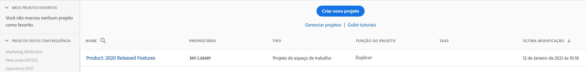
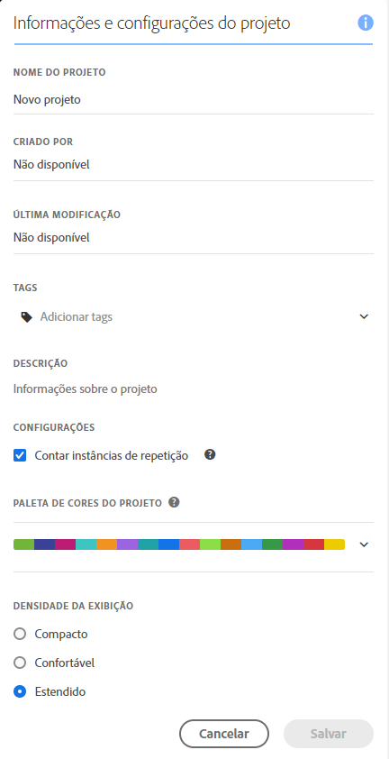
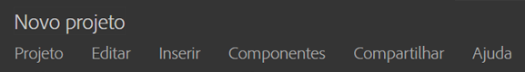
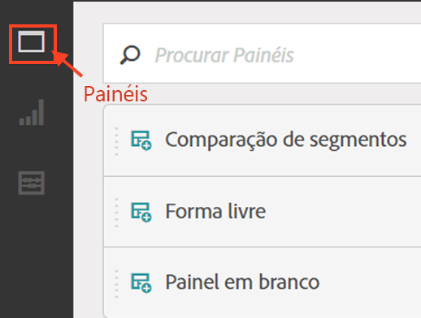
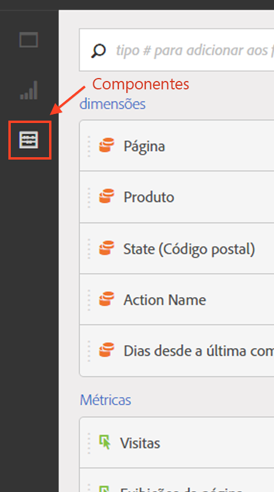

# Criar projeto - visão geral

**[!UICONTROL Analytics]** &gt; **[!UICONTROL Espaço de trabalho]**

Você pode criar um projeto robusto do Analytics com base em uma combinação de exibições, componentes de relatórios e tabelas de dados. Ele adiciona muitos dos recursos do criador de tabelas da Ad Hoc Analysis ao Analytics.

Na Analysis Workspace, você pode comparar e examinar os dados de maneiras que não eram possíveis anteriormente. Por exemplo, é possível configurar relatórios classificados e faça alterações iterativas imediatas à consulta de dados e acesse e manipule os valores no nível de relatório.

A consulta vai diretamente para o mecanismo de relatórios. É possível fazer alterações em linha com outros relatórios para criar a sua análise. Os resultados retornam imediatamente, sem nenhuma atualização do navegador.

## Página da lista de projetos da Workspace {#section_39AA007D7C384F4E869F842F1C7B11F8}

When you first go to **[!UICONTROL Analytics]** &gt; **[!UICONTROL Workspace]**, the page lists all the projects you own or have been granted access to. Para definir essa página como a página de aterrissagem do Adobe Analytics, clique em **[!UICONTROL Definir como página de aterrissagem]**. (Se você não encontrar essa opção, como na captura de tela abaixo, ela já é sua página inicial).

A página da lista de projeto da Workspace contém as informações a seguir:

| Elemento | Descrição |
|---|---|
|    [Modelos](../../../analyze/analysis-workspace/build-workspace-project/starter-projects.md#concept_49B9A327C5004DB0A4BE6291435625C5) de projeto | Você pode usar esses modelos de projeto pré-preenchidos como estão ou adaptá-los às suas necessidades (adicionando ou substituindo métricas ou visualizações, por exemplo) e salvá-los com um novo nome. |
| [Criar novo projeto](../../../analyze/analysis-workspace/build-workspace-project/t-freeform-project.md#task_C2C698ACC7954062A28E4784911E6CF2) | Clique nesse link para criar um novo projeto a partir do zero. |
| Gerenciar projetos | Clicking this link takes you to the Projects Component Manager ( **[!UICONTROL Analytics]** &gt; **[!UICONTROL Components]** &gt; **[!UICONTROL Projects]**), which lists all your projects and lets you tag, share, delete, rename, approve, copy, and export projects to CSV. |
| Exibir tutoriais | O direciona para os [vídeos no YouTube da Analysis Workspace](https://www.youtube.com/playlist?list=PL2tCx83mn7GuNnQdYGOtlyCu0V5mEZ8sS). |
| Nome | Nome do projeto da Workspace. |
| Criado por | A pessoa que criou o projeto (você ou alguém que compartilhou o projeto com você.) |
| Tags | Tags that were applied to the project, either in the Projects Component Manager or under **[!UICONTROL Workspace]** &gt; **[!UICONTROL Project]** &gt; **[!UICONTROL Project Info &amp; Settings]**. |
| Última modificação | Data e hora em que o projeto foi modificado pela última vez. |

## Informações e configurações do projeto {#section_63773D0B9E4543E88068ECECB9EEB4C6}

**[!UICONTROL Espaço de trabalho]** &gt; **[!UICONTROL Projeto]** &gt; **[!UICONTROL Informações e configurações do projeto]**

**[!UICONTROL As Informações e configurações do projeto]** fornecem informações a nível de projeto sobre o projeto ativo no momento.

| Configuração | Descrição |
|---|---|
| Nome do projeto | O nome fornecido ao projeto. Você pode clicar duas vezes no nome para editá-lo. |
| Criado por | Nome do proprietário do projeto |
| Última modificação | Data da última modificação do projeto. |
| Tags | Lista qualquer tag aplicada a um projeto para classificar com mais facilidade. Além disso, também é possível adicionar tags a projetos ao salvá-los. Exiba as tags de um projeto na Página inicial da Workspace na coluna [!UICONTROL Tags]. |
| Descrição | Uma descrição é útil para esclarecer a finalidade de um projeto. Você pode clicar duas vezes na descrição para editá-la. |
| Contagem de instâncias repetidas no projeto | Especifica se as instâncias repetidas devem ser contadas nos relatórios. Se você tiver vários valores em sequência para a mesma variável, pode contá-las como uma ou várias instâncias dessa variável. |
| Esquema de cores da visualização | É possível alterar o esquema de cores utilizado na Workspace, escolhendo em uma paleta de cores diferente ou especificando sua própria paleta. Esse recurso afeta muitas coisas na Workspace, incluindo a maioria das visualizações. |
| Densidade da exibição | Permite ver mais dados na tela, ao reduzir o preenchimento vertical do painel à esquerda, em tabelas de forma livre e de coorte. |

## Menu de projetos {#section_850CDFCB86A64EB0A0AD5B9E0FCB7013}

O menu superior de Projetos tem a seguinte aparência:

O submenu contém as seguintes opções.

>[!NOTE]
>
>Options marked by an asterisk (*) display only with **saved** projects.

| Projeto | Editar | Inserir | Componentes | Compartilhar | Ajuda |
|---|---|---|---|---|---|
| Novo | Recurso Desfazer | Novo painel | Novo segmento | Compartilhar projeto | Vídeos |
| Abrir | Limpar | Novo painel de forma livre | Nova métrica | Obter link do projeto* | Teclas de atalho |
| Salvar | Limpar tudo | Novo painel de Comparação de segmentos | Novo intervalo de datas | Enviar arquivo agora* | Fórum de ajuda |
| Salvar como* |  | Nova tabela de forma livre | Novo alerta | Enviar arquivo agendado* |  |
| Definir como Página inicial* |  | Nova linha | Atualizar componentes | Preparar dados do projeto |  |
| Atualizar projeto |  | Nova barra |  |  |  |
| Baixar CSV |  |  |  |  |  |
| Baixar o PDF* |  |  |  |  |  |
| Informações e configurações do projeto |  |  |  |  |  |

## Trilho da esquerda {#section_271295C26EC840ABB2A8E7EC0498B60E}

The left rail has 3 icons, allowing you access to Panels, [Visualizations](../../../analyze/analysis-workspace/visualizations/freeform-analysis-visualizations.md#concept_09242627629147A88A68F1506954C276), and [Components](../../../analyze/analysis-workspace/components/analysis-workspace-components.md#concept_BEBE3A75E072495D9E2F895567BBD462)(Dimensions, Metrics, Segments, Data Ranges) with one click:

  

Um **[!UICONTROL Painel em branco]foi adicionado à lista de painéis que pode ser acessada no painel esquerdo.** Para criar um **novo painel Coorte**, arraste um Painel em branco e uma visualização da Tabela de coorte.
