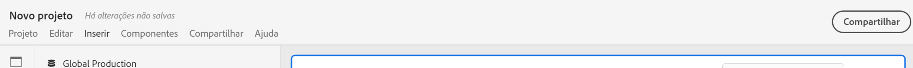
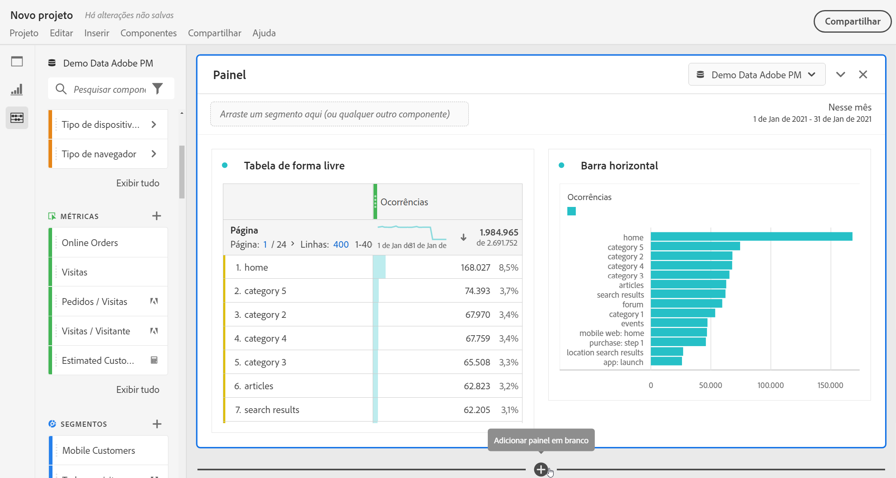
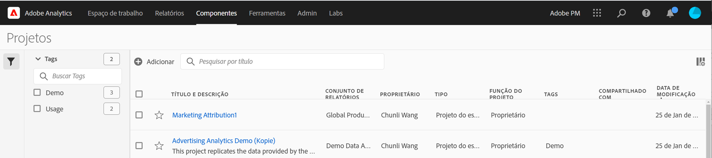

# Visão geral dos Projetos

Os projetos do Workspace permitem combinar componentes de dados, tabelas e visualizações para criar sua análise e compartilhar com qualquer pessoa em sua organização. Antes de iniciar seu primeiro projeto, saiba mais sobre como acessar, navegar e gerenciar seus projetos.

## Lista do projeto {#project-list}

When you first go to **[!UICONTROL Analytics]** > **[!UICONTROL Workspace]**, the page lists all the projects you own or have been shared to you. Essa também é a landing page do Adobe Analytics, a menos que você tenha definido uma landing page personalizada anteriormente.

A página da lista de projeto do Workspace contém as informações a seguir:

| Elemento | Descrição |
|---|---|
| [Criar novo projeto](/help/analyze/analysis-workspace/home.md) | Clique neste link para start de um novo projeto do zero ou de um [modelo](https://experienceleague.adobe.com/docs/analytics/analyze/analysis-workspace/build-workspace-project/starter-projects.html?lang=en#analysis-workspace) criado para você. |
| Gerenciar projetos | Clicar nesse link o direciona para o Gerenciador de componentes de projetos (**[!UICONTROL Analytics]** > **[!UICONTROL Componentes]** > **[!UICONTROL Projetos]**), que lista todos os projetos e permite marcar, compartilhar, excluir, renomear, aprovar e exportar projetos para CSV. |
| Definir como página de aterrissagem | Transforma esta página em sua landing page do Workspace. |
| [Exibir tutoriais](https://docs.adobe.com/content/help/en/analytics-learn/tutorials/analysis-workspace/analysis-workspace-basics/analysis-workspace-introduction.html) | Direciona você para os tutoriais em vídeo do Analysis Workspace. |
| Nome | Nome do projeto do Workspace. |
| Proprietário | A pessoa que criou o projeto (você ou alguém que compartilhou o projeto com você.) |
| Tipo | Indica se é um projeto do Workspace ou um [Scorecard móvel](https://docs.adobe.com/content/help/pt-BR/analytics/analyze/mobapp/home.html). |
| [Função do projeto](https://experienceleague.adobe.com/docs/analytics/analyze/analysis-workspace/curate-share/share-projects.html) | Indica sua função para o projeto - proprietários, edição, duplicado, visualização. |
| Tags | Tags aplicadas ao projeto. |
| Última modificação | Data e hora em que o projeto foi modificado pela última vez. |
| Meus projetos favoritos | Para marcar um projeto como favorito, abra-o e clique na estrela ao lado do seu nome. Ele será exibido nessa lista na próxima vez que você abrir o Workspace. |
| Projetos visualizados com frequência | Lista todos os projetos que você abre com frequência para facilitar o acesso. |

## Barra de menus {#menu-bar}

Em um projeto, o menu fornece opções para gerenciar o projeto, adicionar componentes, encontrar ajuda e muito mais. Cada opção de menu também pode ser acessada por [atalhos](https://experienceleague.adobe.com/docs/analytics/analyze/analysis-workspace/build-workspace-project/fa-shortcut-keys.html)do teclado.

| Item de menu | Descrição |
|---|---|
| Projeto  | Inclui ações comuns para o gerenciamento de projetos, incluindo modelo Novo, Abrir, Salvar, Salvar como e [Salvar como](https://experienceleague.adobe.com/docs/analytics/analyze/analysis-workspace/build-workspace-project/starter-projects.html). Você também pode atualizar o projeto inteiro para recuperar os dados e as definições mais recentes clicando em Atualizar projeto. [As opções de download de CSV e PDF](https://experienceleague.adobe.com/docs/analytics/analyze/analysis-workspace/curate-share/download-send.html) permitem exportar dados do Workspace. [Informações e configurações](https://experienceleague.adobe.com/docs/analytics/analyze/analysis-workspace/build-workspace-project/freeform-overview.html?#info-settings) do projeto oferta muitas opções para gerenciar seu projeto. |
| Editar  | Desfazer ou refazer sua última ação. Limpar tudo redefinirá seu projeto para um ponto de partida em branco. |
| Inserir  | Insira novos painéis ou visualizações desse menu. Também é possível inserir novos painéis e visualizações do painel esquerdo. |
| [Componentes](https://experienceleague.adobe.com/docs/analytics/analyze/analysis-workspace/components/analysis-workspace-components.html) | Crie novos segmentos, métricas calculadas, intervalo de datas ou componentes de alerta do seu projeto. Você também pode criar novos componentes a partir do painel esquerdo. Se suas definições de componente tiverem sido alteradas recentemente, a opção Atualizar componentes recuperará as definições mais recentes. |
| [Compartilhar](https://experienceleague.adobe.com/docs/analytics/analyze/analysis-workspace/curate-share/send-schedule-files.html) | Prepare, compartilhe e agende projetos PDF/CSV para recipient em sua organização. |
| Ajuda | Acesse a documentação da ajuda, os vídeos e a comunidade [do Analytics](https://experienceleaguecommunities.adobe.com/t5/adobe-analytics/ct-p/adobe-analytics-community)Experience League. Gerencie a visibilidade das dicas do Workspace, bem como do [depurador](https://www.adobe.io/apis/experiencecloud/analytics/docs.html#!AdobeDocs/analytics-2.0-apis/master/reporting-tricks.md). Encontre detalhes sobre o Workspace e fatores que afetam o [desempenho](https://experienceleague.adobe.com/docs/analytics/analyze/analysis-workspace/workspace-faq/optimizing-performance.html)do projeto. |
| Botão Compartilhar ou Proprietário | Se você estiver em um projeto Próprio ou Editar, o botão Compartilhar no canto superior direito lhe dará acesso de um clique para gerenciar os recipient do projeto. Se você tiver uma função de Duplicado ou Visualização para o projeto, verá o nome do proprietário do projeto. |

### Informações e configurações do projeto {#info-settings}

**[!UICONTROL Workspace]** > **[!UICONTROL Projeto]** > **[!UICONTROL Informações e configurações do projeto]** O  fornece informações do projeto ativo atualmente.

As configurações incluem:

| Configuração | Descrição |
|---|---|
| Projeto  Nome | O nome fornecido ao projeto. Você pode clicar duas vezes no nome para editá-lo. |
| Criado por | Nome do proprietário do projeto. |
| Última modificação | Data da última modificação do projeto. |
| Tags | Lista qualquer tag aplicada a um projeto para classificar com mais facilidade. |
| Descrição | Uma descrição é útil para esclarecer a finalidade de um projeto. Você pode clicar duas vezes na descrição para editá-la. |
| Contagem de instâncias repetidas no projeto | Especifica se as instâncias repetidas devem ser contadas nos relatórios. Observação: essa configuração não se aplica a visualizações de Fluxo ou Fallout. |
| [Paleta de cores do projeto](https://experienceleague.adobe.com/docs/analytics/analyze/analysis-workspace/build-workspace-project/color-palettes.html) | É possível alterar a paleta de cores categórica usada no Workspace, escolhendo entre as paletas predefinidas que foram otimizadas para daltonismo ou especificando sua paleta personalizada. Esse recurso afeta muitas coisas no Workspace, incluindo a maioria das visualizações. |
| [Exibir densidade](https://experienceleague.adobe.com/docs/analytics/analyze/analysis-workspace/build-workspace-project/view-density.html) | Permite ver mais dados na tela, ao reduzir o preenchimento vertical do painel à esquerda, em tabelas de forma livre e de coorte. |

## Left rail {#left-rail}

Within a project, [panels](https://experienceleague.adobe.com/docs/analytics/analyze/analysis-workspace/panels/panels.html), tables, [visualizations](https://experienceleague.adobe.com/docs/analytics/analyze/analysis-workspace/visualizations/freeform-analysis-visualizations.html), and [components](https://experienceleague.adobe.com/docs/analytics/analyze/analysis-workspace/components/analysis-workspace-components.html) are accessed from the left rail. Estes são os componentes do projeto.

Você também pode acessar visualizações e painéis do Painel em [branco](https://experienceleague.adobe.com/docs/analytics/analyze/analysis-workspace/panels/blank-panel.html) .

Os componentes (Dimension, Métricas, Segmentos, Intervalos de datas) no painel esquerdo estão relacionados ao conjunto de relatórios do painel ativo. O painel ativo terá uma borda azul ao seu redor e o conjunto de relatórios ativo será listado na parte superior do painel do componente.

## Tela do projeto {#canvas}

A tela do projeto é onde você reúne painéis, tabelas, visualizações e componentes para criar sua análise. Um projeto pode conter muitos painéis e cada painel pode conter muitas tabelas e visualizações.

Os painéis são úteis quando você deseja organizar seus projetos de acordo com períodos de tempo, conjuntos de relatórios ou caso de uso de análise. O painel ativo terá uma borda azul ao seu redor e determina quais componentes estão disponíveis no painel esquerdo.

Dependendo do ponto de partida escolhido para seus projetos, você terá uma tabela [de forma](https://experienceleague.adobe.com/docs/analytics/analyze/analysis-workspace/visualizations/freeform-table/freeform-table.html) livre ou um painel [em](https://experienceleague.adobe.com/docs/analytics/analyze/analysis-workspace/panels/blank-panel.html) branco na tela para começar. A maneira mais rápida de analisar o start é selecionar um ou vários componentes e simplesmente arrastá-los e soltá-los na tela do projeto. Uma tabela de dados será automaticamente renderizada para você. [Saiba mais](https://experienceleague.adobe.com/docs/analytics/analyze/analysis-workspace/visualizations/freeform-table/freeform-table.html) sobre as diferentes opções para criar uma tabela ou utilize nosso tutorial [de](https://experienceleague.adobe.com/docs/analytics/analyze/analysis-workspace/home.html?#training-tutorial) treinamento para obter mais orientações sobre como criar seu primeiro projeto.

## Gerente de projetos {#manager}

Analysis Workspace projects can be managed under **Analytics > Components >  Projects**. O Gerenciador de projetos mostra os itens que um usuário específico criou. A propriedade do projeto pode ser transferida para um novo usuário em Admin > Usuários e ativos do Analytics > Transferir ativos.

No Gerenciador de projetos, você pode adicionar, marcar, compartilhar, duplicado/copiar e muito mais. Procure um projeto na barra de pesquisa ou usando as opções de filtro no painel esquerdo. Você pode filtrar por tag, proprietários, tipo de projeto e muito mais.

As ações a seguir são comuns no Gerenciador de projetos e podem ser executadas em um ou vários projetos ao mesmo tempo:

| Ação | Descrição |
|---|---|
| Adicionar | Crie um novo projeto do zero ou start a partir de um [modelo](https://experienceleague.adobe.com/docs/analytics/analyze/analysis-workspace/build-workspace-project/starter-projects.html). |
| Tag ou Aprovar | Escolha &quot;Tag&quot; ou &quot;Aprovar&quot; para organizar seus projetos e facilitar a pesquisa. |
| [Compartilhar](https://experienceleague.adobe.com/docs/analytics/analyze/analysis-workspace/curate-share/share-projects.html) | Disponibilize um projeto para outros usuários do Analysis Workspace em sua organização. |
| Excluir | Exclua seu projeto. |
| Renomear | Edite o nome do seu projeto. |
| Copiar | Crie uma cópia de duplicado do seu projeto. Isso cria uma nova ID de projeto e projeto. Quaisquer compartilhamentos ou programações vinculados ao projeto original não serão copiados. |
| Exportar para CSV | Baixe seu projeto como um arquivo CSV, que inclui dados em texto simples. |
