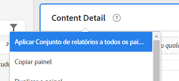
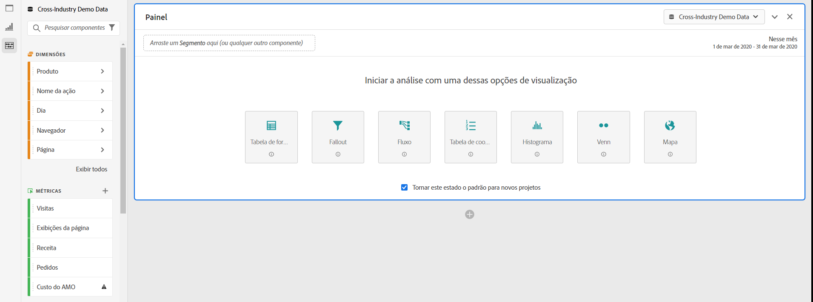
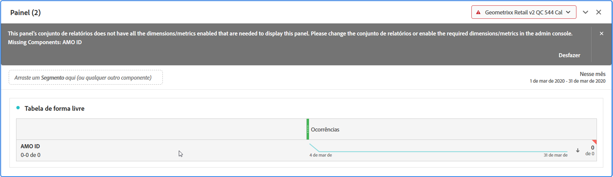

# Vários conjuntos de relatórios no Workspace

Agora você pode criar projetos no Analysis Workspace usando dados de mais de um conjunto de relatórios. Os conjuntos de relatórios agora são escolhidos no nível do painel, então é possível escolher um conjunto de relatórios diferente para cada painel dentro do mesmo projeto do Workspace.

Esse recurso é útil se você desejar, por exemplo,

* Comparar dados de duas regiões diferentes, e os dados estão em dois conjuntos de relatórios diferentes. É possível criar tabelas e visualizações para comparar os dados lado a lado.

* Criar um painel de métricas e visualizações para gerar relatórios para outras organizações. Agora é possível extrair dados de vários conjuntos de relatórios para o mesmo projeto.

## Aplicar conjunto de relatórios a todos os painéis

Você pode aplicar um conjunto de relatórios a todos os painéis ao mesmo tempo, clicando com o botão direito do mouse em qualquer cabeçalho do painel e selecionando **[!UICONTROL Apply Report Suite to All Panels]**.

## Painel ativo

Estamos introduzindo o conceito de &quot;painel ativo&quot; x &quot;painel inativo&quot; com este recurso. Você pode reconhecer o painel ativo pela borda azul clara ao redor dele. Basta clicar dentro de um painel para transformar esse painel no painel ativo.

>[!IMPORTANT]
>Você pode arrastar e soltar em qualquer painel que esteja no mesmo conjunto de relatórios que seu painel ativo. Ao arrastar para um painel inativo do mesmo conjunto de relatórios, o painel ficará ativo.

| Tarefa | Painel ativo | Painel inativo |
|---|---|---|
| Alterar conjunto de relatórios | Sim | Não |
| Arrastar e soltar componentes | Sim | Sim, para qualquer painel que esteja no mesmo conjunto de relatórios que seu painel ativo. |
| Visualizações de arrastar e soltar | Sim | Sim, para qualquer painel que esteja no mesmo conjunto de relatórios que seu painel ativo. |

## Trabalhe com vários conjuntos de relatórios

1. Crie um novo projeto com 2 ou mais painéis no Workspace.

1. Arraste e solte componentes (métricas, dimensões, segmentos, intervalos de datas) no painel. Certifique-se de que os painéis tenham dados e visualizações específicos para o conjunto de relatórios.

   >[!NOTE]
   >Às vezes, um banner é exibido ao carregar um projeto (ou ao alternar para um conjunto de relatórios) onde nem todos os componentes incluídos no projeto são incluídos no conjunto de relatórios. Os componentes ausentes serão listados. Siga [estas instruções](/help/admin/admin-console/permissions/product-profile.md) para definir permissões das métricas/dimensões necessárias.

   

   Você tem três opções para lidar com essa incompatibilidade:
   * Ativar as dimensões/métricas necessárias
   * Alterar o conjunto de relatórios.
   * Continuar com alguns componentes ausentes. Isso resultará em componentes sem nenhum dado e/ou em visualizações em branco.

1. Altere o painel para que use um conjunto de relatórios diferente e observe como o rótulo do componente (conjunto de relatórios atualmente ativo) e os componentes listados são atualizados com base no novo conjunto de relatórios.

1. Use a keyboard shortcut (`shift` while dragging) to turn an inactive panel to an active panel.

1. (Opcional) Você também pode ir para outros construtores de componentes do Analytics e garantir que eles passaram a mostrar um rótulo de conjunto de relatórios que indica

   * Onde um segmento será criado: [Construtor de segmentos](https://docs.adobe.com/content/help/en/analytics/components/segmentation/segmentation-workflow/seg-build.html).
   * Onde uma métrica calculada será criada: [Construtor de métricas calculadas](https://docs.adobe.com/content/help/en/analytics/components/calculated-metrics/calcmetric-workflow/cm-build-metrics.html).
   * Onde um alerta será criado: [Construtor de alertas](https://docs.adobe.com/content/help/en/analytics/components/alerts/alert-builder.html).