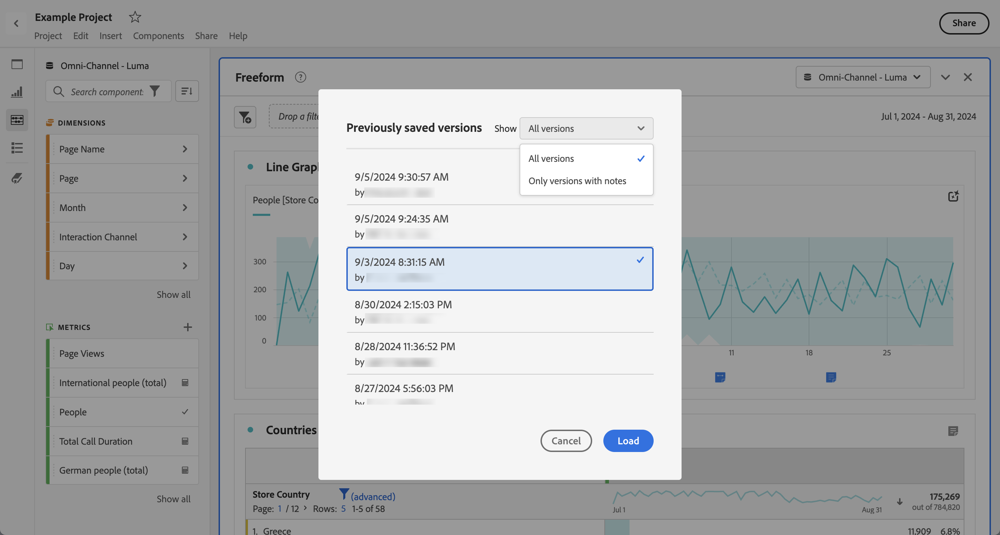

# Abrir projetos

Você pode abrir um projeto diretamente na página [Projetos](/help/analyze/analysis-workspace/build-workspace-project/freeform-overview.md). Procure seu projeto na lista. Use a [pesquisa](/help/analyze/analysis-workspace/build-workspace-project/freeform-overview.md#search) ou o [painel de segmentos](/help/analyze/analysis-workspace/build-workspace-project/freeform-overview.md#segment-panel) para restringir a lista.

* Selecione o título do projeto para abri-lo no Analysis Workspace.

Você também pode abrir um projeto enquanto trabalha em outro projeto.

* Selecione **[!UICONTROL Abrir]** no menu **[!UICONTROL Projeto]**. Você verá uma caixa de diálogo semelhante à página [Projetos](/help/analyze/analysis-workspace/build-workspace-project/freeform-overview.md).  Use a [pesquisa](/help/analyze/analysis-workspace/build-workspace-project/freeform-overview.md#search) ou o [painel de segmentos](/help/analyze/analysis-workspace/build-workspace-project/freeform-overview.md#segment-panel) para restringir a lista.
* Selecione o título do projeto para abri-lo no Analysis Workspace.

Se não conseguir encontrar o projeto e quiser iniciar um novo projeto, selecione **[!UICONTROL Criar novo]**.

## Abrir versão anterior

Para abrir uma versão salva anteriormente de um projeto:

1. Selecione **[!UICONTROL Abrir versão anterior]** no menu **[!UICONTROL Projeto]**.

   

1. Revise a lista de versões anteriores disponíveis na caixa de diálogo **[!UICONTROL Versões salvas anteriormente]**. Você pode alternar entre **[!UICONTROL Todas as versões]** e **[!UICONTROL Somente versões com notas]**.

   Para cada versão, a lista mostra um carimbo de data e hora, o editor e as notas salvas.

1. Selecione uma versão anterior e clique em **[!UICONTROL Carregar]**.
A versão anterior é carregada com uma notificação. A versão anterior não se torna a versão salva atual do projeto até que você clique em **[!UICONTROL Salvar]**. Se você sair da versão carregada, verá a última versão salva quando quiser abrir novamente uma versão anterior.
