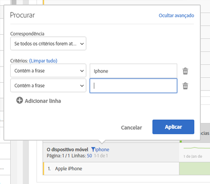

# Paginação, filtragem e classificação de tabelas

Para ter uma visão geral, assista a este vídeo no YouTube:

[Paginação, filtragem e classificação de tabelas na Analysis Workspace](https://www.youtube.com/watch?v=2zxpRPCGspg)

## Advanced filtering options {#section_36E92E31442B4EBCB052073590C1F025}

Clicar no ícone de filtro e, em seguida, em Mostrar avançadas próximo a uma dimensão em uma tabela de forma livre permite filtrar usando o critério a seguir:

* Contém
* Não contém
* Contém todos os termos
* Contém qualquer termo
* Contém a frase
* Não contém nenhum termo
* Não contém a frase
* Igual
* Não é igual
* Começa com
* Termina com

