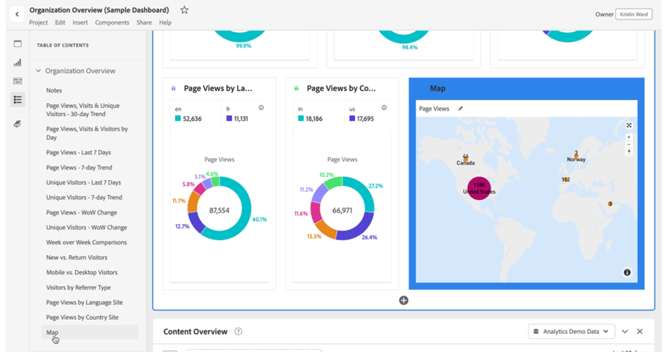

# Índice

É possível exibir um índice para um projeto no Analysis Workspace, o que permite mover-se rapidamente entre quaisquer painéis e visualizações existentes no projeto. O índice é especialmente útil ao visualizar projetos maiores que contêm vários painéis e visualizações.

>[!BEGINSHADEBOX]

Consulte  [Criar um índice](https://experienceleague.adobe.com/pt-br/docs/analytics-learn/tutorials/analysis-workspace/navigating-workspace-projects/create-a-toc-in-analysis-workspace){target="_blank"} para assistir a um vídeo de demonstração.

>[!ENDSHADEBOX]

>[!TIP]
>
>Você pode usar a visualização de cabeçalho da seção para identificar e articular uma seção em um painel que contém várias visualizações. Esses cabeçalhos de seção também são mostrados como entradas no índice.
>

Para exibir o índice de um projeto:

1. No Analysis Workspace, vá para o projeto em que deseja exibir o índice.

1. No painel de botões, selecione  **[!UICONTROL Índice]**. Consulte [Visão geral do Analysis Workspace](/help/analyze/analysis-workspace/home.md) para obter mais informações. 

   O **[!UICONTROL Índice]** do projeto é exibido e cada painel é expandido por padrão.

1. No **[!UICONTROL Índice]**, selecione uma visualização. 

   A visualização selecionada é rolada automaticamente e brevemente realçada.

   

>[!MORELIKETHIS]
>
>* [Simplifique a navegação no painel com o novo recurso de índice do Adobe Analytics](https://experienceleaguecommunities.adobe.com/t5/adobe-analytics-blogs/simplify-dashboard-navigation-with-the-new-table-of-contents/ba-p/731284)

<!--
# Project table of contents

You can view a table of contents within each project in Analysis Workspace, allowing you to quickly move between any panels and visualizations that exist in the project. This is especially useful when viewing larger projects that contain many panels and visualizations.

>[!BEGINSHADEBOX]

See  [Table of contents](https://experienceleague.adobe.com/en/docs/analytics-learn/tutorials/analysis-workspace/navigating-workspace-projects/create-a-toc-in-analysis-workspace){target="_blank"} for a demo video.

>[!ENDSHADEBOX]

To view the table of contents on a project:

1. In Analysis Workspace, go to the project where you want to view the table of contents.

1. In the left nav, select the table of contents icon . 

   The table of contents for the project is displayed, and each panel is expanded by default.

   

1. In the table of contents, select a visualization to go to it within the project.
-->