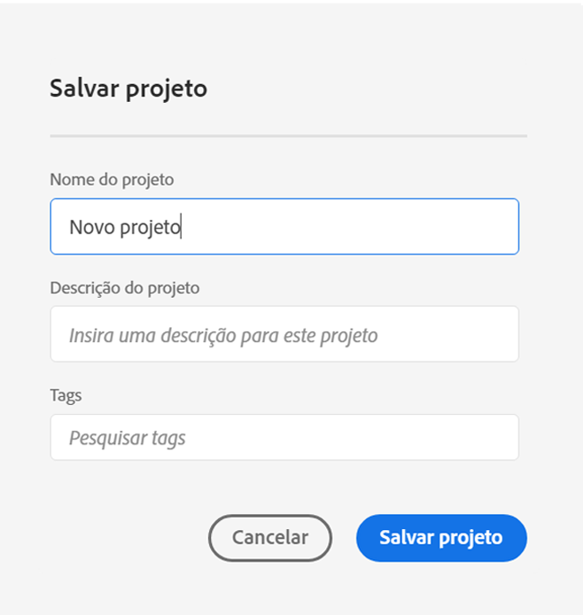
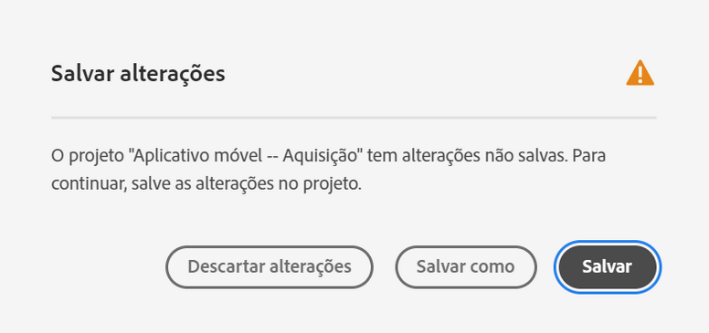
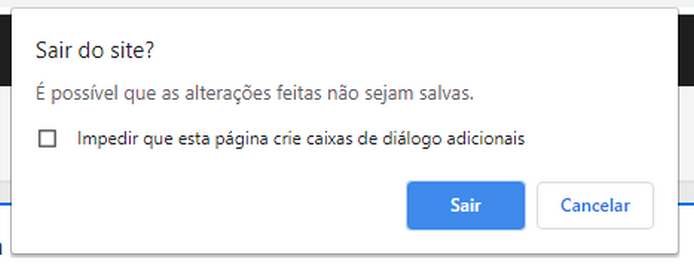
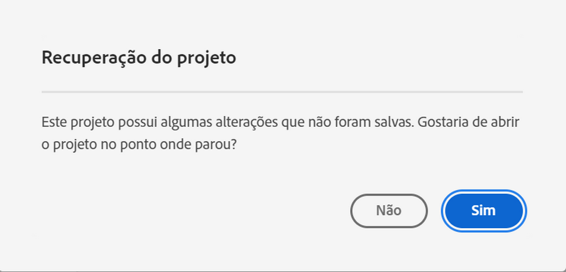

# Salvar projetos

Para salvar suas alterações em um projeto, vá para o menu **[!UICONTROL Projeto]** da Workspace. Além disso, o Adobe salva automaticamente projetos em determinados casos.

## Salvar opções de projeto {#Save}

Há diferentes ações de salvamento que podem ser realizadas no menu **[!UICONTROL Projeto]** , dependendo de como você deseja acessar sua análise no futuro.

| Ação | Descrição |
|---|---| 
| **[!UICONTROL Salvar]** | Salve as alterações no seu projeto. Se o projeto for compartilhado, os recipient do projeto também verão as alterações. Ao salvar seu projeto pela primeira vez, você será solicitado a fornecer um nome, uma descrição (opcional) e (opcional) adicionar tags. |
| **[!UICONTROL Salvar como]** | Crie um duplicado do seu projeto. O projeto original não será afetado. |
| **[!UICONTROL Salvar como modelo]** | Salve seu projeto como um modelo  personalizado que fica disponível para sua organização em **[!UICONTROL Projeto > Novo]** |

## Salvar automaticamente {#Autosave}

Os projetos existentes, isto é, os que foram salvos pelo menos uma vez antes, são salvos automaticamente a cada dois minutos no computador local. Os novos projetos que nunca foram salvos não são salvos automaticamente no momento.

Há alguns cenários que podem levá-lo a não salvar as alterações em um projeto, resultando em diferentes ações disponíveis.

### Abrir outro projeto da Workspace

Adobe fornece a opção de salvar antes de sair da página. Após sair de um projeto existente, a cópia local salva automaticamente é excluída.

### Navegar para fora ou fechar uma guia

O navegador avisa que as alterações não salvas serão perdidas. Você pode optar por sair ou cancelar.

### Falha do navegador ou tempo limite da sessão

Para projetos **existentes** , após retornar ao Workspace, o usuário visualizará um modal de recuperação **do** Projeto. Selecionar &quot;Sim&quot; restaurará o projeto a partir da cópia local salva automaticamente. &quot;Não&quot; exclui a cópia local salva automaticamente e abre a última versão salva pelo usuário do projeto.

Para **novos** projetos que nunca foram salvos, as alterações não salvas não são recuperáveis.