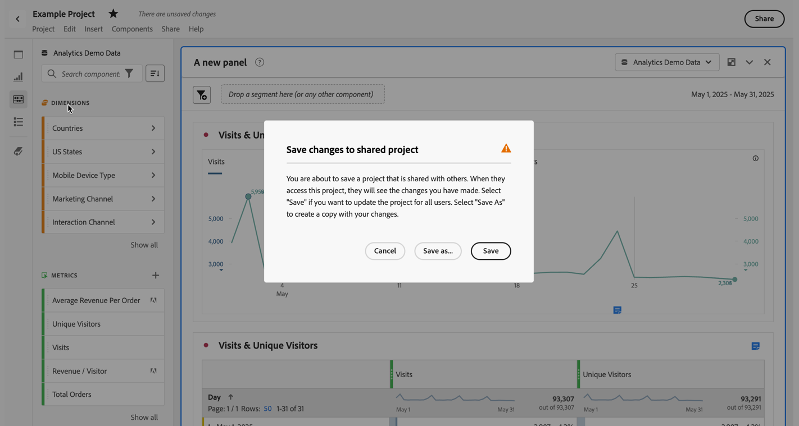

# Salvar projetos {#save-projects}

<!-- markdownlint-disable MD034 -->

>[!CONTEXTUALHELP]
>id="workspace_project_addnotes"
>title="Adicionar observações"
>abstract="Adicione observações sobre a versão do projeto que está sendo salva. Essas notas serão armazenadas com a versão e poderão ser acessadas no menu **[!UICONTROL Projeto]** > **[!UICONTROL Abrir versão anterior]**."

<!-- markdownlint-enable MD034 -->

Os projetos no Analysis Workspace são salvos automaticamente a cada 2 minutos. Você também pode salvar projetos, salvar um projeto como duplicado ou salvar um projeto com notas de versão.

## Salvar

Para salvar um projeto manualmente, com o projeto aberto no Analysis Workspace, selecione **[!UICONTROL Projeto]** e escolha entre as seguintes opções:

* **[!UICONTROL Salvar]**

  Salve as alterações no seu projeto. Se o projeto for compartilhado, os destinatários do projeto também verão as alterações. 

  Ao salvar o projeto pela primeira vez, uma caixa de diálogo **[!UICONTROL Salvar]** é exibida.

  

   1. Especifique o seguinte:

      * **[!UICONTROL Nome]** (obrigatório). nome do projeto.
      * **[!UICONTROL Descrição]**. Uma descrição do projeto.
      * **[!UICONTROL Tags]**. Pesquise tags no campo [!UICONTROL *Pesquisar tags*] ou adicione novas tags usando **[!UICONTROL ENTER]**.
      * **[!UICONTROL Pasta]**.  Selecione uma pasta no menu suspenso [!UICONTROL *Selecionar uma pasta*]. Se você não especificar uma pasta, o projeto será salvo na pasta atual na qual você criou um novo projeto.
      * **[!UICONTROL Notas de versão]**. Adicionar notas de versão na área de texto *Adicionar notas*.

   1. Selecione **[!UICONTROL Salvar]** para salvar o projeto.

  Salvar o projeto salva uma versão do projeto que é armazenada por 90 dias.

  Se você salvar um projeto compartilhado, uma caixa de diálogo de aviso **[!UICONTROL Salvar alterações no projeto compartilhado]** solicitará sua confirmação.

  

   * Clique em **[!UICONTROL Salvar]** para salvar o projeto.
   * Clique em **[!UICONTROL Salvar como]** para salvar o projeto como um projeto duplicado com um novo nome.

* **[!UICONTROL Salvar com notas]**

  

  Ao salvar o projeto, adicione notas sobre o que foi alterado nele. Na caixa de diálogo Salvar notas de versão:

   1. Insira suas **[!UICONTROL Notas de versão]** na área de texto **[!UICONTROL Adicionar notas]**.
   1. Selecione **[!UICONTROL Salvar]**.

  As notas são armazenadas com a versão do projeto e ficam disponíveis quando você [abre uma versão anterior](open-projects.md#open-previous-version) do projeto. Uma versão salva com notas é armazenada automaticamente por um ano.

* **[!UICONTROL Salvar como]**

  

  Crie uma duplicata do seu projeto com um novo nome. A caixa de diálogo Salvar como será exibida.

   1. Especifique o seguinte:

      * **[!UICONTROL Nome]** (obrigatório). nome do projeto.
      * **[!UICONTROL Descrição]**. Uma descrição do projeto.
      * **[!UICONTROL Tags]**. Pesquise tags no campo [!UICONTROL *Pesquisar tags*] ou adicione novas tags usando **[!UICONTROL ENTER]**.
      * **[!UICONTROL Pasta]**.  Selecione uma pasta no menu suspenso [!UICONTROL *Selecionar uma pasta*]. Se você não especificar uma pasta, o projeto será salvo na pasta atual na qual você criou um novo projeto.
      * **[!UICONTROL Notas de versão]**. Adicionar notas de versão na área de texto *Adicionar notas*.

   1. Selecione **[!UICONTROL Salvar]** para salvar o projeto.

  Você pode salvar o projeto em uma pasta diferente. O projeto original não será afetado.

<!-- Cannot find this option in CJA 
| **[!UICONTROL Save as template]** | Save your project as a [custom template](https://experienceleague.adobe.com/docs/analytics/analyze/analysis-workspace/build-workspace-project/starter-projects.html?lang=pt-BR) that becomes available to your organization under **[!UICONTROL Project > New]** | 
-->

## Salvar automaticamente

>[!IMPORTANT]
>
>Mesmo que os novos projetos sejam salvos automaticamente, é necessário salvar cada novo projeto manualmente na **primeira** vez. 
>

Todos os projetos no Analysis Workspace são salvos automaticamente a cada 2 minutos no computador local. A função de salvar automaticamente inclui projetos recém-criados que ainda não foram salvos manualmente.

### Novos projetos

O Analysis Workspace solicita que você salve novos projetos manualmente ao alternar para outro projeto, fechar a guia do navegador e assim por diante.

Se, por qualquer motivo, você perder o acesso a um projeto recém-criado inesperadamente antes de salvá-lo manualmente, uma versão de recuperação do seu projeto será salva na página inicial do Analysis Workspace, em uma pasta chamada **[!UICONTROL Projetos recuperados (últimos 7 dias)]**. Restaure o projeto recuperado e salve-o manualmente no local desejado.

Para restaurar um projeto recuperado:

1. Acesse a pasta **[!UICONTROL Projetos recuperados (últimos 7 dias)]** na página de destino do Analysis Workspace.

<!-- 
     
  -->

1. Abra o projeto e salve-o no local desejado.

### Projetos existentes

Se, por qualquer motivo, você sair de um projeto com alterações que ainda não foram salvas automaticamente, o Analysis Workspace solicitará que você salve as alterações ou exibirá uma mensagem de aviso.

Alguns casos comuns:

#### Abrir outro projeto

Se você abrir outro projeto enquanto estiver trabalhando em um projeto que contenha alterações que ainda não foram salvas automaticamente, o Analysis Workspace solicitará que você salve o projeto atual.

Estas são as opções disponíveis:

* **[!UICONTROL Salvar]**: substitui a cópia local salva automaticamente mais recente do seu projeto pelas alterações mais recentes.
* **[!UICONTROL Descartar alterações]**: descarta as alterações mais recentes. O projeto retém a cópia local salva automaticamente mais recente.
* **[!UICONTROL Cancelar]**: cancele a ação para abrir outro projeto e mantenha o projeto existente aberto.

<!--  -->

#### Sair ou fechar uma guia

Se você sair da página ou fechar a guia do navegador ao visualizar um projeto com alterações que ainda não foram salvas automaticamente, o navegador avisará que as alterações não salvas serão perdidas. Você pode optar por sair ou cancelar. Como esse aviso do navegador é emitido depende do navegador usado.

### Falha do navegador ou tempo limite da sessão

Se o navegador travar ou se o tempo-limite da sessão for atingido, na próxima vez que você acessar o Analysis Workspace, será necessário recuperar as alterações feitas no projeto que ainda não foram salvas automaticamente.

* Selecione **[!UICONTROL Sim]** para restaurar o projeto a partir da cópia salva automaticamente mais recente.

* Selecione **[!UICONTROL Não]** para excluir a cópia salva automaticamente e abrir a última versão salva pelo usuário do projeto.

<!---->

Para **novos** projetos que nunca foram salvos, as alterações não salvas não são recuperáveis.

<!-- Shouldn't this belong to another page?  Moved it to a new open projects page

## Open previously saved version

To open a previously saved version of a project:

1. Select **[!UICONTROL Open previous version]** from the **[!UICONTROL Project]** menu.

   

1. Review the list of previous versions available. You can switch between **[!UICONTROL All versions]** and **[!UICONTROL Only versions with notes]**.

   For each version, the list shows a timestamp
   [!UICONTROL Timestamp] and [!UICONTROL Editor] are shown, in addition to [!UICONTROL Notes] if they were added when the [!UICONTROL Editor] saved. Versions without notes are stored for 90 days; versions with notes are stored for 1 year.
1. Select a previous version and click **[!UICONTROL Load]**.
   The previous version then loads with a notification. The previous version does not become the current saved version of your project until you click **[!UICONTROL Save]**. If you navigate away from the loaded version, when you return, you will see the last saved version of the project.

-->

<!--
# Save projects {#save-projects}

>[!CONTEXTUALHELP]
>id="workspace_project_addnotes"
>title="Add notes"
>abstract="Add notes about the project version being saved. These notes will be stored with the version and accessible under the **[!UICONTROL Project]** > **[!UICONTROL Open previous version]** menu."

Projects in Analysis Workspace are automatically saved every 2 minutes. 

You can also manually save projects. Additional options such as adding tags or notes are available when you manually save a project.

## Save projects manually {#Save} 

Various options are available when manually saving a project in Analysis Workspace.

To manually save a project:

1. With your project open in Analysis Workspace, select **[!UICONTROL Project]**, then choose from the following options: 

   | Action | Description | 
   |---|---| 
   | **[!UICONTROL Save]** | Save changes to your project. If the project is shared, recipients of the project will also see the changes. When you first save your project, you are prompted to give the project a name, (optional) description and add (optional) tags. | 
   | **[!UICONTROL Save with notes]** | Before your project saves, add notes about what changed in the project. Notes are stored with the project version and are available to all editors under [!UICONTROL Project] > [!UICONTROL Open previous version]. | 
   | **[!UICONTROL Save as]** | Create a duplicate of your project. The original project will not be affected. | 
   | **[!UICONTROL Save as template]** | Save your project as a [template](/help/analyze/analysis-workspace/templates/create-templates.md) that becomes available to your organization under **[!UICONTROL Project > New]** | 

## Auto-save {#Autosave} 

All projects in Analysis Workspace are automatically saved every 2 minutes to your local machine. This includes newly created projects that are not yet saved manually. 

* **New projects:** Even though new projects are auto-saved, you must save each new project manually the first time. Analysis Workspace prompts you to save new projects manually when switching to another project, closing the browser tab, and so forth. 

  If for any reason you unexpectedly lose access to a newly created project before manually saving it, a recovery version of your project is saved on the Analysis Workspace landing page in a folder called `Recovered Projects (Last 7 Days)`. You must restore the recovered project and manually save it to a desired location. 

  To restore a recovered project:
  
  1. Go to the [!UICONTROL **Recovered Projects**] folder on the Analysis Workspace landing page.

     

  1. Open your project and save it to a desired location. 

* **Existing projects:** If for any reason you leave a project with changes that are not yet auto-saved, Analysis Workspace either prompts you to save your changes or provides a warning message. 

  Following are some common scenarios:

### Open another project 

If you open an additional project while working on a project that contains changes that are not yet auto-saved, Analysis Workspace prompts you to save the current project before leaving.

The following options are available:

* **Save:** Replaces the most recent auto-saved local copy of your project with your latest changes.
* **Save As:** Saves your latest changes as a new project. The original project is saved only with the most recent auto-saved changes.
* **Discard Changes:** Discards your latest changes. The project retains the most recent auto-saved changes.

### Navigate away or close a tab 

If you navigate away from the page or close the browser tab while viewing a project with changes that are not yet auto-saved, the browser warns that your unsaved changes will be lost. You can choose to leave or cancel. 

### Browser crashes or session times out 

If your browser crashes or if your session times out, then the next time you access Analysis Workspace you're prompted to recover any changes to your project that are not yet auto-saved.

Following is the Project Recovery dialog box that displays the first time you access Analysis Workspace after a crash or a timeout.

Select **Yes** to restore the project from the most recent auto-saved copy.

Select **No** to delete the auto-saved copy and open the last user-saved version of the project.

For **new** projects that have never been saved, unsaved changes are not recoverable.

## Open a previous version {#previous-version}

To open a previous version of a project:

1. Go to **[!UICONTROL Project]** > **[!UICONTROL Open previous version]**

   
   
1. Review the list of prior versions available. 
   [!UICONTROL Timestamp] and [!UICONTROL Editor] are shown, in addition to [!UICONTROL Notes] if they were added when the [!UICONTROL Editor] saved. Versions without notes are stored for 90 days; versions with notes are stored for 1 year.
1. Select a previous version and click **[!UICONTROL Load]**.
   The previous version then loads with a notification. The previous version does not become the current saved version of your project until you click **[!UICONTROL Save]**. If you navigate away from the loaded version, when you return, you will see the last saved version of the project. 

-->