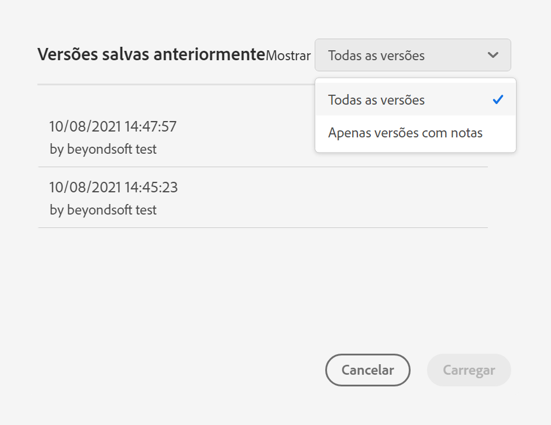

# Salvar projetos

Os projetos na Analysis Workspace são salvos automaticamente a cada 2 minutos.

Também é possível salvar projetos manualmente. Opções adicionais como adicionar tags ou notas estão disponíveis quando você salva manualmente um projeto.

## Salvar projetos manualmente {#Save}

Várias opções estão disponíveis ao salvar manualmente um projeto no Analysis Workspace.

Para salvar manualmente um projeto:

1. Com o projeto aberto no Analysis Workspace, selecione **[!UICONTROL Projeto]** e escolha entre as seguintes opções:

   | Ação | Descrição |
   |---|---| 
   | **[!UICONTROL Salvar]** | Salve as alterações no seu projeto. Se o projeto for compartilhado, os recipients do projeto também verão as alterações. Ao salvar seu projeto pela primeira vez, você deverá fornecer um nome, uma descrição (opcional) e adicionar tags (opcional). |
   | **[!UICONTROL Salvar com notas]** | Antes de salvar o projeto, adicione observações sobre o que foi alterado no projeto. As notas são armazenadas com a versão do projeto e estão disponíveis a todos os editores em [!UICONTROL Projeto] > [!UICONTROL Abrir versão anterior]. |
   | **[!UICONTROL Salvar como]** | Crie um duplicado do seu projeto. O projeto original não será afetado. |
   | **[!UICONTROL Salvar como modelo]** | Salve seu projeto como um [modelo personalizado](https://experienceleague.adobe.com/docs/analytics/analyze/analysis-workspace/build-workspace-project/starter-projects.html?lang=pt-BR) que fica disponível para sua organização em **[!UICONTROL Projeto > Novo]** |

   

## Salvar automaticamente {#Autosave}

Todos os projetos no Analysis Workspace são salvos automaticamente a cada 2 minutos no computador local. Isso inclui projetos recém-criados que ainda não foram salvos manualmente.

* **Novos projetos:** Mesmo que os novos projetos sejam salvos automaticamente, você deve salvar cada novo projeto manualmente na primeira vez. A Analysis Workspace solicita que você salve novos projetos manualmente ao alternar para outro projeto, fechar a guia do navegador e assim por diante.

   Se, por qualquer motivo, você perder inesperadamente o acesso a um projeto recém-criado antes de salvá-lo manualmente, uma versão de recuperação do seu projeto será salva na página inicial da Analysis Workspace em uma pasta chamada `Recovered Projects (Last 7 Days)`. Você deve restaurar o projeto recuperado e salvá-lo manualmente em um local desejado.

   Para restaurar um projeto recuperado:

   1. Vá para o [!UICONTROL **Projetos recuperados**] na página de aterrissagem do Analysis Workspace.

      

   1. Abra o projeto e salve-o no local desejado.

* **Projetos existentes:** Se, por qualquer motivo, você deixar um projeto com alterações que ainda não foram salvas automaticamente, a Analysis Workspace solicitará que você salve as alterações ou fornecerá uma mensagem de aviso.

   Veja a seguir alguns cenários comuns:

### Abrir outro projeto

Se você abrir um projeto adicional enquanto estiver trabalhando em um projeto que contém alterações que ainda não foram salvas automaticamente, a Analysis Workspace solicitará que você salve o projeto atual antes de sair.

As opções disponíveis são as seguintes:

* **Salvar:** Substitui a cópia local salva automaticamente mais recente do seu projeto pelas alterações mais recentes.
* **Salvar como:** Salva as alterações mais recentes como um novo projeto. O projeto original é salvo somente com as alterações salvas automaticamente mais recentes.
* **Descartar alterações:** Descarta suas alterações mais recentes. O projeto retém as alterações salvas automaticamente mais recentes.

### Sair ou fechar uma guia

Se você sair da página ou fechar a guia do navegador ao visualizar um projeto com alterações que ainda não foram salvas automaticamente, o navegador avisará que as alterações não salvas serão perdidas. Você pode optar por sair ou cancelar.

### Falha do navegador ou tempo limite da sessão

Se o navegador travar ou se a sessão expirar, na próxima vez que você acessar o Analysis Workspace, será solicitado a recuperar as alterações no projeto que ainda não foram salvas automaticamente.

A seguir, a caixa de diálogo Recuperação de projeto que exibe a primeira vez que você acessa o Analysis Workspace após uma falha ou um tempo limite.

Selecionar **Sim** para restaurar o projeto a partir da cópia salva automaticamente mais recente.

Selecionar **Não** para excluir a cópia salva automaticamente e abrir a última versão salva pelo usuário do projeto.

Para **novos** projetos que nunca foram salvos, as alterações não salvas não são recuperáveis.

## Abrir uma versão anterior {#previous-version}

>[!NOTE]
>
>As versões anteriores do projeto estão atualmente na versão limitada.

Para abrir uma versão anterior de um projeto:

1. Vá para **[!UICONTROL Projeto]** > **[!UICONTROL Abrir versão anterior]**

   

1. Revise a lista de versões anteriores disponíveis.
   [!UICONTROL O carimbo de data e hora] e o [!UICONTROL Editor] serão exibidos juntamente com as [!UICONTROL Notas] se forem adicionadas quando o [!UICONTROL Editor] realizar o salvamento. As versões sem notas são armazenadas por 90 dias; versões com notas são armazenadas por 1 ano.
1. Selecione uma versão anterior e clique em **[!UICONTROL Carregar]**.
A versão anterior é carregada com uma notificação. A versão anterior não se torna a versão salva atual do projeto até que você clique em **[!UICONTROL Salvar]**. Ao sair da versão carregada, ao retornar, você verá a última versão salva do projeto.
