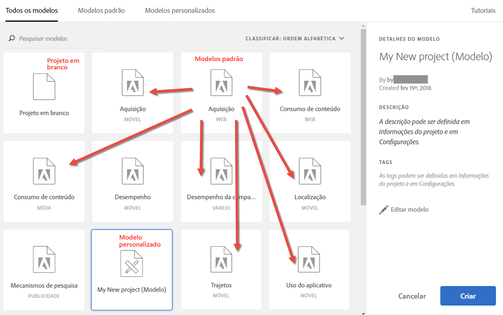
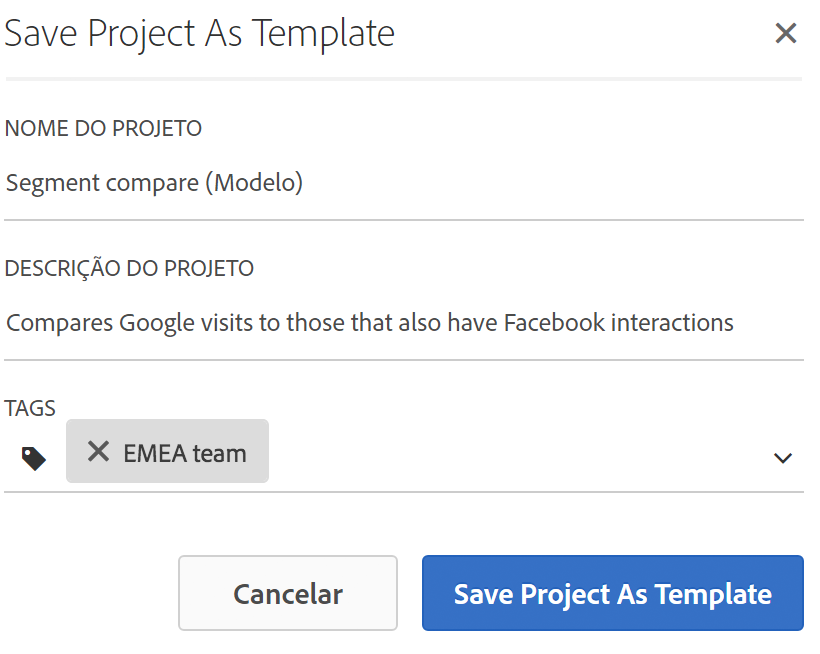
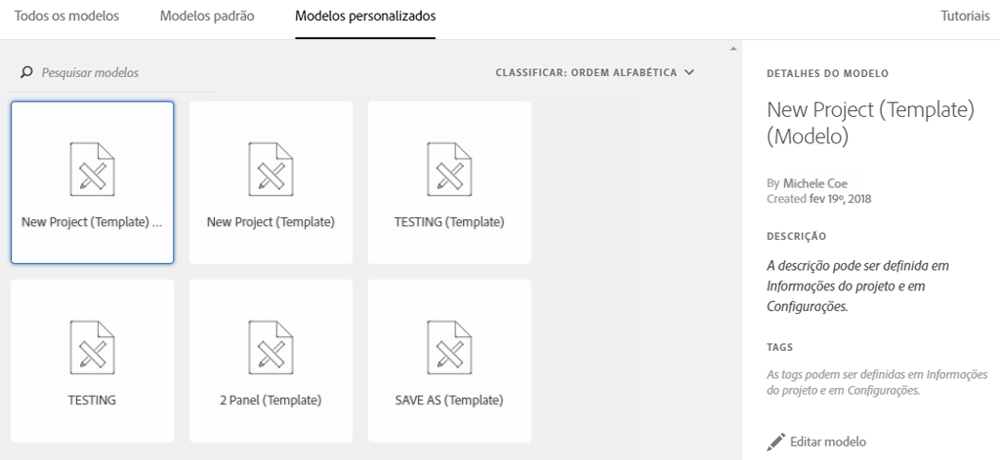

# Modelos

Você pode criar um projeto a partir de:

* **Projeto em branco (padrão)**: Para obter instruções, consulte [Criar um projeto](/help/analyze/analysis-workspace/build-workspace-project/t-freeform-project.md)da área de trabalho de Análise.
* **Modelo** padrão: Esses modelos são criados pela Adobe e fornecidos com o produto.
* **Modelo** personalizado: Esses modelos podem ser criados, compartilhados ou excluídos por usuários com direitos de administrador ou por não administradores, desde que tenham recebido a [!UICONTROL Analysis Workspace: Save as Template] permissão no Admin Console. [Saiba mais...](https://docs.adobe.com/content/help/en/analytics/admin/admin-console/permissions/product-profile.html)

## Criar um modelo personalizado {#create-custom-template}

Os usuários com direitos de administrador podem transformar qualquer projeto que criarem em um modelo personalizado. Veja como:

1. Abra o projeto.
1. Vá para **[!UICONTROL Project]** > **[!UICONTROL Save As Template]**.

   

   O projeto será salvo com o nome do projeto atual, seguido da palavra (Modelo) entre parênteses. Os administradores podem alterar esse nome editando o modelo.

   >[!NOTE]
   >
   >Por padrão, os modelos de projeto estão visíveis para todos em sua organização. Você pode organizá-los aplicando tags. (Vá até **[!UICONTROL Project]** > **[!UICONTROL Project Info & Settings]** para editar tags e descrições.)

### Ações executáveis nos modelos personalizados

| Ação | Descrição |
|--- |--- |
| Editar   modelo | Permite que um administrador edite o modelo alterando sua fonte de dados, modificando componentes, visualizações, intervalos de datas etc.  Para editar um modelo personalizado,<ul><li>abra a lista de modelos personalizados do Analysis Workspace, selecione um e clique em Editar modelo, ou</li><li>no Analytics, clique em Componentes > Projetos e filtre por Modelos. Clique no nome do modelo que deseja editar.</li></ul>**Observação:** Depois de editar um modelo, dependendo da situação, você tem duas opções: Salvar, Salvar como. Estas são as diferenças:<ul><li>**Salvar:** Atualiza o modelo personalizado para todos os usuários. Quando outra pessoa criar um projeto a partir desse modelo personalizado, ela verá as alterações que você fez.</li><li>**Salvar como:** Cria uma cópia do modelo personalizado com suas alterações. (Você saberá que está no modo de edição quando o item de menu Compartilhar > Compartilhar projeto estiver desativado.)</li></ul> |
| Pesquisar nos modelos | Na caixa de diálogo Modelos personalizados, clique em Pesquisar modelos. |
| Classificar modelos | É possível classificar modelos em ordem alfabética, relevância e por data de criação.  Na caixa de diálogo Modelos personalizados, clique em Classificar:. |
| Aplicar tags ao modelo | Abra o modelo e vá até Projeto > Informações e configurações do projeto. Clique em Adicionar tags. |
| Modificar descrição do modelo | Abra o modelo e vá até Projeto > Informações e configurações do projeto. Clique duas vezes na descrição e edite-a. |

## Modelos padrão

Quando você abre um Workspace pela primeira vez, os modelos ficam disponíveis no painel esquerdo. Os modelos do Analysis Workspace abrangem casos usuais. Eles são agrupados pela vertical à qual pertencem e são preenchidos com diferentes dimensões, segmentos, métricas e visualizações, dependendo do conjunto de relatórios selecionado.

Você pode usar esses modelos pré-preenchidos como estão ou adaptá-los às suas necessidades (adicionando ou substituindo métricas ou visualizações, por exemplo) e salvá-los com um novo nome.

[Modelos padrão do Analysis Workspace no YouTube](https://www.youtube.com/watch?v=aRgYwPneVXg&amp;list=PL2tCx83mn7GuNnQdYGOtlyCu0V5mEZ8sS&amp;index=6) (2:46)

Estes são os modelos disponíveis e as perguntas que cada modelo ajuda a responder.

### Treinamento

* **Tutorial** de treinamento: Este modelo padrão orienta você pela terminologia e etapas comuns para criar sua primeira análise no Workspace. Está disponível como modelo padrão no modal Novo projeto e substitui o projeto de amostra atual para novos usuários que não têm outros projetos na lista.

### Publicidade

>[!IMPORTANT]
>
>Os modelos de publicidade estão disponíveis somente se o seu conjunto de relatórios estiver habilitado para a Advertising Cloud.

* **Mecanismos** de pesquisa pagos: Este modelo analisa tendências de publicidade, plataformas de publicidade, palavras-chave, contas, campanhas e muito mais.

### Comércio

* **Magento: marketing e comércio**: esse modelo detalha sua conversão de comércio eletrônico por atribuição de canal de marketing, além de fornecer informações por palavra-chave de pesquisa, página de aterrissagem, localização geográfica e muito mais. Para ter uma visão geral, assista ao vídeo >[!VIDEO](https://www.youtube.com/watch?v=AQOViVLEMHw)

### Mídia

* **Consumo de áudio**: que conteúdo está sendo mais consumido pelos usuários, resultando em interações?
* **Recenticidade - Frequência - Fidelidade**: quem são meus leitores fiéis?

### Dispositivos móveis

>[!IMPORTANT]
>
>Os modelos para dispositivos móveis estão disponíveis somente se o seu conjunto de relatórios estiver habilitado para dispositivos móveis.

* **Mensagens:** focaliza o desempenho das mensagens no aplicativo e por push.
* **Localização:** inclui um mapa que exibe os dados de localização.
* **Métricas principais:** permite o controle das métricas principais do seu aplicativo.
* **Uso do aplicativo:** quantos usuários, inicializações e primeiras inicializações o aplicativo teve e qual foi a duração média das sessões?
* **Aquisição:** você pode ver o desempenho dos links de aquisição para dispositivos móveis.
* **Desempenho:** como está o desempenho do aplicativo e que problemas os usuários estão tendo?
* **Retenção:** quem são meus usuários fiéis e o que eles fazem?
* **Jornadas:** quais são os principais padrões de uso do meu aplicativo?

### Varejo

* **Desempenho da campanha:** que campanhas estão gerando mais receita?
* **Produtos:** que produtos estão tendo o melhor desempenho?

### Web

* **Aquisição:** quais são os principais impulsionadores de tráfego do meu site?
* **Consumo de conteúdo:** quais são os lugares mais acessados do meu site?
* **Retenção:** que tipo de usuário tem maior probabilidade de se tornar um usuário fiel do meu site?
* **Tecnologia:** que tecnologia as pessoas estão usando para acessar o meu site?

### Pessoas

>[!NOTE] O modelo Pessoas e sua respectiva métrica Pessoas estão disponíveis para uso somente como parte do [Device Co-op da Adobe Experience Cloud](https://marketing.adobe.com/resources/help/pt_BR/mcdc/mcdc-people.html).

Este modelo é baseado na métrica de Pessoas, que é uma versão deduplicada da métrica de Visitantes únicos. A métrica de Pessoas fornece uma medida da frequência com que os consumidores que usam vários dispositivos interagem com sua marca. O modelo permite

* Segmentar seus dados para os EUA/Canadá em relação ao resto do mundo. O Device Co-op está disponível atualmente apenas na América do Norte.
* Compare as métricas de Pessoas e Visitantes únicos lado a lado.
* Consulte a &quot;taxa de compactação&quot;, uma métrica calculada que calcula o quão menor a métrica de Pessoas é como uma porcentagem de Visitantes únicos.
* Compare os totais de tipos de dispositivos que seus clientes usam
* Veja quantos dispositivos médios por pessoa são usados.
* Descubra como usar o empilhamento de segmentos com a métrica de Pessoas.
* Saiba como usar a Experience Cloud ID em seu ambiente melhora a eficácia da métrica de Pessoas.

### QI da jornada: Modelo de análise entre dispositivos

<!-->This content is mirrored in the CDA doc.<-->

Este modelo permite que você veja dados vitais de desempenho entre dispositivos. Ele está disponível somente para clientes que têm acesso ao CDA ( [Cross-Device Analytics](https://docs.adobe.com/content/help/pt-BR/analytics/components/cda/cda-home.html) ).

* **Nota especial para os membros do Gráfico** de Cooperação: Mostra qual parte do conjunto de relatórios contém visitantes em regiões nas quais o gráfico cooperativo é suportado e em regiões nas quais ele não é suportado.
* **Identificação de usuários**: Mostra a frequência com que os visitantes do site são identificados usando métodos baseados no Cross-Device Analytics.
* **Medição da audiência**: Mostra uma comparação entre &quot;Dispositivos únicos&quot; e &quot;Pessoas&quot;. A proporção desses dois números é conhecida como &quot;compactação entre dispositivos&quot;, uma métrica calculada visível neste painel. Essa métrica de compactação depende de uma ampla variedade de fatores:
   * **Usando o gráfico** Co-op ou Privado: De modo geral, as organizações que usam a cooperativa de dispositivos tendem a ver taxas de compactação melhores do que as organizações que usam o gráfico privado.
   * **Taxa** de logon: Quanto mais usuários fizerem logon em seu site, mais a Adobe poderá identificar e costurar visitantes em todos os dispositivos. Os sites com uma taxa de logon baixa também têm taxas de compactação baixas.
   * **Cobertura** da Experience Cloud ID: Somente visitantes com um ECID podem ser agrupados. Uma porcentagem menor de visitantes do site que usam uma ECID está correlacionada a taxas de compactação mais baixas.
   * **Uso** de vários dispositivos: Se os visitantes do seu site não usarem vários dispositivos, você poderá ver taxas de compactação mais baixas.
   * **Granularidade** do Relatórios: A compactação por dia geralmente é menor do que a compactação por mês ou ano. As chances de um indivíduo usar vários dispositivos se tornam menores em um único dia do que em mais de um mês inteiro. A segmentação, a filtragem ou o uso de dimensões de detalhamento também podem mostrar uma taxa de compactação menor.
* **Segmentos** baseados em pessoas: Contém uma lista suspensa de segmentos que permite que você visualização dados específicos do dispositivo. Esse painel incentiva a experimentação com segmentos para ver como a inclusão ou exclusão de tipos de dispositivos afetam os relatórios.
* **Analisando a jornada** entre dispositivos: Fornece relatórios de fluxo e fallout com base no tipo de dispositivo.
* **Atribuição** entre dispositivos: Combine os recursos de QI de viagem e QI de atribuição.
* **Outras dicas e truques**: Tópicos úteis sobre o CDA que permitem que você aproveite ao máximo o uso.