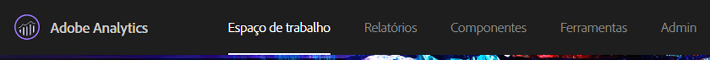
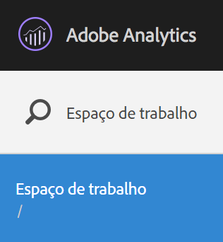
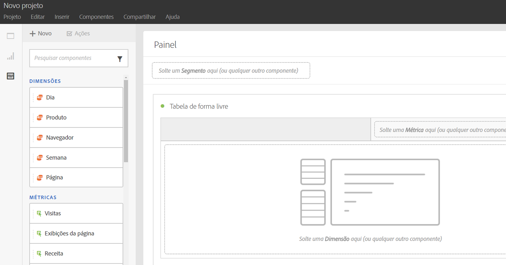
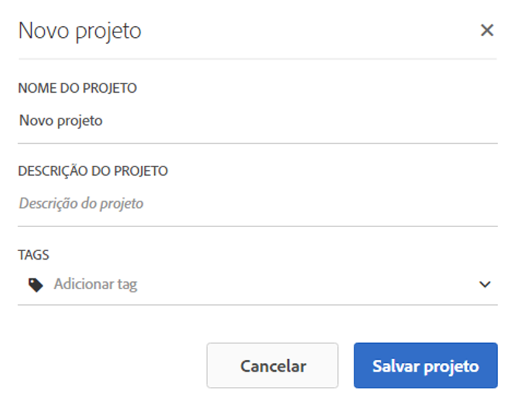
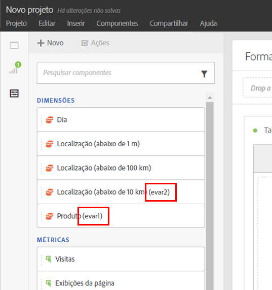
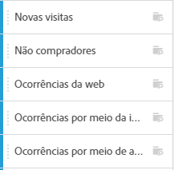
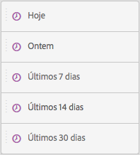
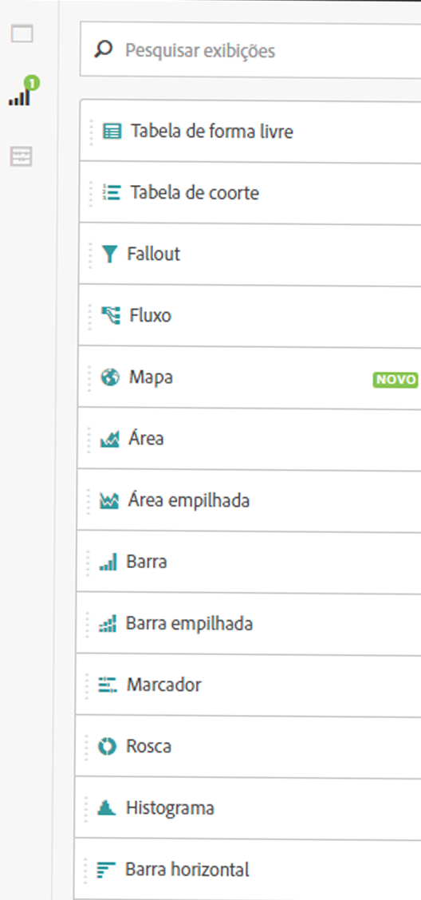
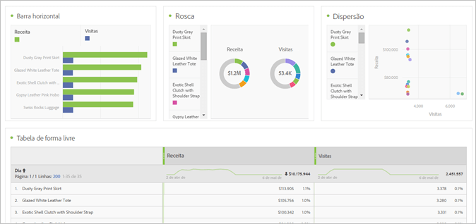
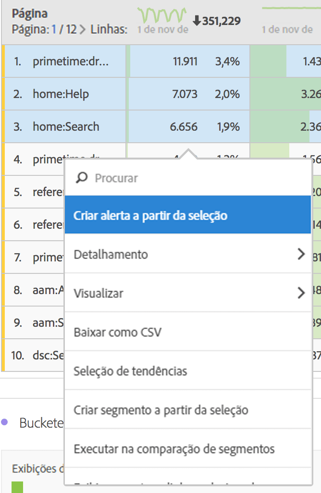

# Criar um projeto da Workspace

Crie um projeto e adicione componentes (dimensões, métricas, segmentos, intervalos de data) no painel de forma livre.

Esse artigo explica os elementos da interface da Analysis Workspace e mostra como criar um projeto. Para casos de uso específicos, consulte os [Casos de uso para a Analysis Workspace](../../../analyze/analysis-workspace/freeform-analysis-examples-use-cases.md#concept_173D1EB783F24EA89E754628BA30FF4B).

## Crie um projeto

1. Especifique a permissão de usuário para criar e preparar os projetos.

   Antes de criar ou preparar um projeto de Analysis Workspace, os administradores devem adicionar você a um grupo com a permissão **[!UICONTROL Criar/preparar projetos na Analysis Workspace]** ativada ou ao grupo de usuários **Todo acesso a relatório[!UICONTROL .]** ( **[!UICONTROL Admin]** &gt; **[!UICONTROL User Management]** &gt; [Groups](https://marketing.adobe.com/resources/help/en_US/reference/?f=groups)).

1. In the [!DNL Experience Cloud], click **[!UICONTROL Analytics]** &gt; **[!UICONTROL Workspace]**.

   

   Como alternativa, insira uma barra (/) para abrir a barra de pesquisa do relatório, em seguida, digite *`workspace`*.

   

1. Click **[!UICONTROL Create New Project]**.

   Você pode escolher criar um projeto de

* um projeto em branco (padrão). Para obter instruções, consulte abaixo.
* Um modelo padrão. Esses modelos são criados pela Adobe e enviados para o recurso instantâneo. Para obter instruções, consulte [Modelos](../../../analyze/analysis-workspace/build-workspace-project/starter-projects.md#concept_49B9A327C5004DB0A4BE6291435625C5)
* Um modelo personalizado. Esses modelos são criados por usuários com direitos de administrador. Para obter instruções, consulte [Modelos](../../../analyze/analysis-workspace/build-workspace-project/starter-projects.md#concept_49B9A327C5004DB0A4BE6291435625C5)

   

1. To create a project from a blank project, click **[!UICONTROL Blank Project]**.

   * Then click **[!UICONTROL Create]**, or
   * Apenas clique em **[!UICONTROL Enter]**.
   Um projeto em branco é exibido, mostrando um painel de forma livre e uma visualização da tabela de dados.

   

   >[!NOTE]
   >
   >Às vezes, uma mensagem «Conjunto de relatórios incompatível» aparece ao carregar um projeto (ou alternar para um conjunto de relatórios) onde nem todos os componentes (métricas/dimensões) incluídos no projeto são incluídos no conjunto de relatórios. É possível ver uma lista de componentes incompatíveis para que você saiba por que está recebendo a mensagem.

<table id="table_3989E45D9D4241CBB2E58B29DA257B2F"> 
 <thead> 
  <tr> 
   <th colname="col1" class="entry"> Elemento </th> 
   <th colname="col2" class="entry"> Descrição </th> 
  </tr> 
 </thead>
 <tbody> 
  <tr> 
   <td colname="col1"><a href="../../../analyze/analysis-workspace/components/analysis-workspace-components.md#concept_BEBE3A75E072495D9E2F895567BBD462" format="dita" scope="local"> Componentes</a> </td> 
   <td colname="col2"> 
Dimensões, métricas, segmentos e intervalos de datas que você pode arrastar para os projetos. 
 </td> 
  </tr> 
  <tr> 
   <td colname="col1"><a href="../../../analyze/analysis-workspace/visualizations/freeform-analysis-visualizations.md#concept_09242627629147A88A68F1506954C276" format="dita" scope="local"> Visualizações</a> </td> 
   <td colname="col2"> 
Itens que você pode arrastar para as áreas da interface do painel ou projeto. 
 </td> 
  </tr> 
  <tr> 
   <td colname="col1"><a href="../../../analyze/analysis-workspace/visualizations/freeform-table.md#concept_0D2E24FCCBAF4194AA941448860E422F" format="dita" scope="local">Painel de forma livre</a> </td> 
   <td colname="col2"> 
A tela ou a área de trabalho com a qual você interage na Analysis Workspace. 
 </td> 
  </tr> 
 </tbody> 
</table>

1. Salve o projeto. Nomeie o projeto, forneça uma descrição (opcional, porém útil) e adicione uma tag ao projeto (opcional), em seguida clique em **[!UICONTROL Salvar projeto]**.

   

1. Agora é possível clicar com o botão direito do mouse e copiar uma visualização ou painel e depois colar (“inserir”) o elemento copiado em outro lugar dentro do projeto ou em um projeto diferente.

   É possível usar esta capacidade para criar “blocos de construção” (visualizações/painéis predefinidos) que podem ser copiados para dentro de outros projetos para iniciá-los mais rapidamente, com dados específicos da sua empresa.

   >[!NOTE]
   >
   >Depois de copiar/salvar como, os intralinks agora são relativos ao projeto em que vivem, e não ao projeto original do qual foram copiados.

## Adicionar Componentes e Visualizações {#task_CDAC9B3007BE4A3790AFAD3746D669B1}

1. Build your project by dragging *`components`* and *`visualizations`* to the project.

   **Componentes**

   A barra de ferramentas Componentes exibe dimensões, métricas, segmentos e intervalos de datas pesquisáveis que são usados com mais frequência.

<table id="table_4626163E26DE46CB86391868BBA3AD32"> 
 <thead> 
  <tr> 
   <th colname="col1" class="entry"> Componente </th> 
   <th colname="col2" class="entry"> Descrição </th> 
  </tr> 
 </thead>
 <tbody> 
  <tr> 
   <td colname="col1"> Dimensões (laranja) </td> 
   <td colname="col2"> 
Aplicar no nível de projeto 
 
 
 
Prop#, eVar# e event# estão anexados aos nomes de dimensão e você pode pesquisar nesses números. Exemplo: "Campanha interna" aparece no painel esquerdo como "Campanha interna (evar2)". 
 
 Observe que os números de prop, eVar e event não aparecem na tabela (para manter os títulos curtos). 
 
Há uma ordem de classificação padrão para algumas dimensões não incluídas, quando são soltas em uma tabela de forma livre ou quando são exibidas no painel esquerdo. Por exemplo, quando a "Hora do dia" for colocada em uma tabela ou exibida no painel esquerdo, aparecerá classificada em 00 para 23. Você ainda pode classificar por qualquer coluna de métrica. 
 </td> 
  </tr> 
  <tr> 
   <td colname="col1"> Métricas (verde) </td> 
   <td colname="col2"> 
Aplicar no nível de projeto. 
 
 
 
  Ocorrências é a métrica padrão da tabela de dados. 
 </td> 
  </tr> 
  <tr> 
   <td colname="col1"> Segmentos (azul) </td> 
   <td colname="col2"> 
Podem ser arrastados somente no nível do painel, mas você pode criar segmentos em linha na tabela de dados. 
 
 
 
Consulte <a href="../../../analyze/analysis-workspace/freeform-analysis-examples-use-cases.md#concept_173D1EB783F24EA89E754628BA30FF4B" format="dita" scope="local"> Casos de uso da Analysis Workspace</a> para obter mais informações. 
 </td> 
  </tr> 
  <tr> 
   <td colname="col1"> Intervalos de datas e granularidades (roxo) </td> 
   <td colname="col2"> 
Podem ser arrastados somente no nível do painel. Você pode criar um projeto do Calendário ao configurar um intervalo de datas. 
 
 
 </td> 
  </tr> 
 </tbody> 
</table>

**[Visualizações](../../../analyze/analysis-workspace/visualizations/freeform-analysis-visualizations.md#concept_09242627629147A88A68F1506954C276)**

O painel [!UICONTROL Visualizações] oferece gráficos, roscas, tabelas de dados, tabelas de [coorte](../../../analyze/analysis-workspace/visualizations/cohort-table/cohort-analysis.md#concept_9D240A490265427DA694D18D14EACC0E), diagramas de Venn padrão do Analytics e assim por diante. Você pode arrastar e soltar várias visualizações em seu projeto.

1. Etapa

## Use o menu de clique com botão direito para Personalizar os dados {#concept_8117C300F21843B99F4E1B9AB7B11B6F}

O menu de opções permite executar as seguintes ações, que dependem da célula na tabela na qual você clicou com o botão direito do mouse.

<table id="table_0F84CC5B604D4D41BD0C9668DF525929"> 
 <thead> 
  <tr> 
   <th colname="col1" class="entry"> Ação </th> 
   <th colname="col2" class="entry"> Descrição </th> 
  </tr>
 </thead>
 <tbody> 
  <tr> 
   <td colname="col1"><a href="../../../analyze/analysis-workspace/components/calendar-date-ranges/time-comparison.md#concept_93BCAD81B7A54ABBBA5CD9E419F6F764" format="dita" scope="local"> Adicionar coluna de período de tempo</a> </td> 
   <td colname="col2"> </td> 
  </tr> 
  <tr> 
   <td colname="col1"><a href="../../../analyze/analysis-workspace/components/calendar-date-ranges/time-comparison.md#concept_93BCAD81B7A54ABBBA5CD9E419F6F764" format="dita" scope="local"> Comparar períodos de tempo</a> </td> 
   <td colname="col2"> </td> 
  </tr> 
  <tr> 
   <td colname="col1"> 
Copiar para a área de transferência 
 </td> 
   <td colname="col2"> </td> 
  </tr> 
  <tr> 
   <td colname="col1"> 
Excluir selecionados 
 </td> 
   <td colname="col2"> </td> 
  </tr> 
  <tr> 
   <td colname="col1"><a href="/help/components/c-alerts/intellligent-alerts.md" format="dita" scope="local"> Criar alerta a partir da seleção</a> </td> 
   <td colname="col2"> </td> 
  </tr> 
  <tr> 
   <td colname="col1"><a href="../../../analyze/analysis-workspace/components/dimensions/t-breakdown-fa.md#task_B594DA2476E84DFDA8279E831F0BD9C4" format="dita" scope="local"> Detalhamento</a> 
    <ul id="ul_18C83B8514AD4C1C86C071AA8402CB5C"> 
     <li id="li_6CA84ED293EA4940A7495DA9D9121264">Dimensões </li> 
     <li id="li_EA16EE017B2E4A6998918706938A21BF">Métricas </li> 
     <li id="li_0405D339CD01405DB508A7D8D1A976B4">Segmentos </li> 
     <li id="li_819CE81C552F49BB9C1B83ED3B42C5F7">Hora </li> 
    </ul> </td> 
   <td colname="col2"> </td> 
  </tr> 
  <tr> 
   <td colname="col1"><a href="../../../analyze/analysis-workspace/visualizations/freeform-analysis-visualizations.md#concept_09242627629147A88A68F1506954C276" format="dita" scope="local"> Visualizar</a> </td> 
   <td colname="col2"> </td> 
  </tr> 
  <tr> 
   <td colname="col1"><a href="../../../analyze/analysis-workspace/curate-share/download-send.md#concept_BB548979F47F45739679B830428C3025" format="dita" scope="local"> Baixar como CSV</a> </td> 
   <td colname="col2"> </td> 
  </tr> 
  <tr> 
   <td colname="col1"><a href="../../../analyze/analysis-workspace/analysis-workspace-features.md#concept_4D69EE46E3C24EEB97C935A8789364F9" format="dita" scope="local"> Seleção de tendências</a> </td> 
   <td colname="col2"> </td> 
  </tr> 
  <tr> 
   <td colname="col1"><a href="../../../analyze/analysis-workspace/components/t-freeform-project-segment.md#task_11C6A2C7717B48049E5750B9D20FEC80" format="dita" scope="local"> Criar segmento a partir da seleção</a> </td> 
   <td colname="col2"> </td> 
  </tr> 
  <tr> 
   <td colname="col1"><a href="../../../analyze/analysis-workspace/c-panels/c-segment-comparison/segment-comparison.md#concept_74FAC1C6D0204F9190A110B0D9005793" format="dita" scope="local"> Executar comparação intra-segmento</a> </td> 
   <td colname="col2"> </td> 
  </tr> 
  <tr> 
   <td colname="col1"> Exibir somente as linhas selecionadas </td> 
   <td colname="col2"> </td> 
  </tr> 
  <tr> 
   <td colname="col1"> Exibir todas as linhas </td> 
   <td colname="col2"> </td> 
  </tr> 
 </tbody> 
</table>

Consulte [Interações de teclado e mouse disponíveis na Analysis Workspace](../../../analyze/analysis-workspace/build-workspace-project/fa-shortcut-keys.md#concept_9A6356084DBC4D468E265E7A65B3E051) para obter informações sobre a cópia e a seleção de linhas.
