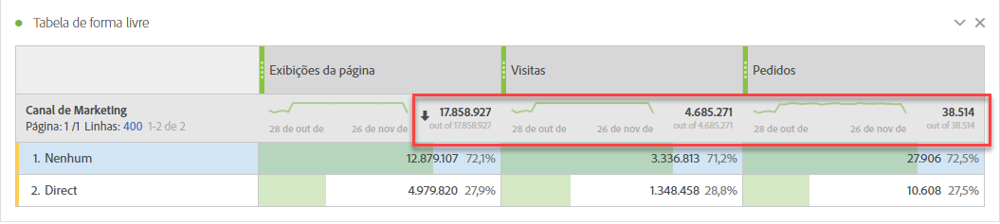
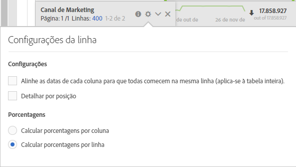

# Totais do Workspace

Nas Tabelas de forma livre, aparece uma linha total em cada nível de detalhamento, que pode mostrar dois totais:

* **[!UICONTROL Total geral]** (número cinza abaixo do resultado): esse total representa todas as ocorrências coletadas, às vezes chamadas de “total do conjunto de relatórios”. Quando um segmento é aplicado no nível do painel ou na tabela de forma livre, esse total é ajustado para refletir todas as ocorrências que correspondem aos critérios do segmento.
* **[!UICONTROL Total da tabela]** (número preto): normalmente esse total é uma parte do [!UICONTROL Total geral] ou igual a ele. Ele reflete todos os filtros de tabela aplicados na tabela de forma livre, incluindo a opção [!UICONTROL Não incluir].

## Exibir configuração total

Em **[!UICONTROL Configurações da coluna]**, há opções para **[!UICONTROL Mostrar totais]** e **[!UICONTROL Mostrar total geral]**. Se essas configurações estiverem desmarcadas, os totais serão removidos da tabela. Isso pode ser desejado nos casos em que os totais não fazem sentido, por exemplo, em determinados cenários [Métrica calculada](https://docs.adobe.com/content/help/pt-BR/analytics/components/calculated-metrics/calcmetrics-reference/cm-totals.html).

## Configurações do Total de linhas estáticas

Os totais de [linhas estáticas](https://docs.adobe.com/content/help/pt-BR/analytics/analyze/analysis-workspace/build-workspace-project/column-row-settings/manual-vs-dynamic-rows.html) se comportam de maneira diferente e são controlados em **[!UICONTROL Configurações da linha]**.

* **[!UICONTROL Mostrar a soma das linhas atuais como total]**: mostra uma soma das linhas da tabela do lado do cliente, o que significa que o total **não** removerá a duplicação de métricas como visitas ou visitantes.
* **[!UICONTROL Mostrar total geral]**: mostra uma soma do lado do servidor, o que significa que o total removerá a duplicação de métricas como visitas ou visitantes.

## Perguntas frequentes

| Perguntas | Resposta |
|---|---|
| Em qual “total” as porcentagens da coluna cinza se baseiam? | Depende da seleção da configuração **[!UICONTROL Porcentagens]** em **[!UICONTROL Configurações da linha]**:<ul><li>Calcular porcentagens por coluna: essa é a configuração padrão. As porcentagens serão baseadas no Total da tabela.</li><li>Calcular porcentagens por linha: as porcentagens serão baseadas no Total Geral.</li></ul> |
| Como a configuração **[!UICONTROL Incluir não especificado (Nenhum)]** afeta os totais? | Se a configuração **[!UICONTROL Incluir não especificado (Nenhum)]** estiver desmarcada, a linha Nenhum/Não especificado será removida da tabela, do Total da tabela, e continuará para qualquer métrica calculada que use tipos de métricas [“Total”](https://docs.adobe.com/content/help/pt-BR/analytics/components/calculated-metrics/calcmetric-workflow/m-metric-type-alloc.html) |
| Quando os filtros de tabela personalizados são aplicados a uma tabela de forma livre, todas as minhas métricas calculadas e minha formatação condicional são consideradas para o filtro? | No momento não. **[!UICONTROL Incluir não especificado (Nenhum)]** será contabilizado, mas os filtros de tabela personalizados não afetarão os seguintes:<ul><li>O intervalo máximo/mínimo da coluna da formatação condicional pesquisa em todos os dados.</li><li>As métricas calculadas que usam os tipos de métricas **[!UICONTROL Total geral]**.</li><li>As métricas calculadas com funções que calculam várias linhas em uma tabela de forma livre (ou seja, Soma da coluna, Máximo da coluna, Mín. da coluna, Contagem, Média, Média, Percentual, Quartil, Contagem de linhas, Desvio padrão, Variação, Cumulativo, Média Cumulativa, Variantes de regressão, Pontuação T, Teste T, Pontuação Z, Teste Z).</li></ul> |
| Em Métricas calculadas, o que o tipo de métrica **[!UICONTROL Total geral]** reflete? | **[!UICONTROL Total geral]** continua se referindo ao **[!UICONTROL Total geral]** e não reflete os filtros aplicados a uma tabela ou ao **[!UICONTROL Total da tabela]**. |
| Qual total é mostrado quando os dados são copiados e colados de uma tabela de forma livre ou baixados via CSV? | A linha total reflete somente o **[!UICONTROL Total da tabela]** e respeita a configuração da coluna **[!UICONTROL Mostrar totais]**. |

