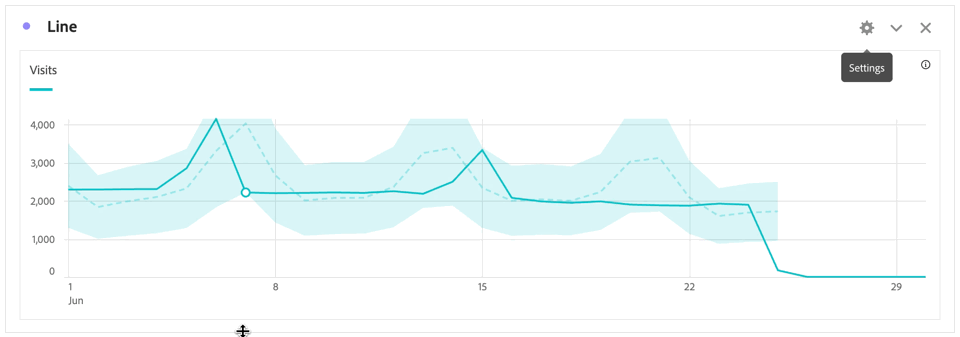

# Exibir anomalias no Analysis Workspace

É possível exibir anomalias em uma tabela ou em um gráfico de linhas.

## Exibir anomalias em uma tabela {#section_869A87B92B574A38B017A980ED8A29C5}

É possível exibir anomalias em uma Tabela de forma livre da série de tempo.

1. Selecione a no cabeçalho da coluna e verifique se a opção **[!UICONTROL Anomalias]** está selecionada na lista de opções. Para obter mais informações, consulte [Configurações de coluna](/help/analyze/analysis-workspace/visualizations/freeform-table/column-row-settings/column-settings.md).

1. As anomalias são mostradas na tabela como a seguir:

   

   Um ◥ é exibido no canto superior direito de cada linha em que uma anomalia de dados é detectada.

   A **linha vertical colorida** em cada linha ➋ indica o valor esperado. A **área sombreada colorida** em cada linha ➊ indica o valor real. A forma como a linha (valor esperado) se compara com a área sombreada (valor real) determina se há uma anomalia. (Uma observação é considerada anômala com base nas técnicas estatísticas avançadas descritas em [Técnicas estatísticas usadas na detecção de anomalias](/help/analyze/analysis-workspace/c-anomaly-detection/statistics-anomaly-detection.md).)

1. Selecione ◥ no canto superior direito de uma linha para ver os detalhes sobre a anomalia. Mostra a extensão (em percentagem) em que o valor real diverge acima ou abaixo do valor esperado.

## Exibir anomalias em um gráfico de linhas

Os gráficos de linha são a única visualização que permite visualizar anomalias.

Para exibir anomalias em um gráfico de linhas:

1. Selecione  no cabeçalho da visualização e certifique-se de que a opção [!UICONTROL **Mostrar anomalias**] esteja selecionada na lista de opções. Para obter mais informações, consulte [Linha](/help/analyze/analysis-workspace/visualizations/line.md).

1. (Opcional) Para permitir que o intervalo de confiança dimensione o gráfico, selecione  no cabeçalho da visualização e selecione a opção **[!UICONTROL Permitir que anomalias dimensionem o eixo Y]**.

   Essa opção não é selecionada por padrão porque, às vezes, pode tornar o gráfico menos legível.

   As anomalias são mostradas no gráfico de linhas da seguinte maneira:

   

   Um **ponto branco** aparece na linha sempre que uma anomalia de dados é detectada. (Uma observação é considerada anômala com base nas técnicas estatísticas avançadas descritas em [Técnicas estatísticas usadas na detecção de anomalias](/help/analyze/analysis-workspace/c-anomaly-detection/statistics-anomaly-detection.md).)

   A **área sombreada clara** é a faixa de confiança, ou o intervalo esperado, em que os valores devem ocorrer. Qualquer valor que não esteja nesse intervalo esperado é uma anomalia.

   Se você tiver várias métricas no gráfico de linhas, apenas as anomalias serão exibidas e você deverá passar o mouse sobre cada anomalia para ver a faixa de confiança dessa métrica.

   A **linha pontilhada** é o valor esperado exato.

1. Selecione uma anomalia (ponto branco) para exibir as seguintes informações:

   * A data em que a anomalia ocorreu.

   * O valor bruto da anomalia.

   * O valor percentual superior ou inferior ao valor esperado, que é representado pela linha sólida verde.

   * O link **[!UICONTROL Analisar]** para iniciar a Análise de contribuição

