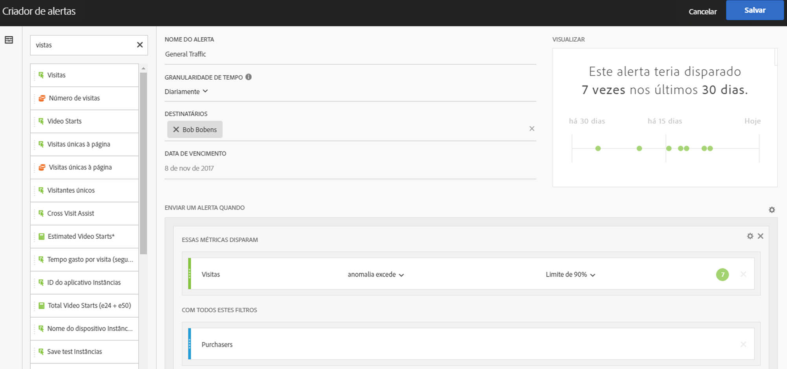
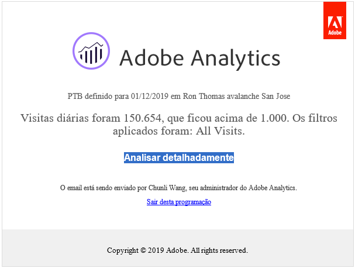
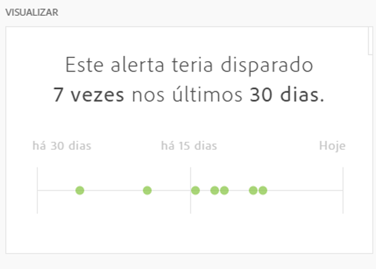

# Criador de alertas

>[!IMPORTANT]
>
>Os Alertas inteligentes estão disponíveis somente para clientes do Adobe Analytics Prime e do Adobe Analytics Ultimate.

## Acessar o Criador de alertas

Acesse o Criador de alertas de uma das seguintes formas:

* Usando o seguinte atalho no Analysis Workspace:

   `ctrl (or cmd) + shift + a`
* Acessando **[!UICONTROL Workspace]** > **[!UICONTROL Componentes]** > **[!UICONTROL Novo alerta]**.
* Selecionando um ou mais itens de linha da tabela de forma livre, clicando com o botão direito do mouse e selecionando **[!UICONTROL Criar alerta a partir da seleção]**.
* A partir de um relatório do Reports &amp; Analytics, acessando **[!UICONTROL Mais]** > **[!UICONTROL Adicionar alerta]**.

## Criar alertas

A interface do Criador de alertas é semelhante àquela que cria segmentos ou métricas calculadas no Analytics:

<!--Meike, I edited this table for validation -->

**Nome do Alerta**

Especifique um nome para o alerta. O nome do alerta pode conter o nome do relatório ou o limite da métrica.

**Granularidade de tempo**

Especifique quando você deseja verificar a métrica: por hora, dia, semana ou mês.

> [!NOTE] Para conjuntos de relatórios com um calendário personalizado, não oferecemos suporte à granularidade mensal no Criador de alertas.

**Destinatários**

Especifique para onde o alerta pode ser enviado. Um alerta pode ser enviado a um usuário do Analytics, a um grupo do Analytics, a um endereço de email bruto ou a um número de telefone.

>[!IMPORTANT]
>
>O telefone deve ser precedido por um “+” e um [código de país](https://countrycode.org/).

O email que um usuário receberia depois que um alerta é acionado é semelhante ao modelo abaixo:

**Data de expiração**

Defina a data de expiração do alerta.

**Enviar um Alerta quando...**

*... qualquer uma dessas métricas forem acionadas*

* Arraste e solte métricas na tela que adicionará disparadores.

   Será exibida uma mensagem **“componentes incompatíveis”** se nem todos os componentes (métricas/dimensões/segmentos) no alerta forem compatíveis com o conjunto de relatórios selecionado atualmente.
* Determine o limite que a métrica deve exceder antes de definir um alarme. Você pode definir este valor para um limite e, em seguida, para uma das condições a seguir:

   * a anomalia existe
   * a anomalia está acima do esperado
   * a anomalia está abaixo do esperado
   * é igual ou maior que
   * é igual ou menor que
   * alterações por
   * Você pode definir um limite de 90%, 95%, 99%, 99,75% e 99,9%.
   Observe que você também pode usar as métricas calculadas.

*... com esses filtros*

* Arraste e solte os segmentos ou dimensões para adicionar filtros. Por exemplo, adicionar um segmento “Somente dispositivos móveis” significaria que a regra dispara somente para dispositivos móveis.
* Filtros adicionais serão adicionados usando uma declaração AND.

**Adicionar uma regra**

Você pode adicionar regras AND ou OR, clicando no ícone de engrenagem.

## Visualizar alertas {#section_10D75BA7B77E4C5FAF58A719C082E070}

A visualização de alertas interativa mostra a frequência de disparo aproximada de um alerta com base na experiência passada.

Por exemplo, se você definir a granularidade de tempo para diário, a visualização pode informar se o alarme foi disparado para uma determinada métrica x vezes durante os últimos 30 ou 31 dias.

Se achar que muitos alertas podem ter sido disparados, você pode ajustar o limite no [Gerenciador de alertas](/help/components/c-alerts/alert-manager.md).

