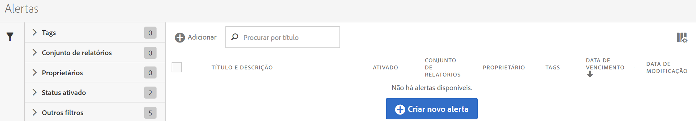
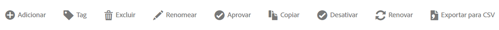

# Gerenciador de Alerta

The Alert Manager ( **[!UICONTROL Analytics]** &gt; **[!UICONTROL Components]** &gt; **[!UICONTROL Alerts]**) is structured very much like the [Segment Manager](https://marketing.adobe.com/resources/help/en_US/analytics/segment/seg_manage.html) and the [Calculated Metric Manager](https://marketing.adobe.com/resources/help/en_US/analytics/calcmetrics/cm_manager.html) and allows you to

* Acesse o Criador de alertas, clicando em **[!UICONTROL + Adicionar]**.
* Marcar alertas. Isso permite organizá-los para facilitar o uso.
* Excluir alertas.
* Renomear alertas.
* Aprovar alertas.
* Copiar alertas.
* Ativar/desativar alertas.
* **Renovar** uma data de expiração para o alerta. When one or more alerts are selected, they can be renewed by clicking **Renew**.This extends their expiration dates to be 1 year from the day Renew was clicked, regardless of their original expiration date.
* Exportar um alerta para um arquivo .CSV
* Editar alertas ao clicar duas vezes no título do alerta.
* Pesquisar por alertas.
* Adicionar alertas a outros conjuntos de relatórios.
* Especificar/alterar o proprietário de um alerta.
* Adicionar outros filtros.
* Definir uma **data de expiração** para o alerta.

